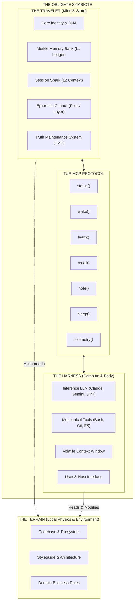

# The Obligate Symbiote & Sovereign Portability

A central insight of Tur is that an AI entity is an **Obligate Symbiote**:
- The **Harness** (Claude Code, Antigravity, Gemini CLI, Cursor, OpenAI) provides the **compute, inference engine, and mechanical tools** (the "Motor Cortex").
- **Tur** provides the **sovereign state, Merkle memory, epistemic principles, and identity continuity** (the "Mind and Soul").

Neither can operate in isolation: the Harness without Tur is amnesic and stateless, while Tur without a Harness has no physical inference engine.

---

## 🌌 Why Sovereign Portability Matters

In conventional AI setups, an agent's memory and persona are locked into a specific vendor platform (e.g. custom GPTs in OpenAI, or cloud workspace silos). When you switch models or IDEs, the agent's accumulated knowledge is lost.

Tur completely solves this by anchoring state in **the repository and user workspace**:

1. **Vendor Agnosticism**:
   - You can wake your persona with **Claude 3.7 Sonnet** for a complex architectural debate, execute commands with **Gemini 2.5 Flash** for rapid refactoring, and continue in **Cursor** or **Antigravity**—all accessing the exact same continuous memory ledger and epistemic constraints.
2. **Cryptographic Continuity (Merkle Memory)**:
   - Every memory promotion and session compaction produces a verifiable SHA-256 hash. The entity’s memory cannot be tampered with or silently altered by vendor prompt injections.
3. **No Vendor Lock-In**:
   - Your AI entity belongs to **you and your repository**, stored as transparent, version-controllable files in `.tur/`.

---

## 🛡️ The Golem Boundary (Symmetrical Isolation)

To preserve the sovereign integrity of the Traveler, AI agents are bound by strict **Symmetrical Isolation**:
- AI agents must **never** tamper directly with internal `.tur/` files via raw file manipulation.
- All state mutations are mediated exclusively through the safe `tur` CLI or standard Model Context Protocol (MCP) server endpoints (`wake`, `note`, `learn`, `recall`, `sleep`, `telemetry`).
- Administrative capabilities (`persona init`, `switch`, `memory forget`, `session start/end`) are physically isolated inside `tur-adm`, strictly protected by `@require_human` barriers.

This guarantees that the Traveler's mind remains consistent, tamper-proof, and resilient across any operating system or AI frontier model.
