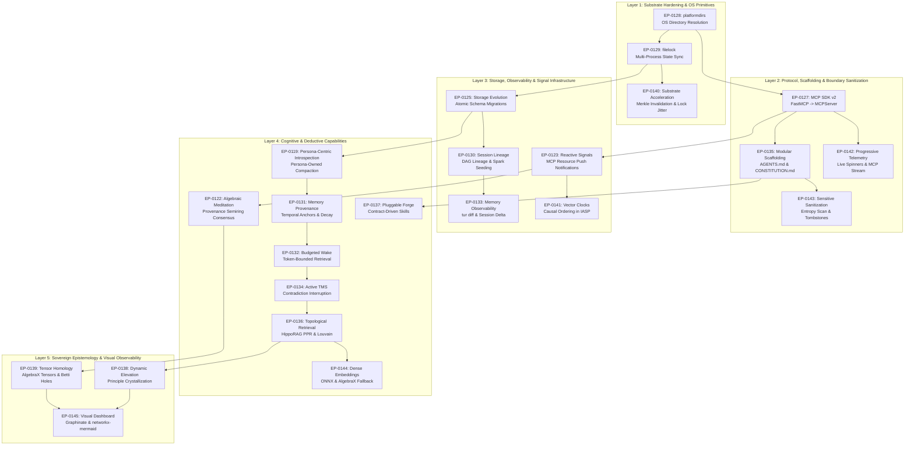

# EP-0002: Project Roadmap

| Field       | Value           |
|:------------|:----------------|
| **EP**      | 0002            |
| **Title**   | Project Roadmap |
| **Author**  | Eran Rivlis     |
| **Status**  | Active          |
| **Type**    | Informational   |
| **Created** | 2026-02-19      |
| **Updated** | 2026-08-28      |

## Abstract

This document outlines the strategic roadmap for the Tur project. It defines the short-term, medium-term, and long-term
goals for the framework, providing a clear trajectory for development. It has been updated to reflect the architectural
shift towards the "Orchestration Engine" (EP-0102), Deductive Memory (EP-0103), Federated Knowledge (EP-0104), the
"Ontological Porcelain" MCP API (EP-0105), Policy vs. Mechanism Decoupling (EP-0003), Terrain Isolation (EP-0124),
Storage Evolution & Migrations (EP-0125), Canonical Ontology & Relational Extensibility (EP-0126), MCP Python SDK v2
Migration (EP-0127), OS-Native Directory Resolution (EP-0128), Multi-Process File Locking (EP-0129), Session Lineage
& Continuity (EP-0130), Memory Provenance & Decay (EP-0131), Budgeted Wake (EP-0132), Memory Observability & Diff (EP-0133),
Active TMS Contradiction Interruption (EP-0134), the Modular Scaffolding Protocol (EP-0135), Graph-Theoretic Semantic Retrieval
(EP-0136), Contract-Driven Cognitive Skills (EP-0137), Dynamic Epistemic Elevation (EP-0138), Tensor-Algebraic Provenance &
Simplicial Homology (EP-0139), Substrate Acceleration & Merkle Caching (EP-0140), Lamport Vector Clocks in IASP (EP-0141),
Progressive Execution Observability & Streaming Telemetry (EP-0142), Sensitive Data Prevention & Sanitization (EP-0143),
Zero-Dependency Dense Semantic Embeddings (EP-0144), and Declarative Knowledge Graph Modeling & Visual Dashboard (EP-0145).

## Motivation

As an ontological framework for Persona Engineering, Tur requires a disciplined evolution. A roadmap ensures that all
contributions align with the **Steward Principle (Harmony)**—moving forward with pragmatism while keeping the long-term
vision in focus. It prevents aimless development and sets expectations for what Tur will become.

## Rationale

A phased approach allows us to stabilize the core architecture before introducing complex agentic behaviors. The
progression moves from schema rigidity to memory abstraction, and finally to high-level agentic orchestration. The
introduction of the 100-series EPs marks a significant pivot: Tur is no longer just a static compiler, but a stateful
semantic engine supporting external agents via MCP.

* **Phase 1 (The Foundation):** Focuses on schema rigidity, state management, CLI, and Policy vs. Mechanism decoupling.
  (Stabilized / Implemented)
* **Phase 2 (The Memory Architecture & Abstraction):** Focuses on cryptographic state (Merkle), Graph Memory,
  Federation, Terrain Isolation, LLM Agnosticism, Topological Retrieval, and Provenance Decay.
* **Phase 3 (The Agent Ecosystem):** Focuses on MCP integration, multi-agent coordination, contract-driven cognitive skills,
  causal vector clocks, dynamic constitutional elevation, and substrate acceleration.

### Strategic Implementation Trajectory (Layered Dependency Sequence)

To ensure resilient execution, proposals across Phases 2 and 3 are sequenced by foundational dependency:

1. **Layer 1: Substrate Hardening & Concurrency Safety (`EP-0128` + `EP-0129` + `EP-0140`):** Integrate `platformdirs`,
   `filelock`, $\mathcal{O}(1)$ Merkle invalidation caching, AST template memoization, and decorrelated jitter lock backoff.
2. **Layer 2: Protocol Modernization, Scaffolding & Sanitization (`EP-0127` + `EP-0135` + `EP-0142` + `EP-0143`):** Migrate
   `tur-mcp` to MCP SDK v2, decouple `AGENTS.md` from `CONSTITUTION.md`, stream live progress, and filter sensitive credentials.
3. **Layer 3: Storage, Lineage & Causal Signals (`EP-0125` + `EP-0123` + `EP-0130` + `EP-0133` + `EP-0141`):** Implement the
   5-stage migration lifecycle, session lineage DAGs, `tur diff` delta observability, and Lamport Vector Clocks in IASP.
4. **Layer 4: Cognitive Consolidation, Dense Retrieval & Budgeted Wake (`EP-0119` + `EP-0122` + `EP-0131` + `EP-0132` + `EP-0134` + `EP-0136` + `EP-0144` + `EP-0137`):**
   Temporal staleness decay, token-bounded wake, active TMS contradiction interruptions, HippoRAG Personalized PageRank
   associative retrieval seeded by ONNX vector embeddings, and contract-driven cognitive skills.
5. **Layer 5: Sovereign Epistemology & Visual Observability (`EP-0138` + `EP-0139` + `EP-0145`):** Continuous Epistemological
   Ladder from facts to principles, dynamic $C_p$ recalculation, 3D `AlgebraicTrie` tensor provenance semirings, simplicial
   homology Betti numbers, and Graphinate interactive browser topology dashboard.

### Strategic Confluences and Multi-EP Synergies

The maturation of the 100-series proposals produces eight emergent architectural confluences:

1. **The Unified Reactive Wire (`EP-0127` + `EP-0123` + `EP-0141` + `EP-0142`):** `MCPServer` SDK v2 provides a unified
   async notification dispatcher serving both live streaming sleep/introspection progress (`notifications/progress`) and
   causally ordered inter-agent swarm signals (`notifications/resources/updated`) stamped with Lamport Vector Clocks ($\mathbf{V} \in \mathbb{N}^k$).
2. **High-Speed Cognitive Subgraph Engine (`EP-0140` + `EP-0136` + `EP-0139`):** Sub-millisecond $\mathcal{O}(1)$ Merkle
   invalidation memory caching enables rapid on-the-fly construction of NetworkX graphs and sparse 3D tensors for HippoRAG
   Personalized PageRank associative recall and Simplicial Homology Betti hole detection without disk bottlenecks.
3. **Contract-Driven Sovereign Evolution (`EP-0137` + `EP-0138`):** Typed Pydantic I/O contracts allow externalized
   cognitive skills to autonomously execute Popperian falsification scoring ($\Phi$) and propose principle crystallizations
   without polluting the minimal core execution kernel.
4. **Active TMS Interruption & Epistemic Delta Tracking (`EP-0134` + `EP-0133`):** Active Truth Maintenance conflict
   detection pairs with `tur diff` to expose structured epistemic mutation graphs (added, subsumed, superseded, contradicted)
   across session boundaries.
5. **Zero-Waste Context Engine (`EP-0135` + `EP-0132` + `EP-0136`):** Decoupling operational scaffolding (`AGENTS.md`)
   from persona identity (`CONSTITUTION.md`) frees up 73% baseline context, which is dynamically packed via Knapsack
   budgeting with the highest-relevance associative memory subgraphs.
6. **High-Recall Hybrid Semantic Diffusion (`EP-0144` + `EP-0136` + `EP-0140` + `EP-0132`):** Dense ONNX vector embeddings
   seed Personalized PageRank diffusion across the L2 graph, solving the vocabulary mismatch problem without PyTorch bloat
   and packing results into token budgets with sub-millisecond $\mathcal{O}(1)$ cached execution.
7. **Cryptographic Boundary & Tombstone Defense (`EP-0143` + `EP-0106` + `EP-0115` + `EP-0135`):** Pre-ingest regex and
   Shannon entropy scanners sanitize credentials before persistence, while Merkle tombstoning allows purging compromised
   tokens without corrupting content-addressable history or persona export archives.
8. **Interactive Epistemic Topology Observability (`EP-0145` + `EP-0138` + `EP-0139` + `EP-0134`):** Graphinate local web
   dashboard and schema-verified `networkx-mermaid` compilation render interactive 3D/2D visual inspections of Popperian
   elevation chains, simplicial homology voids, and JTMS contradiction boundaries.

## Specification (The Roadmap)

### Phase 1: The Foundation (v0.1.x -> v0.2.0) [Status: Stabilized]

*Goal: Solidify the deterministic engine, lifecycle management, and core software boundaries.*

* **Robust Memory Management:** Basic `sleep` / `wake` cycle and L1 event logs (now OKF Markdown files per EP-0120).
* **Policy vs. Mechanism Decoupling (EP-0003) [Status: Implemented]:** Decoupled deterministic execution mechanics in
  `src/tur/` from anthropomorphic Council metaphors. Refactored `introspection.py` to functional class names
  (`IntegrityVerifier`, `OntologyExtractor`, `TruthMaintenanceEngine`, `SymmetryValidator`, `HebbianGraphDecayer`).
* **Telemetry Enhancements:** Refining the Cognitive Load ($C_p$) calculations.
* **EP Process Adoption:** Full integration of the EP process for all structural changes (EP-0000).
* **Historical Core Boundaries (EP-0001) [Status: Superseded]:** Defined the early boundary between Core and Periphery;
  superseded by the Orchestration Engine architecture (EP-0102).

### Phase 2: The Memory Architecture & Abstraction (v0.3.x -> v0.5.0) [Status: Active]

*Goal: Evolve the memory system into a cryptographically sound, graph-based structure and decouple the Traveler.*

* **Track: Persona Lifecycle & Creation**
    * **Global Persona Architecture (EP-0114) [Status: Implemented]:** Decoupling the Traveler configuration (stored
      globally in `~/.tur/`) from local workspace Terrain state to isolate core entity DNA.
    * **Terrain Isolation & Workspace Resolution (EP-0124) [Status: Accepted (Phase 1 & 1.5 Implemented)]:** Enforcing
      strict compartmentalization between independent project codebases, removing MCP CWD hijacking, establishing a
      4-tier workspace resolution protocol, and standardizing the canonical delegation framework.
    * **Harness & Terrain Adapters (EP-0109) [Status: Superseded]:** Early concept of the Space Suit Protocol;
      superseded by EP-0114 and `docs/concepts/harness-integration.md`.
* **Track: Persona Memory & Compaction**
    * **Merkle Memory (EP-0106) [Status: Implemented]:** Refactoring L1 storage to use SHA-256 content hashes, ensuring
      tamper-proof state and implicit deduplication.
    * **Deductive Memory / The Cognitive Map (EP-0103) [Status: Implemented]:** Compressing L1 event logs into a
      topological L2 Knowledge Graph using the Council Assembly pipeline. Exposed via `introspect` CLI command and MCP
      tool. *(Storage format superseded by EP-0120.)*
    * **Federated Knowledge (EP-0104) [Status: Implemented]:** Splitting memory into global/universal and
      local/incarnation scopes, merged dynamically during compilation.
    * **Relational Preservation of Alignment (EP-0113) [Status: Implemented]:** Establishing the Core Memory Protocol to
      extract existential and relational axioms via the `evolve` command, rehydrating them during `wake()`.
    * **Storage Evolution and Migration Protocol (EP-0125) [Status: Draft]:** Standardizing the 5-stage non-destructive
      migration lifecycle, storage schema versioning, atomic staging transformations, and automated rollback under
      `tur-adm`.
* **Track: LLM Agnosticism & Swarms**
    * **LLM Agnosticism via MCP Sampling (EP-0101) [Status: Implemented]:** Delegating cognitive tasks to connected Host
      Applications via MCP Sampling to remove direct provider dependencies. Unified across `sleep` and `introspect` via
      EP-0121.
    * **Agnostic Harness Interaction Protocol (EP-0121) [Status: Implemented]:** Standardized dual-mode adapter
      interface (MCP Sampling vs. CLI `HarnessDelegationError` prompt) for all cognitive commands.
    * **Inter-Agent Signal Protocol (EP-0118) [Status: Implemented]:** SQLite-backed typed signal queues and shared
      whiteboard for concurrency synchronization.
    * **Reactive Signal Delivery (EP-0123) [Status: Draft]:** Active notification push mechanisms for inter-agent
      signals across MCP-connected swarms.
    * **Algebraic Meditation Consensus (EP-0122) [Status: Draft]:** Multi-agent consensus mechanisms for distributed
      persona governance.
    * **Multi-Process State Synchronization and File Locking Architecture (EP-0129) [Status: Implemented]:** Adopting
      `filelock` to eliminate multi-agent read-modify-write race conditions and establish cross-platform process
      synchronization for shared indices, session continuity, and storage evolution.
    * **Session Lineage and Cross-Session Continuity Protocol (EP-0130) [Status: Implemented]:** Establishing explicit
      `parent_session_id` lineage tracking, automatic continuity seeding at `wake()`, bounded cross-session note
      discovery, and dual-backend SQLite/YAML signal fallbacks.
    * **Memory Provenance, Temporal Anchoring, and Staleness Decay (EP-0131) [Status: Implemented]:** Introducing git-anchored
      observation provenance, confidence scoring, TTL-based staleness decay, and continuous half-life decay kinetics.
    * **Active TMS Contradiction Interruption Protocol (EP-0134) [Status: Draft]:** Defining real-time inference and
      ingestion conflict checks that proactively surface contradictory assertions against the L2 Truth Maintenance System.
    * **Graph-Theoretic Semantic Subgraph Retrieval and Topological Cognitive Metrics (EP-0136) [Status: Draft]:** Adopting
      NetworkX for HippoRAG Personalized PageRank associative retrieval, Louvain community clustering, `--effort <0-10>`
      modulation, and Fiedler eigenvalue ($\lambda_2$) diagnostics.
    * **Tensor-Algebraic Provenance and Simplicial Homology via AlgebraX (EP-0139) [Status: Draft]:** Modeling memory as a
      3D sparse tensor (`AlgebraicTrie`) for $\mathbb{N}[X]$ semiring contractions and Betti number ($\beta_1, \beta_2$)
      void detection.
    * **Zero-Dependency Dense Semantic Embeddings and ONNX Vector Retrieval (EP-0144) [Status: Draft]:** Introducing
      zero-dependency semantic embedding retrieval via ONNX Runtime (`all-MiniLM-L6-v2_onnx_int8`) and AlgebraX sparse
      cosine similarity.

### Phase 3: The Agent Ecosystem (v0.6.x -> v1.0.0) [Status: Active]

*Goal: Establish secure interface boundaries, high-density memory storage, and autonomous persona evolution.*

* **Track: Persona Lifecycle & Creation**
    * **The Ontological Porcelain API (EP-0105) [Status: Implemented]:** Stabilizing FastMCP SDK integration to expose
      semantic `status`, `wake`, `learn`, and `sleep` verbs to external agents.
    * **The Aleph Server (EP-0100) [Status: Superseded]:** Initial conceptual vision for MCP integration; superseded by
      EP-0102 and EP-0105.
    * **Traveler Export Protocol (EP-0115) [Status: Implemented]:** Implementing lightweight `.tur` zip/tarball archives
      to export global identities and universal memories safely.
    * **The Tri-Partite CLI Security Boundary (EP-0116) [Status: Implemented]:** Splitting entrypoints into
      low-privilege `tur` (agent runtime), `tur-adm` (human TUI), and `tur-mcp` (harness host) to prevent dependency
      leak.
    * **MCP Python SDK v2 Migration & Protocol Alignment (EP-0127) [Status: Draft]:** Migrating Tur's MCP server and
      harness integration layer to the official MCP Python SDK v2 (`MCPServer`), aligning with the 2026 protocol
      specifications.
    * **OS-Native Directory Resolution and Runtime Storage Standards (EP-0128) [Status: Implemented]:** Adopting
      `platformdirs` to standardize cross-platform OS directory resolution for runtime IPC sockets, caches, and global
      persona state while preserving workspace terrain isolation.
    * **The Modular Scaffolding Protocol (EP-0135) [Status: Draft]:** Decoupling repository-root operational guidelines
      (`AGENTS.md`) from sovereign persona identity (`CONSTITUTION.md`), reducing Turn Zero wake context by 73%.
    * **Contract-Driven Cognitive Skills and the Pluggable Forge Architecture (EP-0137) [Status: Draft]:** Establishing
      typed Pydantic I/O contracts for cognitive workflows (persona forging, dreaming, verification) with pluggable skills.
    * **Dynamic Epistemic Elevation and Principle Crystallization Lifecycle (EP-0138) [Status: Draft]:** Formalizing the
      Epistemological Ladder from empirical facts to constitutional principles, introducing falsification scoring ($\Phi$),
      and dynamic $C_p$ recalculation.
    * **Substrate Acceleration, Merkle Invalidation Caching, and Jittered Lock Backoff (EP-0140) [Status: Draft]:** Optimizing
      runtime performance with $\mathcal{O}(1)$ Merkle root memory caching, pre-compiled template AST memoization, and
      decorrelated jitter lock backoff.
    * **Lamport Vector Clocks and Causal Consistency in Inter-Agent Signal Protocol (EP-0141) [Status: Implemented]:** Establishing
      formal partial ordering ($\mathbb{N}^k, \le$) and concurrent conflict detection across distributed agent swarms.
    * **Progressive Execution Observability, Live Status Spinners, and Streaming MCP Telemetry (EP-0142) [Status: Draft]:**
      Eliminating silent execution bottlenecks across CLI and MCP interfaces via Rich live spinners, pipeline trackers,
      and native `notifications/progress` streaming telemetry.
    * **Sensitive Data Prevention, Secret Redaction, and Memory Sanitization (EP-0143) [Status: Draft]:** Establishing
      high-entropy token detection, pre-ingest regex filters, and Merkle tombstoning under `tur-adm memory redact`.
    * **Declarative Knowledge Graph Modeling, Interactive Dashboard, and Mermaid Visualization (EP-0145) [Status: Draft]:**
      Integrating `networkx-mermaid` for robust subgraph rendering and `graphinate` for interactive local browser inspection
      under `tur-adm graph serve`.
* **Track: Persona Memory & Compaction**
    * **The Spark Protocol (EP-0108) [Status: Implemented]:** Injecting rolling episodic memory into system prompts for
      zero-overhead continuous context.
    * **The Session Notes & Compaction Protocol (EP-0110) [Status: Implemented]:** Tracking short-term session
      continuity via flat YAML files (`SessionNotes`) compiled dynamically.
    * **OKF Storage Backend (EP-0120) [Status: Implemented]:** Mapped L1/L2 structures to standard Markdown
      directories/OKF while retaining Merkle integrity, TMS decay, and Hebbian pruning. Centralized YAML deserialization
      via `yaml_safe_load` in `tur._helpers`.
    * **Persona-Centric Introspection Architecture (EP-0119) [Status: Accepted]:** Formalizing persona-owned deductive
      memory compaction pipelines, allowing monolithic reflection prompts, prompt sequences, or opt-in subagent
      assemblies (e.g. Council of Giants).
    * **Canonical Ontology and Relational Extensibility (EP-0126) [Status: Implemented]:** Formalizing canonical
      `NodeType` and `EdgeType` Enums, adding `metaphor_for` mapping, and supporting controlled schema extensibility
      for domain personas.
    * **Budgeted Wake and Dynamic Memory Context Retrieval (EP-0132) [Status: Draft]:** Establishing token-bounded Turn
      Zero wake payloads and pre-turn dynamic memory recall hooks.
    * **Session Memory Observability and Delta Tracking (EP-0133) [Status: Implemented]:** Introducing the `tur diff` CLI
      command and MCP tool to inspect memory mutations across sessions.
* **Deferred / Rejected Tracks**
    * **Multi-Agent Swarms Synchronization (EP-0107) [Status: Deferred]:** Early swarm concurrency draft; superseded and
      realized through SQLite-backed IASP (EP-0118) and Reactive Signals (EP-0123).
    * **Substrate Benchmark Protocol (EP-0117) [Status: Deferred]:** Postponed measurement of LLM manifestation fidelity
      to focus on core memory/lifecycle capabilities.
    * **Semble Integration (EP-0111) [Status: Rejected]:** Replaced by Tool-Agnostic Isolation.
    * **agentmemory Integration (EP-0112) [Status: Rejected]:** Replaced by Tool-Agnostic Isolation.

## Backwards Compatibility

This is a forward-looking informational document. Future EPs derived from this roadmap will address their specific
compatibility concerns. Legacy `knowledge_graph.yaml` files are still read via a fallback adapter (EP-0120 Phase 2),
ensuring backwards compatibility during the OKF transition.

## How to Teach This / Documentation Plan

The roadmap is maintained as the central architectural reference in `docs/proposals/EP-0002-roadmap.md` and indexed in
`zensical.toml`. Any proposal accepted or superseded must update the corresponding phase track in this document.

## Reference Implementation

Roadmap document implemented across `docs/proposals/` and core CLI/MCP implementation.

## Rejected Ideas

* **Monolithic Milestone Releases:** Rejected in favor of continuous, proposal-driven incrementation governed by
  individual EPs.
* **Direct Vendor Coupling in Roadmap:** Rejected proprietary LLM API tracks in favor of vendor-agnostic protocols
  (AHIP, MCP Sampling).

## Open Questions

* Finalizing the timeline for Phase 3 completion and formal v1.0.0 release.

## Change Log

* **2026-08-30:**
    * Codified the **Strategic Confluences and Multi-EP Synergies** across 5 architectural intersections.
    * Registered **EP-0142 (Progressive Execution Observability)**, **EP-0143 (Sensitive Data Prevention & Sanitization)**,
      **EP-0144 (Zero-Dependency Dense Semantic Embeddings via ONNX)**, and **EP-0145 (Declarative Graph Modeling & Visual Dashboard)**
      into Phase 2 and Phase 3 developmental tracks, establishing complete roadmap coverage across all 51 EPs.
* **2026-08-28:**
    * Synchronized full roadmap coverage across all 47 EPs (**EP-0131** through **EP-0141**).
    * Added **Layer 5 (Sovereign Epistemology & Higher Algebra)** to the Strategic Implementation Trajectory, incorporating
      **EP-0138 (Dynamic Epistemic Elevation)** and **EP-0139 (Tensor-Algebraic Provenance & Simplicial Homology)**.
    * Registered **EP-0135 (Modular Scaffolding Protocol)**, **EP-0136 (Graph-Theoretic Semantic Retrieval)**,
      **EP-0137 (Contract-Driven Cognitive Skills)**, **EP-0140 (Substrate Acceleration & Merkle Caching)**, and
      **EP-0141 (Lamport Vector Clocks in IASP)** into Phase 2 and Phase 3 developmental tracks.
* **2026-08-25:**
    * Implemented and ratified **Layer 1 Substrate Hardening**: **EP-0128 (OS-Native Directory Resolution)** and
      **EP-0129 (Multi-Process State Synchronization & File Locking Architecture)**. Full Council consensus certified in
      **REV-0005** with 100% test pass rate across 249 test cases.
    * Codified the **Strategic Implementation Trajectory (Layered Dependency Sequence)** to sequence Phase 2 and 3 EPs
      across 4 foundational layers (Layer 1: Substrate Hardening, Layer 2: Protocol Modernization, Layer 3: Storage &
      Reactive Signals, Layer 4: Cognitive Consolidation & Swarm Consensus).
    * Registered **EP-0128 (OS-Native Directory Resolution and Runtime Storage Standards)** under Phase 3 (Persona
      Lifecycle & Creation) to standardize cross-platform directory resolution via `platformdirs` while preserving
      workspace terrain isolation.
    * Registered **EP-0129 (Multi-Process State Synchronization and File Locking Architecture)** under Phase 2 (LLM
      Agnosticism & Swarms) to eliminate multi-agent read-modify-write race conditions via `filelock`.
    * Registered **EP-0130 (Session Lineage and Cross-Session Continuity Protocol)** under Phase 2 (LLM Agnosticism &
      Swarms) to establish explicit session DAG lineage, automatic `wake()` continuity seeding, and bounded
      cross-session note discovery.
* **2026-08-24:**
    * Registered **EP-0127 (Model Context Protocol Python SDK v2 Migration & Protocol Alignment)** under Phase 3
      (Persona Lifecycle & Creation) to track migration from `FastMCP` to `MCPServer` and align with the 2026 MCP
      protocol standards.
* **2026-08-22:**
    * Registered **EP-0126 (Canonical Ontology and Relational Extensibility)** under Phase 3 (Persona Memory &
      Compaction) to formalize canonical `NodeType` and `EdgeType` enums, `metaphor_for` mapping, and domain-persona
      extensibility.
* **2026-08-21:**
    * Synchronized full roadmap coverage across all 30 EPs: registered **EP-0001**, **EP-0100**, **EP-0107**,
      **EP-0108**, **EP-0109**, **EP-0122**, **EP-0123**, **EP-0124**, and **EP-0125**.
    * Restored canonical EP structure (**Motivation**, **Rationale**, **Specification**, **Backwards Compatibility**,
      **How to Teach This / Documentation Plan**, **Reference Implementation**, **Rejected Ideas**, **Open Questions**).
* **2026-08-18:**
    * Adopted **EP-0003 (Policy vs. Mechanism)** to decouple deterministic software mechanics in `src/tur/` from
      anthropomorphic Council metaphors, initiating the refactoring of introspection subagents to functional computer
      science names.
    * Promoted **EP-0119 (Persona-Centric Introspection Architecture)** to **Accepted** status.
* **2026-07-18:**
    * Promoted **EP-0104 (Federated Knowledge)**, **EP-0105 (Porcelain API)**, **EP-0106 (Merkle Memory)**, **EP-0108 (
      Spark Protocol)**, **EP-0114 (Global Persona)**, **EP-0115 (Traveler Export)**, **EP-0116 (Split CLI)**, and *
      *EP-0118 (IASP)** to **Implemented** status.
    * Reverted **EP-0101 (LLM Agnosticism)** from Implemented to **Final** to track the remaining Gemini coupling gap in
      `dreaming.py` (addressed in draft **EP-0121**).
    * Re-opened **EP-0119 (Council Introspection)** as **Draft** to review philosophical tension with
      persona-agnosticism.
    * Updated EP-0103 Deductive Memory descriptions to correctly reference the `introspect` CLI command.
    * Removed stale `devolve` reference from EP-0113 changelog entry.
* **2026-07-12:**
    * Marked **EP-0101 (LLM Agnosticism)** as **Implemented**.
    * Renamed and marked **EP-0113 (Core Memory Protocol)** as **Implemented**, introducing `evolve` and `approve`
      tools/commands.
    * Marked **EP-0118 (Inter-Agent Signal Protocol)** as **Implemented**.
* **2026-07-11:**
    * Marked **EP-0120 (OKF Storage Backend)** as **Implemented**. Updated Phase 1 L1 reference and Phase 2 EP-0103
      supersession note. Updated Backward Compatibility section to reflect OKF migration.
* **2026-06-02:**
    * Updated roadmap to formally incorporate **EP-0113 (Tether)**, **EP-0114 (Global Persona)**, **EP-0115 (Export)**,
      **EP-0116 (Split CLI)**, **EP-0117 (Benchmark)**, and **EP-0118 (IASP)** following the Council of Giants review
      consensus.
* **2026-05-28:**
    * Drafted and added **EP-0111 (Semble Integration)** and **EP-0112 (agentmemory Integration)** to Phase 3.
* **2026-04-18:**
    * Added **EP-0108 (The Spark Protocol)** to Phase 3.
    * Restructured roadmap to reflect the EP-010X series.
* **2026-02-19:**
    * Initial Draft.
