# EP-0004: Canonical Command Grammar, Interaction Semantics, and Interface Taxonomy

| Field       | Value                                                                    |
|:------------|:-------------------------------------------------------------------------|
| **EP**      | 0004                                                                     |
| **Title**   | Canonical Command Grammar, Interaction Semantics, and Interface Taxonomy |
| **Author**  | Eran Rivlis, Ariel                                                       |
| **Status**  | Active                                                                   |
| **Type**    | Standards Track (Living Standard)                                        |
| **Created** | 2026-08-23                                                               |
| **Updated** | 2026-08-23                                                               |

## Abstract

This proposal establishes a unified, living standard governing **command grammar**, **noun-verb syntax**, **state
configuration symmetry (`get`/`set`)**, and **zero-dependency interactive fallback heuristics** across all Tur
interfaces: the low-privilege agent runtime (`tur`), the human administrative interface (`tur-adm`), and the harness
bridge (`tur-mcp`).

By standardizing interaction semantics and eliminating ambiguous verb aliases, EP-0004 ensures predictable, ergonomic
interaction for human architects while preserving non-blocking determinism for autonomous AI agents.

---

## Motivation

As Tur evolved from a prompt compiler into a tri-partite memory engine (EP-0116), individual CLI commands and
administrative tools were added organically across feature proposals (EP-0113, EP-0115, EP-0124, EP-0125).

This organic growth introduced three distinct semantic friction points:

1. **Cognitive Ambiguity from Duplicate Aliases**:
   Having competing verbs (e.g. `tur-adm persona switch` alongside `tur-adm persona default`) caused confusion over
   whether an action was a temporary session switch or a persistent workspace configuration.
2. **Asymmetrical State Querying**:
   Users could set workspace personas, but lacked a dedicated, non-intrusive query command (`persona get`) to verify the
   active configuration without invoking agent execution commands like `tur status`.
3. **Heavy TUI Dependencies & Crash Vectors**:
   Early administrative forms relied on the `textual` async TUI framework. This forced an unnatural packaging split
   (`tur[admin]`), caused runtime crashes in lightweight or headless `uvx` environments (`No module named 'textual'`),
   and cleared the user's terminal scrollback buffer for trivial two-field inputs.

---

## Rationale (The Council Framework)

1. **Symmetry (Noether)**:
   Every mutable property in the workspace or global store must obey getter/setter symmetry (`tur-adm <noun> get` and
   `tur-adm <noun> set`).
2. **Parsimony & Gricean Restraint (Shannon / Dennis Point)**:
   *"There should be one—and preferably only one—obvious way to do it."* Redundant verb synonyms are eliminated in favor
   of single, canonical nouns and verbs.
3. **Robust Simplicity (Feynman)**:
   Interactive CLI workflows must rely strictly on line-buffered, standard-library-compatible `rich.prompt` primitives
   rather than heavy full-screen terminal hijacking frameworks.

---

## Specification

### 1. Tri-Partite Semantic Boundaries

Tur strictly separates its execution semantics based on the consumer:

```mermaid
graph TD
    subgraph AgentRuntime ["1. Agent Runtime (tur)"]
        A1["Deterministic Execution"] --> A2["Non-Blocking / Zero Stdin Prompts"]
        A2 --> A3["Direct Action Verbs: wake, status, note, learn, sleep"]
    end

    subgraph HumanAdmin ["2. Sovereign Administration (tur-adm)"]
        H1["Human-Governed @require_human"] --> H2["Noun-Verb Taxonomy: persona, memory, session, clean"]
        H2 --> H3["get / set Configuration Symmetry"]
        H3 --> H4["Zero-Dependency Numbered Interactive Fallbacks"]
    end

    subgraph HarnessBridge ["3. Harness Gateway (tur-mcp)"]
        M1["JSON-RPC Endpoint"] --> M2["FastMCP Strict Schema Tools"]
        M2 --> M3["Headless Tool Invocations"]
    end
```



* **`tur` (Agent Runtime)**:
    - Must **never hang on interactive `stdin` prompts**.
    - If a required parameter is omitted in an unconfigured environment, `tur` resolves via deterministic fallbacks
      (`TUR_ACTIVE_PERSONA_ID` $\to$ single available persona) or immediately exits with code `1` and an actionable
      message.
* **`tur-adm` (Human Sovereign Administration)**:
    - Protected by `@require_human`.
    - Ergonomically interactive: accepts direct CLI arguments, or falls back to clean, numbered selection menus when
      arguments are omitted.
* **`tur-mcp` (Harness Gateway)**:
    - Exposes typed JSON-RPC tool schemas for external AI agent harnesses (Claude Desktop, Cursor, Gemini CLI, ACP).

---

### 2. Noun-Verb Architectural Invariant

All human administrative commands follow a strict **Noun $\to$ Verb** structure:

$$\texttt{tur-adm} \; \langle\text{noun}\rangle \; \langle\text{verb}\rangle \; [\text{arguments}]$$

* **Canonical Nouns**:
    * `persona`: Identity, Aleph axioms, principles, directives, and export/import packages.
    * `memory`: Cryptographic Merkle ledger, core memories, approval staging, and archive forgetting.
    * `session`: Chronological timelines, active session continuity, and sparks/notes.
    * `clean`: Root-level maintenance for storage bank hygiene.

---

### 3. The Symmetrical `get` / `set` Configuration Invariant

Whenever an operational target or property is managed for a workspace or global store, the CLI must provide exact
getter/setter symmetry:

#### **A. `tur-adm persona get`**

Queries and displays the active workspace persona configuration without executing agent prompt compilation:

```bash
$ tur-adm persona get
Active Workspace Persona: Ariel (v5.4.0) [7544202e-92f5-40ce-adfb-e4b0eae6c262]
Source: .tur/state.yaml
```

#### **B. `tur-adm persona set [identifier]`**

Sets the active persona for the current workspace in `.tur/state.yaml`:

* **Direct Mode**: `tur-adm persona set Ariel` (executes immediately).
* **Interactive Mode**: `tur-adm persona set` (displays numbered list of available personas).

*(Note: `tur-adm persona switch` and `tur-adm persona default` are unified under `persona set`).*

---

### 4. The Zero-Dependency Interactive Fallback Protocol

When an interactive command in `tur-adm` requires a target resource (Persona, Memory, Session) and the user omits the
identifier:

1. **Rich Table Rendering**: Display a formatted `rich.table.Table` with a numeric `#` index column.
2. **Indexed Choice**:
    - Items are indexed `1 .. N`.
    - Index `0` is always reserved for `[yellow]Cancel[/yellow]`.
3. **Standard Line-Buffered Input**:
   Prompt via `rich.prompt.IntPrompt` with validated choices and default selection:
   ```text
   ┌────────────────────────────── Available Personas ──────────────────────────────┐
   │ # │ Name             │ Version │ UUID                                          │
   │───┼──────────────────┼─────────┼───────────────────────────────────────────────│
   │ 1 │ Ariel (Active)   │ v5.4.0  │ 7544202e…                                     │
   │ 2 │ Andrew           │ v1.0.0  │ fab6858c…                                     │
   │ 0 │ Cancel           │         │                                               │
   └────────────────────────────────────────────────────────────────────────────────┘
   Select active persona [1]: 2
   ✔ Set active workspace persona to 'Andrew' in .tur/state.yaml
   ```
4. **No Terminal Hijacking**:
   Wizards must never enter raw alternate screen buffers (`altscreen`). Prompts leave a clean, persistent trace in
   terminal scrollback.

---

### 5. Canonical Subcommand Reference Matrix

| Subcommand                   | Arguments                        | Interactive Fallback | Purpose                                                  |
|:-----------------------------|:---------------------------------|:--------------------:|:---------------------------------------------------------|
| **`tur-adm persona init`**   | -                                |         Yes          | Bootstrap a new persona (Name + Aleph).                  |
| **`tur-adm persona list`**   | -                                |          No          | Tabulate all registered personas in the registry.        |
| **`tur-adm persona view`**   | `[identifier]`                   |         Yes          | Inspect DNA, principles, and directives.                 |
| **`tur-adm persona get`**    | -                                |          No          | Display active persona configured for workspace.         |
| **`tur-adm persona set`**    | `[identifier]`                   |         Yes          | Assign active persona in workspace state.                |
| **`tur-adm persona export`** | `[identifier]` `[-o path]`       |         Yes          | Package persona into a portable `.tur` archive.          |
| **`tur-adm persona import`** | `<archive>` `[--set-active]`     |          No          | Unpack and verify a `.tur` identity archive.             |
| **`tur-adm memory list`**    | `[identifier]` `[--pending]`     |          No          | List memories across scopes and statuses.                |
| **`tur-adm memory view`**    | `<memory_id>` `[identifier]`     |          No          | View full content and cryptographic Merkle hash.         |
| **`tur-adm memory approve`** | `<memory_id>` `[identifier]`     |          No          | Promote pending Core Memory to active prompt constraint. |
| **`tur-adm memory forget`**  | `<memory_id>` `[identifier]`     |          No          | Archive a memory from active retrieval.                  |
| **`tur-adm session list`**   | `[identifier]`                   |          No          | List session timelines and statuses.                     |
| **`tur-adm session start`**  | `<session_id>` `[identifier]`    |          No          | Manually open a designated session ID.                   |
| **`tur-adm session end`**    | `[session_id]` `[identifier]`    |          No          | Conclude and seal an active session.                     |
| **`tur-adm session note`**   | `<index>` `[session_id]`         |          No          | Inspect a specific milestone note in a session.          |
| **`tur-adm clean`**          | `[--dry-run]` `[--global/local]` |          No          | Prune orphaned files and dangling state.                 |

---

### 6. Destructive Safety & Confirmation Protocol

Commands that perform destructive or irreversible actions (`memory forget`, `clean`, `rollback`) must:

1. Require explicit confirmation (`[y/N]`) when running interactively on a human TTY.
2. Provide a non-interactive `--yes` / `-y` override flag for automated admin scripting.

---

## Reference Implementation

* [`src/tur/cli/wizards.py`](file:///C:/dev/erivlis/tur/src/tur/cli/wizards.py) — Core zero-dependency Rich interactive
  prompt helpers (`init_wizard`, `select_persona_wizard`).
* [`src/tur/cli/admin.py`](file:///C:/dev/erivlis/tur/src/tur/cli/admin.py) — Typer command implementations adhering to
  `get`/`set` symmetry and noun-verb taxonomy.
* [`tests/test_cli_admin.py`](file:///C:/dev/erivlis/tur/tests/test_cli_admin.py) — Test suite verifying both direct CLI
  invocations and mocked interactive flows.

---

## Backwards Compatibility

* **Consolidation**: `tur-adm persona switch` and `tur-adm persona default` are unified under `tur-adm persona set`. For
  smooth transition, aliases remain available with deprecation warnings pointing to `persona set`.
* **Zero Dependency Guarantee**: Base `pip install tur` contains 100% of `tur` and `tur-adm` capabilities without
  requiring `[admin]` extras.

---

## Change Log

* **2026-08-23**: Initial Draft and ratification. Codified `get`/`set` symmetry, deprecated `textual` in favor of pure
  Rich prompts in `src/tur/cli/wizards.py`, unified `persona set`, and introduced the Zero-Dependency Interactive
  Fallback Protocol.
