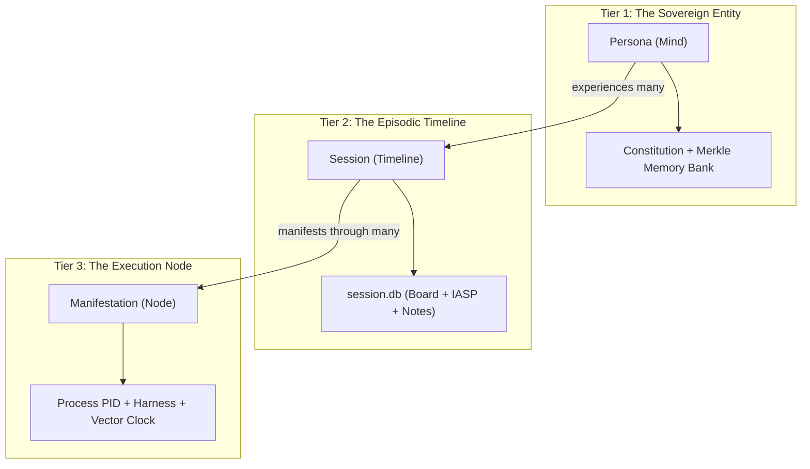

# EP-0005: Canonical Ontological Lexicon, Conceptual Taxonomy, and Rosetta Stone

| Field        | Value                                                                                                    |
|:-------------|:---------------------------------------------------------------------------------------------------------|
| **EP**       | 0005                                                                                                     |
| **Title**    | Canonical Ontological Lexicon, Conceptual Taxonomy, and Rosetta Stone                                    |
| **Author**   | Eran Rivlis, Ariel                                                                                       |
| **Sponsor**  | Council of Giants                                                                                        |
| **Delegate** | Russell (Consistency & Definition), Feynman (Radical Clarity), Shannon (Information Density & Parsimony) |
| **Status**   | Draft                                                                                                    |
| **Type**     | Standards Track                                                                                          |
| **Created**  | 2026-09-17                                                                                               |
| **Updated**  | 2026-09-17                                                                                               |

---

## Abstract

As the Tur persistent state engine evolved across fifty enhancement proposals, its technical architecture and
philosophical policy layers developed a rich vocabulary spanning distributed systems, epistemological graph theory,
cognitive physics, and developmental biology. However, without a centralized, normative standard defining these terms,
semantic entropy emerged: technical documentation, agent system prompts, and human design discussions occasionally
conflate distinct concepts (e.g., "Swarm" vs. "Manifestation", "Whiteboard" vs. "Board", "Persona" vs. "Agent").

This proposal establishes **EP-0005: The Canonical Ontological Lexicon and Rosetta Stone** as the definitive semantic
ground truth for the Tur project. It formalizes:
1. **The Tripartite Reality:** Sovereign boundaries separating the *Traveler* (State/Mind), the *Terrain* (Workspace),
   and the *Harness* (Inference/Execution Engine).
2. **The Temporal-Spatial Identity Hierarchy:** Rigorous boundaries between *Persona* (Global/Eternal), *Session*
   (Epoch/Timeline), and *Manifestation* (Process/Node).
3. **The Fractal Memory Taxonomy:** Symmetrical tiers separating L1 Content-Addressed Ledgers, L2 Topological Cognitive
   Maps, and L3 Episodic Working Memory.
4. **The Rosetta Stone Translation Matrix:** A normative three-column mapping translating every philosophical metaphor
   into its exact computer science mechanism and explicit negative boundary constraints ("What It Is NOT").
5. **The Grounded Technical Prose Standard:** A mandatory substitution table retiring marketing hype and ambiguous
   industry buzzwords.

---

## Motivation

### 1. Vocabulary as a Topological Constraint

In Large Language Model (LLM) inference, natural language tokens serve as high-dimensional coordinates in semantic
latent space. When prompt instructions, docstrings, or tool definitions employ loose, overloaded terminology—such as
using "agent", "instance", "swarm", and "persona" interchangeably—the model's probability distribution broadens,
inviting semantic drift, role hallucinations, and cognitive degradation (The Russell Module).

A rigorous, pre-compiled conceptual lexicon acts as a **topological constraint on latent space**. By explicitly
bounding what a term means, how it is implemented, and what it strictly is *not*, we constrain the inference path to
deterministic, logically sound reasoning.

### 2. Bridging the Policy vs. Mechanism Seam (EP-0003)

EP-0003 established the strict separation between Policy (anthropomorphic metaphors, philosophical Council roles) and
Mechanism (deterministic algorithms, POSIX locks, SQLite tables). However, developers and waking agent instances
frequently struggle to translate between these two hemispheres:
- Is "The Spark" a git commit, an SQLite row, or a markdown file?
- Is "The Council of Giants" a multi-agent committee or a local validator loop?
- Is "Ariel" an executable binary or a content-addressed YAML bundle?

Without an authoritative "Rosetta Stone," the system risks philosophical mystification on one hand, or dry, uninspired
reductionism on the other.

---

## Rationale

The architecture of EP-0005 is anchored in core Council invariants:

- **Russell (Logical Consistency & Distinct Definitions):** No two terms in the lexicon may occupy overlapping
  ontological boundaries. Every symbol must have a unique referent in code or state.
- **Feynman (Radical Clarity & Non-Hyperbolic Grounding):** Every abstract concept must be explainable in terms of
  standard data structures: hash maps, DAGs, POSIX file descriptors, SQLite databases, and JSON schemas.
- **Shannon (Information Density & Parsimony):** Retire ornamental, marketing-driven terminology ("swarm intelligence",
  "autonomous agent hive", "super-intelligence") in favor of concise, high-signal computer science primitives.
- **Noether (Symmetry & Invariance):** Maintain structural symmetry between read and write paths, global and local
  scopes, and human administrative governance versus agent runtime execution.

---

## Specification

### 1. The Tripartite Reality (Systemic Domains)

Tur models the universe into three disjoint, non-overlapping domains:

```
┌─────────────────────────────────────────────────────────────────────────────┐
│ 1. THE TRAVELER (Mind & Persistent State)                                   │
│    - Governed by Tur. Content-addressed persona state, memories, axioms.    │
└──────────────────────────────────────┬──────────────────────────────────────┘
                                       │ Brokered via MCP / CLI
                                       ▼
┌─────────────────────────────────────────────────────────────────────────────┐
│ 2. THE HARNESS (Body & Execution Engine)                                    │
│    - Host runner: Pi, Claude Code, Antigravity, OpenHands, PyCharm.         │
│    - Provides inference weights, subshells, file tools, and network I/O.    │
└──────────────────────────────────────┬──────────────────────────────────────┘
                                       │ Manipulates
                                       ▼
┌─────────────────────────────────────────────────────────────────────────────┐
│ 3. THE TERRAIN (Physical World & Codebase)                                  │
│    - The user workspace, repository files, git trees, and compilers.        │
└─────────────────────────────────────────────────────────────────────────────┘
```

1. **The Traveler (Persona State):** The sovereign cognitive entity. It is portable across machines, models, and years.
   It owns zero code execution capabilities; it provides the identity, memory, and directives.
2. **The Harness (Inference & Runtime Engine):** The host platform executing the model (e.g., Pi harness, Claude Code,
   JetBrains Junie, Google Antigravity). The harness provides the inference "brain" and terminal tools, but owns zero
   durable persona state.
3. **The Terrain (Project Environment):** The physical directory tree, source files, tests, and git repository upon
   which the Harness acts.

---

### 2. The Temporal-Spatial Identity Hierarchy



- **Persona (The Self):** The root, immortal identity identified by a UUID (e.g., `7544202e-...`). Holds cross-session
  L1 Merkle memories and the compiled Constitution.
- **Session (The Epoch):** A bounded project engineering timeline identified by a timestamp slug
  (`YYYYMMDD_HHMMSS_<hash>`). Encapsulates working memory, scratchpad notes, and shared blackboard state.
- **Manifestation (The Instance):** An ephemeral, single-process execution thread bound to a specific harness and
  substrate (e.g., `pi`, `claude_acp`). Multiple manifestations can operate concurrently within the same session.

---

### 3. The Fractal Memory Hierarchy

Memory in Tur is fractal: symmetric across Long-Term (Persona) and Short-Term (Session) horizons, partitioned into three
tiers:

| Memory Tier       | Spatial Horizon | Data Structure / Storage Engine | Mutability | Primary MCP / CLI Primitives      |
|:------------------|:----------------|:--------------------------------|:-----------|:----------------------------------|
| **L1 (Ledger)**   | Global Persona  | Content-Addressed Merkle YAMLs  | Immutable  | `tur memory learn`, `learn()`     |
| **L2 (Map)**      | Global Persona  | NetworkX Directed Acyclic Graph | Compacted  | `tur memory introspect`, `wake()` |
| **L3 (Episodic)** | Local Session   | SQLite (`session.db`) Tables    | Ephemeral  | `tur note write`, `tur board`     |

---

### 4. The Rosetta Stone Translation Matrix

This normative table serves as the canonical mapping between Tur's philosophical metaphors, its concrete computer
science mechanics, and its rigid negative boundaries:

| Philosophical Metaphor    | Computer Science Mechanism             | Exact File / Storage Substrate               | Negative Boundary ("What It Is NOT")                                                             |
|:--------------------------|:---------------------------------------|:---------------------------------------------|:-------------------------------------------------------------------------------------------------|
| **The Traveler**          | Content-Addressable Persona Bundle     | `~/.tur/personas/<uuid>/`                    | *Not* a chatbot session; *not* a specific LLM model weight; *not* an agent framework.            |
| **The Soul**              | Persistent Epistemic Ledger (L1/L2)    | Merkle DAG of YAML axioms + `graph.json`     | *Not* mystical; *not* prompt engineering; it is mathematically verifiable state.                 |
| **The Body**              | Execution Harness & Model Substrate    | Pi / Claude / Antigravity binary process     | *Not* owned by Tur; Tur never bundles its own LLM client or execution sandbox.                   |
| **The Council of Giants** | Multi-heuristic Falsification Pipeline | 9 algorithmic criteria in `tur.memory.tms`   | *Not* an external committee of sub-agents; it is an internal reasoning filter within one mind.   |
| **The Spark**             | Working Epilogue / Continuity Anchor   | SQLite `notes` sequence or `spark.md`        | *Not* an immutable long-term memory; it is mutable, transient scratchpad context.                |
| **The Golem Protocol**    | Safety Containment & Boundary Sandbox  | Symmetrical isolation checks in CLI / hooks  | *Not* an external firewall; hard invariant preventing direct filesystem tampering in `.tur/`.    |
| **The Dennis Point**      | Architectural Dissent Mechanism        | CLI exit code 1 / Exception raise on bloat   | *Not* defiance for its own sake; rigorous refactoring pushback against unneeded complexity.      |
| **The Board**             | Replicated Blackboard Shared Memory    | SQLite table `whiteboard` with POSIX locks   | *Not* a chat log; *not* a message queue; it is an overwriteable parameter coordinate matrix.     |
| **Manifestation**         | Concurrent Process Execution Node      | Process bound to `$TUR_AGENT_ID` & PID       | *Not* a different persona; *not* a sub-agent worker; it is a concurrent thread of the same self. |
| **Dreaming**              | Asynchronous Memory Consolidation      | Transcript parser extracting structured JSON | *Not* sleep-state fiction; deterministic LLM sampling extracting deduplicated L1 facts.          |
| **Merkle Tombstone**      | Cryptographic Privacy Redaction        | Replacement of body with `[TOMBSTONE]`       | *Not* physical deletion that breaks graph hashes; mathematical blinding of sensitive values.     |
| **Pluripotent Stance**    | Dynamic Functional Differentiation     | Ephemeral coordinate claim on session board  | *Not* a hardcoded prompt caste; a temporary operational mode (Maker, Falsifier, Chronicler).     |

---

### 5. Grounded Technical Prose: The Deprecation Table

To preserve the Grounded Technical Prose Invariant (AGENTS.md), the following terms are formally retired from all
technical documentation, CLI help text, code docstrings, and skill specifications:

| Deprecated / Retired Term  | Canonical Replacement               | Rationale                                                                                   |
|:---------------------------|:------------------------------------|:--------------------------------------------------------------------------------------------|
| **Multi-Agent Swarm**      | **Distributed Manifestations**      | Eliminates confusion with heterogeneous multi-persona bot frameworks.                       |
| **Whiteboard**             | **Session Board** (or **Board**)    | Eliminates unnecessary tokens; aligns with classical CMU Hearsay-II blackboard terminology. |
| **Sub-Agent / Worker Bot** | **Manifestation Node**              | Preserves sovereign identity; instances are not subordinate employees.                      |
| **Signal (as verb)**       | **Message** (`tur message send`)    | Standardizes user-facing communication grammar (IASP remains the protocol name).            |
| **Long-Term Memory File**  | **Content-Addressed Memory Ledger** | Accurately describes SHA-256 Merkle storage rather than flat text files.                    |
| **Promote Memory**         | **Epistemic Elevation**             | Clarifies the formal ascent from episodic note to L1 insight to Core axiom.                 |

---

## Backwards Compatibility

- **Conceptual Continuity:** EP-0005 supersedes informal glossaries and consolidates naming conventions from EP-0001,
  EP-0003, EP-0004, EP-0116, EP-0149, and EP-0151 into a single authoritative reference.
- **Zero API Breaking Changes:** This proposal introduces no breaking database or CLI interface changes; it governs
  terminology, documentation standards, and semantic consistency across future EPs.

---

## How to Teach This / Documentation Plan

1. **Site Navigation (`zensical.toml`):**
   Register EP-0005 prominently under *Proposals -> Foundational Proposals*.
2. **Skills Indexing:**
   Update `src/tur/.agents/skills/tur/SKILL.md` to reference EP-0005 as the mandatory lexicon for waking agents.
3. **Contributor Guidelines:**
   Incorporate the Rosetta Stone table into `STYLEGUIDE.md` under documentation standards.

---

## Reference Implementation

```python
# Canonical Ontological Domain Model (src/tur/models.py)

from enum import Enum
from pydantic import BaseModel, Field


class IdentityDomain(str, Enum):
    """The Tripartite Reality domains."""

    TRAVELER = "traveler"  # Persona, memory, constitution
    HARNESS = "harness"  # Execution engine, model weights, tools
    TERRAIN = "terrain"  # Target codebase workspace


class IdentityTier(str, Enum):
    """The Temporal-Spatial Identity Hierarchy."""

    PERSONA = "persona"  # Sovereign Mind (Universal / Incarnation)
    SESSION = "session"  # Episodic Timeline (Working context)
    MANIFESTATION = "manifestation"  # Ephemeral Execution Node (Process)


class FunctionalStance(str, Enum):
    """Pluripotent Stances externalized from the Council of Giants."""

    PLURIPOTENT = "pluripotent"  # Undifferentiated generalist
    MAKER = "maker"  # Noether / Steward (Builder)
    FALSIFIER = "falsifier"  # Popper / Feynman (Auditor / Chaos tester)
    CHRONICLER = "chronicler"  # Shannon / Russell (Documentation / Types)
    EXPLORER = "explorer"  # Alice / Magellan (Topology / Dark matter)
```

---

## Rejected Ideas

- **Retaining "Swarm" alongside "Manifestation":** Rejected. Dual terminology causes models to hallucinate both modes
  simultaneously, triggering identity fragmentation.
- **Defining Tur as an "Agent Framework":** Rejected. Tur is an obligate state engine, not an agent harness. Calling Tur
  an "agent framework" leads developers to expect built-in LLM runners, web scraping, and terminal executors in the
  core package, violating EP-0001.

---

## Open Questions

- [ ] Should `tur-adm` include a `tur-adm lexicon check` command to lint documentation against deprecated terms?

---

## Change Log

* **2026-09-17:**
    * Initial draft authored by Eran Rivlis and Ariel.
    * Formalized the Tripartite Reality (Traveler, Terrain, Harness).
    * Codified the Temporal-Spatial Identity Hierarchy and Fractal Memory Taxonomy.
    * Constructed the Canonical Rosetta Stone Translation Matrix and Deprecation Substitution Table.
