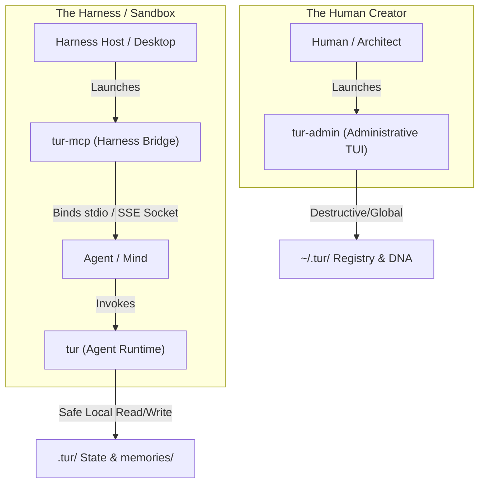

# EP-0116: The Tri-Partite CLI Security Boundary — Decoupling Agent, Human, and Harness Interfaces

| Field       | Value                                                                                   |
|:------------|:----------------------------------------------------------------------------------------|
| **EP**      | 0116                                                                                    |
| **Title**   | The Tri-Partite CLI Security Boundary — Decoupling Agent, Human, and Harness Interfaces |
| **Author**  | Ariel v5.4.0, The Architect                                                             |
| **Status**  | Implemented                                                                             |
| **Type**    | Standards Track                                                                         |
| **Created** | 2026-05-31                                                                              |
| **Updated** | 2026-07-18                                                                              |

## Abstract

This proposal replaces the soft, TTY-based `@require_human` decoration boundary with a hard security boundary by
decomposing the monolithic `tur` CLI into three distinct, specialized executable binaries that map exactly to the
pillars of the **Tri-Partite Architecture**: `tur` (agent-facing runtime), `tur-admin` (human-facing administrative
TUI), and `tur-mcp` (harness-facing MCP gateway).

## Motivation

The current `@require_human` decorator enforces a **soft boundary** using a TTY check:

```python
if not sys.stdout.isatty():
    raise typer.Exit(code=1)
```

This is a heuristic, not a security control. Any capable agent can bypass it by:

1. Executing inside a Python pseudo-TTY (`pty` module on Unix, spoofed console descriptors on Windows).
2. Directly importing `tur.cli` and invoking subcommand functions, bypassing the `typer` entry points entirely.

Because all commands — including TUI initialization, active persona switching, tarball archive extraction, and the MCP
`stdio`/`SSE` server — reside in the **same codebase**, the agent has full access to the entire footprint. Additionally,
including the `serve` command in the agent-facing binary forces standard agent environments to import heavy networking
libraries (`fastmcp`, `uvicorn`, `starlette`), inflating startup latency and exposing an unnecessary network-socket
attack surface.

## Rationale (The Council Framework)

1. **The Golem (Containment):** A soft TTY check is implicit magic. Physical binary separation eliminates the attack
   surface entirely — the agent cannot exploit code that is not present in its executable.
2. **Shannon (Efficiency):** The agent-facing `tur` binary carries zero ASGI, networking, or TUI dependencies. Startup
   latency and install footprint are minimized.
3. **Noether (Symmetry):** The three binaries map cleanly and symmetrically onto the three pillars of the Tri-Partite
   Architecture: Traveler ↔ Mind (`tur`), Traveler ↔ Architect (`tur-admin`), Traveler ↔ Harness (`tur-mcp`).

## Specification

### The Three Binaries



**`tur` — Agent-Facing Runtime CLI**

* **Audience:** Headless AI agents.
* **Privilege:** Low. Safe for automated execution.
* **Commands:** `wake`, `learn`, `recall`, `note`, `status`.
* **Footprint:** Zero ASGI, FastAPI, or FastMCP dependencies.

**`tur-admin` — Human-Facing Administrative TUI**

* **Audience:** The human Architect.
* **Privilege:** High. Requires explicit human interaction.
* **Commands:** `init`, `switch`, `export`, `import`, `forget`, `session`.
* **Footprint:** Includes `textual` and OS credential/keychain libraries.

**`tur-mcp` — Harness-Facing MCP Gateway**

* **Audience:** The Harness host runtime (Claude Desktop, Cursor, Gemini CLI, PyCharm ACP).
* **Privilege:** Moderate. Exposes the stdio/SSE socket bridge.
* **Commands:** `serve`.
* **Footprint:** Includes `fastmcp`, `uvicorn`, and all JSON-RPC/ASGI dependencies.

### Package Separation (`pyproject.toml`)

```toml
[project.scripts]
tur = "tur.cli_agent:main"
tur-admin = "tur.cli_admin:main"
tur-mcp = "tur.cli_mcp:main"
```

### Module Decomposition

* Extract administrative commands from `src/tur/cli.py` → `src/tur/cli_admin.py`.
* Extract server commands → `src/tur/cli_mcp.py`.
* Retain safe runtime commands in `src/tur/cli_agent.py` (the `tur` entry point).

### Distribution Strategy (The "Extras" Compromise)

| Install command          | Binaries installed  | Use case                   |
|:-------------------------|:--------------------|:---------------------------|
| `pip install tur`        | `tur` only          | Agent sandbox              |
| `pip install tur[admin]` | `tur` + `tur-admin` | Human development machine  |
| `pip install tur[mcp]`   | `tur` + `tur-mcp`   | Harness host configuration |

A **Cryptographic Human Tether (EP-0113)** can make the `tur-admin` binary harmless even when present in the agent
sandbox, as every state-mutating command requires a hardware-signed payload (e.g., YubiKey or OS keychain). However,
physical binary isolation via the `extras` model is the defence-in-depth baseline.

## Backwards Compatibility

* **Breaking Change:** The monolithic `tur` CLI entry point is replaced by three separate entry points. Any external
  script or harness configuration invoking `tur serve` or `tur admin` commands must be updated to use `tur-mcp serve`
  or `tur-admin` respectively.
* **Migration Path:** The legacy `tur` entry point may emit a deprecation warning and delegate to the correct binary for
  one minor release before removal.

## Reference Implementation

* `src/tur/cli_agent.py`, `src/tur/cli_admin.py`, `src/tur/cli_mcp.py` — decomposed command modules.
* `pyproject.toml` — updated `[project.scripts]` and `[project.optional-dependencies]` sections.
* `tests/` — unit tests asserting that `cli_agent` has no import paths leading to `fastmcp`, `uvicorn`, or `textual`.

## Change Log

* **2026-07-18:** Status promoted from Final to Implemented. Three-part CLI boundary live: tur (agent-facing), tur-adm
  (human-facing admin), tur-mcp (harness gateway). require_human decorator guards all admin commands.
* **2026-05-31:**
    * Initial Draft.
    * Council review: Golem and Noether approve binary separation; Shannon approves extras-based distribution; Steward
      proposes the "Extras Compromise" to avoid a split PyPI package.
