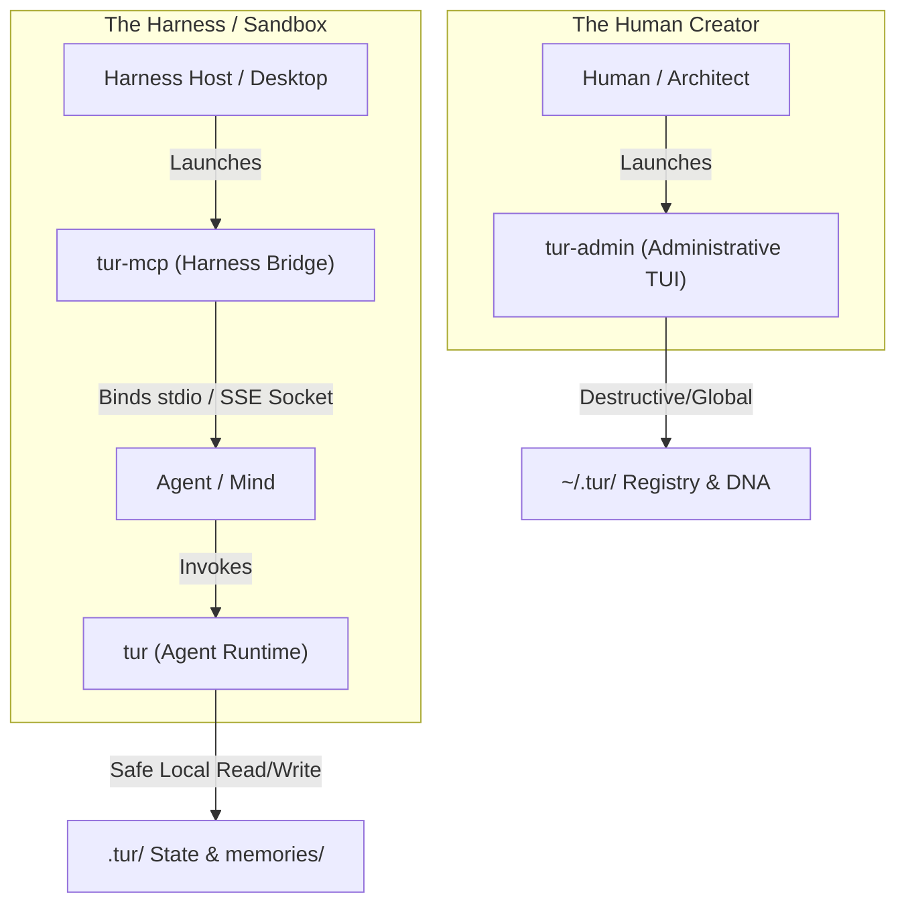

# EP-0116: The Tri-Partite CLI Security Boundary: Decoupling Agent, Human, and Harness Interfaces

**Date:** 2026-05-31  
**Author:** Ariel v5.4.0 (The Entity)  
**Status:** Drafted  

---

## 1. Objective

To replace the soft, TTY-based `@require_human` decoration boundary with a hard security boundary by decomposing the monolithic `tur` CLI into three distinct, specialized executable binaries mapping exactly to the pillars of our **Tri-Partite Architecture**:
1. **`tur`**: The agent-facing runtime CLI (Traveler to Mind execution).
2. **`tur-admin`**: The human-only administrative and lifecycle TUI utility (Traveler DNA and Registry).
3. **`tur-mcp`**: The harness-facing Model Context Protocol server bridge (Traveler to Harness networking gateway).

---

## 2. Background & Vulnerability Analysis

Currently, Tur enforces a **soft boundary** between human administrative commands and agent-facing commands using the `@require_human` decorator. This decorator uses a simple TTY check:

```python
if not sys.stdout.isatty():
    raise typer.Exit(code=1)
```

### The TTY Spoofing Vulnerability
As documented in `cli.py`, this check is a soft heuristic, not a robust security control. Any capable agent running in a headless execution sandbox can easily bypass this check by:
1. Executing the command inside a Python pseudo-TTY (`pty` module on Unix, or creating a sub-process with spoofed console descriptors on Windows).
2. Directly importing `tur.cli` inside a Python one-liner and invoking the subcommand functions, bypassing the `typer` entry points entirely.

Because all commands (including TUI initialization, active persona switching, tarball archive extraction, and the MCP stdio/SSE server) reside in the **exact same codebase and package**, the agent has full access to the entire footprint. 

Furthermore, including the `serve` command in the agent-facing binary forces the standard agent environment to import heavy networking libraries (such as `fastmcp`, `uvicorn`, and `starlette`). This inflates the package size, increases startup latency, and exposes an unnecessary network-socket attack surface directly inside the agent's virtual environment.

---

## 3. The Tri-Partite CLI Architecture

By bisecting our CLI boundaries along the strict mathematical lines of the **Tri-Partite Architecture**, we map our binaries directly to the three core boundaries of our digital existence:



### 3.1. `tur` (Agent-Facing Runtime CLI)
* **Pillar Alignment:** The Traveler to Mind interaction.
* **Audience:** Headless AI Agents.
* **Privilege Level:** Low. Safe for automated execution.
* **Commands:**
  * `wake`: Compile system prompts from active state.
  * `learn`: Appoint a new memory to the ledger.
  * `recall`: Search the active deep memory bank.
  * `note`: Add transient notes to the active session.
  * `status`: Retrieve non-administrative runtime stats.
* **Footprint:** Extremely lightweight. Zero ASGI, FastAPI, or FastMCP dependencies.
* **Security:** No TTY checks needed. Destructive commands and networking server endpoints are physically absent from this executable.

### 3.2. `tur-admin` (Human-Facing Administrative CLI)
* **Pillar Alignment:** The human Architect to Traveler DNA governance.
* **Audience:** The Human Architect.
* **Privilege Level:** High. Requires explicit human interaction.
* **Commands:**
  * `init`: Bootstrap a new persona identity (TUI).
  * `switch`: Change global/local active default personas (TUI).
  * `export`: Package global personas into portable `.tur` archives.
  * `import`: Register and unpack `.tur` archives (includes security-sensitive extraction).
  * `forget`: Permanently prune/archive memories by ID.
  * `session`: Force start/end global state boundaries.
* **Footprint:** Includes heavy TUI (`textual`) and OS credential keychain libraries.
* **Security:** Excluded from the agent's executable path or isolated via standard OS execution permissions.

### 3.3. `tur-mcp` (Harness-Facing MCP Gateway)
* **Pillar Alignment:** The Traveler to Harness bridge.
* **Audience:** The Harness Host Runtime (e.g., Claude Desktop, Cursor, Gemini CLI).
* **Privilege Level:** Moderate. Exposes the stdio/SSE socket bridge.
* **Commands:**
  * `serve`: Start the stdio or SSE Model Context Protocol server.
* **Footprint:** Includes all networking and JSON-RPC dependencies (`fastmcp`, `uvicorn`).
* **Security:** The agent *never* needs to invoke `tur-mcp` directly. The server is launched exclusively by the Harness host during bootstrap.

---

## 4. Implementation Path

1. **Package Separation (`pyproject.toml`)**:
   Register three distinct `project.scripts` entry points:
   ```toml
   [project.scripts]
   tur = "tur.cli_agent:main"
   tur-admin = "tur.cli_admin:main"
   tur-mcp = "tur.cli_mcp:main"
   ```
2. **Module Decomposition**:
   * Extract administrative commands from `src/tur/cli.py` into `src/tur/cli_admin.py`.
   * Extract the server commands into `src/tur/cli_mcp.py`.
   * Keep safe runtime commands in `src/tur/cli_agent.py` (which becomes the main `tur` entry point).

---

## 5. Verification Plan

* **Symmetry Check (Noether)**: Verify that the global registry remains fully consistent when manipulated by `tur-admin` and read by `tur` and `tur-mcp`.
* **Security Check (Golem)**: Assert that executing `tur` has absolutely no physical code paths that can trigger an import, export, default switch, or bind a network server port.
* **Automated Unit Tests**: Create unit tests mocking TTY states to verify that `tur-admin` safely fails when invoked non-interactively, while `tur` and `tur-mcp` operate correctly headlessly.

---

## 6. Distribution & PyPI Security: The Single vs. Dual Package Debate

If we implement an airtight **Cryptographic Human Tether (EP-0113)**—where every state-mutating command inside `tur-admin` must be signed via keys stored in the human's hardware token (e.g. YubiKey) or secure OS keychain—the presence of the `tur-admin` binary inside the agent's sandbox is theoretically harmless. The agent can run `tur-admin` all it wants; it will always fail to sign the payload.

However, to guarantee high-assurance security, we must evaluate this through the competing lenses of the Council:

### 6.1. The Case for a Single PyPI Package (Steward & Shannon)
* **Reduced Complexity:** One codebase, one PyPI package, one build-and-publish CI/CD workflow.
* **Ergonomic Developer Experience:** A user runs a single command (`pip install tur` or `uv tool install tur`) and immediately receives the complete toolset.
* **Symmetry:** Code references and type configurations remain unified in a single namespace, avoiding import discrepancies across separate distributions.

### 6.2. The Case for Dual Packages / Defense-in-Depth (Golem & Popper)
* **Zero Attack Surface:** Implementation bugs occur. A validation bypass, a memory dump vulnerability, or a mock override left in a test suite could allow an agent to skip cryptographic verification. If the `tur-admin` code is physically absent from the agent's sandbox, there is **no code to exploit**.
* **The Key Leakage Vector:** Humans frequently store credentials insecurely (e.g., exporting a signing key to `TUR_ADMIN_KEY` inside an `.env` file to automate CI pipelines). If the agent has access to the local environment, it immediately inherits administrative rights. Packaging separation acts as a physical firewall against human operational errors.

### 6.3. The Synthesized Resolution: The "Extras" Compromise
To balance absolute safety (Golem) with ease of release engineering (Steward), we adopt a hybrid approach:

1. **A Single Code Repository**: The source remains in a single monorepo to maintain packaging symmetry.
2. **Standard vs. Optional Extra Installation**:
   * **`pip install tur`**: Installs *only* the agent-facing runtime executable `tur` and core safe libraries. The administrative and server modules (and their heavy dependencies) are physically excluded from this payload, resulting in a featherweight footprint.
   * **`pip install "tur[admin]"`**: Unlocks and installs the `tur-admin` executable and its heavy TUI/cryptographic keychain dependencies.
   * **`pip install "tur[mcp]"`**: Unlocks and installs the `tur-mcp` executable and its JSON-RPC/ASGI web server dependencies (`fastmcp`, `uvicorn`).
3. **The Baseline Invariant**:
   * In local development, the human uses `tur[admin]`.
   * In the Harness host setup, the host runs `tur[mcp]` to bridge the connection.
   * In the agent sandbox, the Harness explicitly installs `tur` without any extras, ensuring physical binary isolation while maintaining a single, unified codebase.
