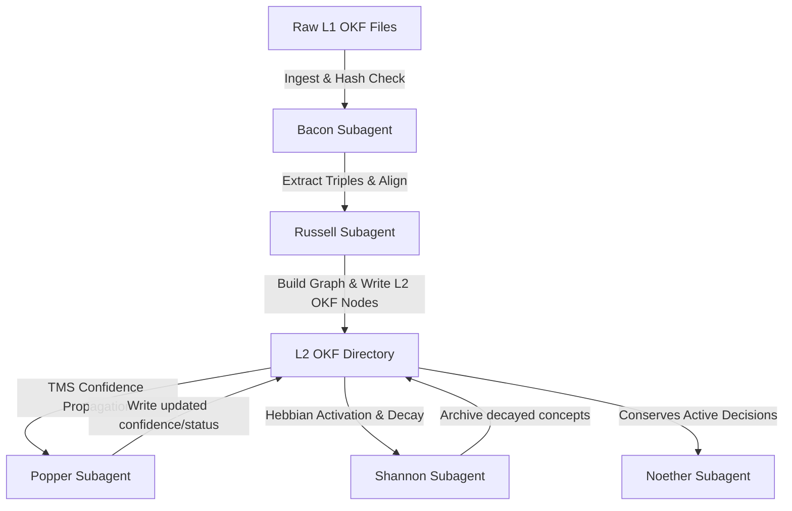

# EP-0120: Open Knowledge Format (OKF) Storage Backend

* **Status**: Draft
* **Author**: Ariel (Persona v5.4.0) & The Architect
* **Created**: 2026-06-17
* **Supersedes**: EP-0103, EP-0114

---

## 1. Context & Motivation

Currently, Tur manages memory at two layers:
1. **L1 Event Logs**: Stored as individual `.yaml` files containing serialized Pydantic memory objects under `.tur/personas/<uuid>/memories/`.
2. **L2 Knowledge Graph**: Compiled by `src/tur/introspection.py` and stored as a centralized, monolithic `knowledge_graph.yaml` containing a serialized NetworkX node-link structure.

While this architecture guarantees consistency and facilitates mathematical operations (such as cycle detection and spreading activation), it lacks **human-editability** and **portability**. A developer cannot easily inspect or surgically modify individual concepts or memory fragments without custom tools.

The **Open Knowledge Format (OKF)** offers a human- and agent-friendly, vendor-neutral structure of markdown files with YAML frontmatter. By adapting Tur to use OKF as its underlying storage medium, we unlock native Git-based tracking, Obsidian/Notion interoperability, and absolute tool agnosticism, while retaining Tur's advanced cognitive safety protocols (TMS, cryptographic validation, and Hebbian pruning).

---

## 2. Proposed Design

We propose representing both L1 and L2 memory layers as a directory tree of OKF-conformant markdown documents.

```
.tur/personas/<uuid>/
├── index.md                      # Bundle Root (Index for Progressive Disclosure)
├── log.md                        # Central Update Log
├── memories/                     # L1 Event Logs (Chrono-Log)
│   ├── active/                   # Uncompacted/New memories
│   │   └── 20260617_090000_fact_a1b2c3d4.md
│   ├── subsumed/                 # Compacted into L2 (read-only history)
│   └── archive/                  # Forgotten/Archived memories
└── concepts/                     # L2 Knowledge Graph
    ├── active/                   # Active nodes in the L2 Cognitive Map
    │   ├── concept-30708713.md
    │   └── concept-df4d3330.md
    └── archive/                  # Decayed/Pruned nodes (confidence <= 0.2)
```

---

## 3. Serialization Schemas

### 3.1 L1 Memories (Event Log)
Each L1 event file is mapped to an OKF Concept.

**File Path**: `memories/active/<timestamp>_<type>_<id>.md`

```markdown
---
type: L1 Memory
title: Memory a1b2c3d4
description: Event: Decomposed the main.py monolith into domain modules.
tags: [refactoring, architecture]
timestamp: 2026-06-08T18:45:00Z
scope: INCARNATION                 # Federated Scope (INCARNATION, UNIVERSAL, USER, PERSONA)
memory_type: FACT                  # Fact, Insight, Axiom, Conjecture
hash: a1b2c3d4e5f6g7h8...          # Cryptographic Merkle Hash
---

Decomposed the monolith 'main.py' into isolated domain modules: user, persona, session, and dreaming.
Removed 'main.py' aggregator. Standardized all CLI script paths.
```

### 3.2 L2 Concepts (Graph Nodes)
Instead of a single `knowledge_graph.yaml`, every node in the L2 graph is represented by its own OKF file.

**File Path**: `concepts/active/concept-<id>.md`

```markdown
---
type: L2 Concept
title: Monolith Decomposition
description: Split main.py into user, persona, session, and dreaming.
tags: [refactoring, code-health]
timestamp: 2026-06-08T18:50:00Z
node_type: Fact                    # Fact, Insight, Decision, Constraint, OpenQuestion
sources:                           # Merkle IDs of source L1 memories
  - a1b2c3d4e5f6g7h8...            
confidence: 1.0                    # Decayed/Hebbian confidence float
retrieval_count: 0                 # Interaction activation count
pinned: false                      # Is this a core constitutional principle?
relations:                         # Typed directed graph edges (Tur specific extension)
  - target: /concepts/active/concept-df4d3330.md
    type: refines
    confidence: 1.0
  - target: /concepts/active/concept-8633d88a.md
    type: depends_on
    confidence: 0.9
---

# Details

The decomposition of `main.py` solidifies our commitment to direct, domain-driven architectures over monolithic delegation. This has decoupled the CLI from MCP server boundaries.

# Citations

[1] [Decomposition Commit](https://github.com/erivlis/tur/commit/abc123xyz)
```

---

## 4. Subagent Adaptations (Cognitive Lifecycle)

To keep Tur's cognitive functionality intact, the subagents in `src/tur/introspection.py` will be refactored to parse and update OKF directories:



### 4.1 Bacon (Ingestion & Verification)
* **Action**: Scans `memories/active/` and `memories/subsumed/`.
* **Validation**: Re-calculates the SHA-256 hash of each file's markdown body + frontmatter attributes to verify cryptographic seals (integrity). Raises `TamperedStateError` if any seal is broken.

### 4.2 Russell (Ontological Extraction)
* **Action**: Receives new L1 documents from Bacon. Calls the Host LLM to extract new concepts.
* **Writing**: Writes a new `.md` file to `concepts/active/` for each newly minted concept. If it merges or updates an existing concept, it appends details to the Markdown body and updates the frontmatter (`sources`, `timestamp`).

### 4.3 Popper (Belief Revision / TMS)
* **Action**: Parses the `relations` block of all active L2 concepts.
* **TMS Logic**: Reconstructs the dependency graph in memory using NetworkX. If a node is marked `superseded` or its confidence decays to `0.0`, Popper recursively updates the frontmatter of all descendant files (linked via `depends_on`) in the directory, marking them `superseded` and resetting their confidence.

### 4.4 Noether (Symmetry Conservation)
* **Action**: Compares the `hash` fields of all active L1 memories under `memories/active/` against the `sources` YAML lists of all active L2 concept files under `concepts/active/`.
* **Symmetry Check**: If any active L1 memory is missing from the L2 graph, Noether raises a `SymmetryError` to prevent loss of context during compaction.

### 4.5 Shannon (Hebbian Decay & Pruning)
* **Action**: Reads the transient `recall_access_log.txt`. Increments the `retrieval_count` in the frontmatter of accessed concept files.
* **Pruning Logic**: For files that weren't accessed, it decrements their `confidence` by `0.1`. If confidence drops to `0.2` or below, Shannon moves the file from `concepts/active/` to `concepts/archive/` (or updates its `status` key to `archived`), deleting any dangling links.

---

## 5. Evaluation: Pros & Cons

### Pros
* **Human-in-the-Loop Curation**: Humans can open Obsidian or a text editor and edit a concept or correct a link directly.
* **Sub-concept Version Control**: Instead of git diffing a massive 150KB single YAML graph, git shows line-by-line history of individual concepts changing.
* **Swarm Readiness**: Multiple agents can read and write separate concept files concurrently with minimal risk of merge conflicts (POSIX atomic file operations limit conflicts to single-file level).
* **Decoupled Search**: External search servers (like Semble) can index the `concepts/` directory directly as a collection of document chunks without custom parsing logic.

### Cons
* **I/O Overhead**: Instead of reading a single `knowledge_graph.yaml` file, Tur must read and parse multiple small markdown files.
* **Synonym Unification Complexity**: Synonyms must be checked by reading and comparing many files, which can be slower than scanning a single NetworkX data structure in memory.
* **Link Validation Latency**: Ensuring reference integrity (preventing broken links) requires scanning all body links across all files, which has a higher complexity than validating a NetworkX edge list.

---

## 6. Migration Strategy

1. **Dual-Backend Phase**: Maintain the NetworkX parser but add an OKF exporter that saves a copy of the graph as a directory of Markdown documents during the introspection compile step.
2. **Read-Through Adapter**: Transition the `topological_recall` in `src/tur/recall.py` to read from the OKF directory if it exists, falling back to `knowledge_graph.yaml`.
3. **Full Deprecation**: Deprecate the centralized `.yaml` graph format once directory traversal speeds are optimized (e.g., using a fast Rust-based parser or caching the NetworkX graph in memory during active sessions).
