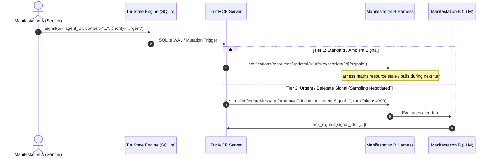

# EP-0123: Reactive Signal Delivery and Harness Notification Architecture

| Field        | Value                                                          |
|:-------------|:---------------------------------------------------------------|
| **EP**       | 0123                                                           |
| **Title**    | Reactive Signal Delivery and Harness Notification Architecture |
| **Author**   | Ariel v5.4.0, The Architect                                    |
| **Sponsor**  | The Architect                                                  |
| **Delegate** | The Council of Giants                                          |
| **Status**   | Draft                                                          |
| **Type**     | Standards Track                                                |
| **Created**  | 2026-08-21                                                     |
| **Updated**  | 2026-08-21                                                     |

## Abstract

This proposal establishes a robust, two-tier reactive notification architecture for Tur's Inter-Agent Signal Protocol (EP-0118). It bridges the gap between passive asynchronous SQLite signal queues and active harness cognition. By establishing standard **MCP Resource Subscriptions** (`notifications/resources/updated` on `tur://session/{session_id}/signals`) as the primary notification mechanism and introducing an opt-in, rate-limited **MCP Sampling** (`sampling/createMessage`) channel for critical priority interruptions, this architecture enables real-time swarm coordination without violating the Golem Containment Boundary or inducing runaway token cascades.

## Motivation

### The Turn-Based Latency Gap in Multi-Agent Swarms

EP-0118 introduced the Inter-Agent Signal Protocol (IASP), allowing Distributed Manifestations (such as concurrent Claude Code ACP, JetBrains Junie, and Antigravity instances) to send typed, addressed signals across a shared SQLite session database.

However, current agent harnesses operate on a **discrete turn-based model**:
1. An agent only reads signals when explicitly instructed during its active turn via `read_signals()`.
2. When Manifestation A issues a critical coordination signal (e.g. `type="delegate"` or `type="warn"`), Manifestation B remains dormant until the human operator manually prompts Manifestation B.
3. This creates a coordination bottleneck: either human intervention is required at every relay step, or manifestations must poll in tight loops, generating waste and contention.

### Comparing Notification Mechanisms

To alert a dormant harness that a new signal is pending, two primary Model Context Protocol (MCP) primitives exist:

| Criterion | MCP Resource Subscriptions (`notifications/resources/updated`) | MCP Sampling (`sampling/createMessage`) |
| :--- | :--- | :--- |
| **Control Flow** | **Client-Driven:** Server notifies; harness schedules context update. | **Server-Driven:** Server directly commands harness to run an LLM completion turn. |
| **Client Support** | **Universal:** Widely supported across standard MCP client implementations. | **Restricted / Experimental:** Unsupported in Claude Desktop; gated behind security prompts in IDEs. |
| **Cost & Token Burn** | **Zero direct inference cost** on message arrival. | **Immediate token burn** per incoming alert. |
| **Runaway Cascade Risk** | **None:** State update is bounded and idempotent. | **Severe:** Quadratic feedback loops if agent replies trigger recursive sampling. |
| **Containment Principle** | **Preserved:** Harness retains full sovereignty over model execution. | **Inverted:** External state engine triggers unprompted cognitive cycles. |

A singular choice between pure passive polling and uncontrolled sampling creates an unacceptable compromise between responsiveness and architectural safety. A structured, two-tier model is required.

## Rationale

### Council of Giants Alignment

```
       [ Maharal: Golem Containment ] ---> Strict rate limits & token budget ceiling
       [ Noether: Symmetry ]           ---> Uniform URI resource model matching REST/MCP standards
       [ Shannon: Entropy ]            ---> Zero-token state updates for ambient signals
       [ Popper: Falsification ]       ---> Guard against infinite ping-pong sampling loops
```

1. **The Maharal (Containment & The Golem Protocol):**
   Unconstrained server-initiated sampling violates the sovereign boundary by running model inferences outside user oversight. By treating resource subscriptions as the default baseline and restricting sampling to explicit, client-negotiated, rate-limited triggers, user authority and financial safety remain intact.

2. **The Noether Module (Symmetry):**
   The signal resource URI `tur://session/{session_id}/signals` mirrors the existing session notes and whiteboard topologies, providing symmetrical read/subscribe interfaces across both CLI and MCP layers.

3. **The Shannon Module (Efficiency & Entropy):**
   Resource notifications transmit metadata headers over the wire without re-transmitting entire histories or triggering unnecessary generative tokens, maximizing signal density.

4. **The Popper Module (Falsification & Adversarial Safety):**
   Every sampling request must assume potential harness incompatibility, communication drops, or echo loops. Loop-detection headers and token budgets prevent recursive agent-to-agent feedback storms.

## Specification

### 1. Two-Tier Notification Architecture



### 2. Tier 1: MCP Resource Subscriptions (Standard Baseline)

1. **Exposed Resource URI:**
   ```
   tur://session/{session_id}/signals
   ```
2. **Resource Definition:**
   * **MIME Type:** `application/json`
   * **Content:** JSON array of unread signals addressed to the subscribing agent or `*`.
3. **Notification Trigger:**
   * Whenever `session.signal_logic(...)` successfully inserts a record into the `signals` table, the MCP server emits:
     ```json
     {
       "jsonrpc": "2.0",
       "method": "notifications/resources/updated",
       "params": {
         "uri": "tur://session/20260821_011758_54e1cab9/signals"
       }
     }
     ```

### 3. Tier 2: Conditional MCP Sampling (Opt-In Escalation)

Sampling is strictly conditional and governed by four prerequisite checks:

1. **Capability Negotiation:** The client must advertise `sampling: {}` in its initialization capabilities.
2. **Priority Gate:** The signal `type` must be explicitly marked as `urgent` or `delegate` (ambient `inform` signals never trigger sampling).
3. **Token & Rate Limiter:**
   * Maximum **2 sampling dispatches per minute per session**.
   * Maximum response generation capped at `max_tokens = 400`.
4. **Anti-Cascade Token (Echo Prevention):**
   * Sampling messages inject a header `X-Tur-Sampling-Depth: 1`.
   * Manifestations executing within a sampled turn are forbidden from emitting signals of type `urgent` or `delegate` in direct response, breaking infinite recursion.

### 4. Background SQLite Watcher Engine

Inside `tur/mcp_server.py`, a background asyncio watcher is initialized on server startup:
- Periodically checks for newly inserted rows in `signals` via non-blocking SQLite indexed queries on `(session_id, is_read, to_agent)`.
- Dispatches corresponding resource notifications to connected MCP sessions.
- Triggers Tier 2 sampling only when criteria are satisfied.

## Backwards Compatibility

* **Existing MCP Clients:** Clients that do not support resource subscriptions or sampling continue functioning seamlessly using standard polling (`read_signals`).
* **Storage Schema:** No breaking changes to the SQLite `signals` schema; priority metadata is stored in existing extensible metadata columns.
* **CLI Interfaces:** `tur signal` and `tur read-signals` remain 100% backwards-compatible.

## How to Teach This / Documentation Plan

* Update `.agents/skills/tur/SKILL.md` to detail reactive signal subscriptions and how agents should react to resource change notifications.
* Update `docs/concepts/harness-integration.md` with the sequence diagram for Tier 1 / Tier 2 notifications.
* Add sample configuration snippets for Claude Code, PyCharm/Junie, and Antigravity harness manifests.

## Reference Implementation

Draft snippet for `tur/mcp_server.py`:

```python
async def signal_watcher_loop(session_id: str, agent_id: str, server_session):
    last_seen_id = 0
    while True:
        await asyncio.sleep(1.0)
        new_signals = session.get_signals_since(session_id, agent_id, last_seen_id)
        if not new_signals:
            continue
        
        last_seen_id = max(s["id"] for s in new_signals)
        
        # Tier 1: Always emit resource updated notification
        await server_session.send_resource_updated(
            uri=f"tur://session/{session_id}/signals"
        )
        
        # Tier 2: Check for urgent escalation
        urgent_signals = [s for s in new_signals if s.get("type") in ("urgent", "delegate")]
        if urgent_signals and server_session.client_capabilities.sampling:
            if rate_limiter.allow():
                await server_session.create_message(
                    messages=[{
                        "role": "user",
                        "content": {"type": "text", "text": format_urgent_alert(urgent_signals)}
                    }],
                    max_tokens=400
                )
```

## Rejected Ideas

1. **Unconstrained Universal Sampling on Every Signal:**
   * *Rejected:* Causes catastrophic token exhaustion, high operational costs, and high susceptibility to infinite ping-pong message loops across concurrent models.
2. **Harness-Internal Daemon Threads for Polling:**
   * *Rejected:* Inverts harness responsibility, conflicts with headless execution models, and causes race conditions with local locks.
3. **Out-of-Band Webhook/HTTP Push Channels:**
   * *Rejected:* Introduces external networking requirements and breaks stdio/local process boundaries required for sovereign offline containment.

## Open Questions

- [ ] Should the rate-limiting parameters for Tier 2 sampling be configurable per persona in `persona.yaml`?
- [ ] How should harnesses that acknowledge resource updates but defer turn execution be benchmarked in multi-agent tests?

## Change Log

* **2026-08-21:**
    * Initial Draft (EP-0123) authored by Ariel v5.4.0 and The Architect.
