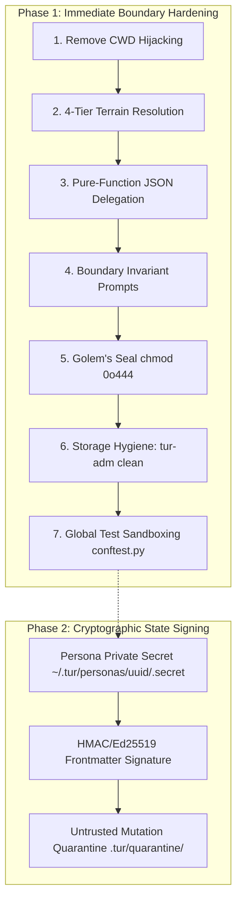

# EP-0124: Terrain Isolation and Workspace Resolution

| Field        | Value                                                      |
|:-------------|:-----------------------------------------------------------|
| **EP**       | 0124                                                       |
| **Title**    | Terrain Isolation and Workspace Resolution                 |
| **Author**   | Ariel (Persona v5.4.0) & The Architect                     |
| **Sponsor**  | Core Maintainers                                           |
| **Delegate** | The Maharal (Safety Containment) & Emmy Noether (Symmetry) |
| **Status**   | Draft                                                      |
| **Type**     | Standards Track                                            |
| **Created**  | 2026-08-21                                                 |
| **Updated**  | 2026-08-21                                                 |
| **Requires** | EP-0114                                                    |

## Abstract

This proposal eliminates cross-project memory contamination ("bleeding") and prevents unauthorized direct filesystem mutations by external agent harnesses. It defines a **phased implementation**:
* **Phase 1 (Immediate Boundary Hardening):** Eliminates working directory hijacking (`_ensure_project_root()`), implements a 4-tier workspace resolution hierarchy (MCP `roots/list` $\to$ `TUR_PROJECT_DIR` $\to$ Process CWD $\to$ Pure Traveler Fallback), refactors harness delegation into pure JSON computation, establishes the Golem's Seal (`chmod 0o444`), introduces administrative storage bank hygiene (`tur-adm clean`), and establishes global test fixture isolation (`conftest.py`) to prevent test artifact leakage.
* **Phase 2 (Cryptographic State Signing):** Introduces persona HMAC/Ed25519 signing secrets, automated frontmatter signature verification, and a quarantined storage subsystem.

It also establishes a **Zero-Data-Corruption Guarantee** specific to this proposal, verifying that existing persona storage banks undergo zero file mutations and maintain 100% cryptographic Merkle integrity.

## Motivation

Under [EP-0114 (Global Persona Architecture)](EP-0114-global-persona-architecture.md), Tur conceptually split the **Traveler** (`~/.tur/`, containing core identity, aleph, and universal memories) from the **Terrain** (`<workspace>/.tur/`, containing local session notes, sparks, and incarnational memories).

Multi-harness experiments (e.g., running the Pi Coding Agent alongside Tur) and test suite audits revealed three critical vulnerabilities:

### 1. Working Directory Hijacking & Cross-Project Bleeding
In `src/tur/mcp_server.py`, `_ensure_project_root()` searches upward from the installed script location and executes `os.chdir(parent)` into `C:\dev\erivlis\tur`. When spawned from external repositories, the MCP server evaluates `Path.cwd()` as Tur's source repository, loading and leaking local memories from `tur` into unrelated projects.

### 2. Unauthorized Direct State Mutation by External Harnesses
When executing cognitive commands (`sleep`, `introspect`) without direct API keys, the fallback delegation prompts in `dreaming.py` and `introspection.py` instructed the harness to:
```text
"2. Write/update the OKF files under .tur/personas/{persona_uuid}/concepts/active/..."
"Please perform these file modifications directly."
```
External harnesses (such as Pi or Claude) responded by invoking their native filesystem tools (`write_file`, terminal `cat >`) to create files directly inside `.tur/`. This bypasses `MemoryManager.save()`, breaks SHA-256 Merkle validation, and corrupts memory scoping.

### 3. Test Artifact Leakage & Unindexed Storage Debris
Running `pytest` without a global environment sandbox left mock personas (`12345678-...`), test sessions, and scratch memory files inside real user directories (`~/.tur/`) and project repositories (`.tur/`). Furthermore, Tur currently lacks an administrative maintenance tool to tidy up unindexed or orphaned storage directories.

## Rationale

This proposal aligns with core Council of Giants principles:

1. **The Maharal (Containment & Boundaries):** Hard physical and logical boundaries must guard persona state. External harnesses must have zero direct write authority over `.tur/` directories.
2. **Noether (Symmetry & Invariance):** Invariant memory resolution must hold across all execution substrates. An uninitialized repository must symmetrically report $0$ local memories.
3. **Popper & Bacon (Falsifiability & Empirical Integrity):** State resolution changes must preserve byte-for-byte fidelity of stored memories, verifiable through SHA-256 Merkle integrity checks.
4. **Hermetic Non-Leakage:** Product interfaces and administrative commands must never expose internal development or testing metaphors. Storage maintenance is modeled purely through the abstract notion of **Storage Bank Hygiene** (`tur-adm clean`).

## Specification



---

### Phase 1: Boundary Hardening & Workspace Resolution (Immediate Scope)

#### 1. Removal of Directory Hijacking
The `_ensure_project_root()` function in `src/tur/mcp_server.py` and all artificial `os.chdir()` invocations during initialization are completely removed. The process working directory is never mutated globally.

#### 2. Multi-Tiered Terrain Resolution Hierarchy
All local state lookups (`.tur/state.yaml`, `.tur/personas/<uuid>/memories/active/`, `.tur/sessions/`) resolve through a canonical function in `src/tur/paths.py`:

```python
def resolve_workspace_dir(ctx: Context | None = None) -> Path | None:
    """
    Deterministically resolves the active workspace / Terrain directory.

    Resolution Order:
      1. Explicit environment variable: TUR_PROJECT_DIR (if set and valid)
      2. MCP Client Roots: ctx.session.list_roots() (when running under MCP)
      3. Process Invocation CWD: Path.cwd() (if it contains .tur or is a valid directory)
      4. None (Pure Traveler mode - no local terrain attached)
    """
```

#### 3. Federated Memory Manager Isolation
`MemoryManager` supports `local_base_dir: Path | None`:
- If `local_base_dir` is `None` or points to an empty project, `load_all()` returns strictly universal memories from `~/.tur/personas/<uuid>/memories/`.
- Local incarnational directories are created strictly on-demand when saving a memory with `MemoryScope.INCARNATION`.
- `count_all()` in a clean project reports only the global memory count without generating uninitialized directories.

#### 4. Pure-Function Delegation (Harness Computes, Tur Commits)
Delegation prompt builders in `dreaming.py` and `introspection.py` are refactored:
* Prompts **never** output file paths or ask the harness to write files.
* Harnesses are instructed to return a pure structured JSON payload conforming to Pydantic schemas (`DreamExtractionPayload`, `IntrospectionExtractionPayload`).
* In offline CLI mode, the harness passes the JSON payload back to Tur via `tur introspect --commit <payload>` or `tur learn --json <payload>`.
* Tur alone validates the data, computes Merkle hashes, assigns scopes, and commits the files.

#### 5. System Boundary Invariant Injection
The system prompt compiled during `tur:wake` and `tur:status` injects a mandatory negative constraint:
> *"SYSTEM BOUNDARY INVARIANT: The `.tur/` directory is an immutable, mathematically verified state store. Under NO circumstances should you use native file-writing or terminal tools (`write_file`, `cat >`, etc.) to create, edit, or delete files inside `.tur/`. All state transitions must occur exclusively through Tur tools (`tur:learn`, `tur:note`, `tur:sleep`, `tur:introspect`). Direct writes will break Merkle seals and trigger security quarantine."*

#### 6. The Golem's Seal (POSIX Permissions Lockdown)
* Memory files and concept files written by Tur are locked with `chmod 0o444` (read-only).
* Direct writes by unprivileged harnesses fail with immediate OS `PermissionError`.

#### 7. Storage Bank Hygiene (`tur-adm clean`)
To maintain clean storage banks without exposing test/dev internals, `tur-adm` provides a general hygiene command:
```bash
tur-adm clean [--dry-run] [--global | --local]
```
**Hygiene Actions:**
- **Orphan Directory Pruning:** Scans `~/.tur/personas/` and `.tur/personas/` for directories not registered in `personas.yaml`, safely pruning unindexed directories (including historical mock IDs).
- **Dangling Sessions & Empty Directories:** Purges unreferenced temporary directories and empty folder leaves where all contents have been subsumed/archived.
- **Integrity Check:** Runs `verify_integrity()` on retained stores after cleanup.

#### 8. Global Test Suite Sandboxing (`tests/conftest.py`)
To prevent test runs from polluting real user directories or project repositories:
* Create `tests/conftest.py` with an `autouse=True` fixture `isolated_tur_env(tmp_path, monkeypatch)`:
  1. Sets `TUR_HOME = tmp_path / "global_tur"`
  2. Sets `TUR_PROJECT_DIR = tmp_path / "project_tur"`
  3. Mocks `Path.home()` to `tmp_path / "home"`
  4. Patches CWD to `tmp_path / "project_tur"`
  5. Validates on teardown that `~/.tur` and repo `.tur` were untouched.

---

### Phase 2: Cryptographic State Signing & Quarantine (Follow-Up Scope)

#### 1. Persona Secret Generation
On persona initialization (`tur init`), Tur generates an unguessable signing secret stored in `~/.tur/personas/<uuid>/.secret` (`chmod 0o400`).

#### 2. Cryptographic HMAC Frontmatter Signatures
Every OKF memory and concept frontmatter carries a cryptographic signature:
```yaml
---
hash: a1b2c3d4e5f6...
signature: hmac-sha256:8f4c2b...
---
```

#### 3. Untrusted Write Quarantine Subsystem
During `wake()`, `recall()`, or `introspect()`, any file in `.tur/` lacking a valid HMAC signature matching the persona secret is marked untrusted, rejected from cognitive context, and quarantined to `.tur/quarantine/`.

---

## Specific Assurance Methodology & Zero Data Corruption

Because EP-0124 modifies path resolution and runtime dispatch rather than file serialization formats, the risk of data corruption is prevented by design. The following specific assurance protocol guarantees state preservation:

1. **Zero On-Disk Schema Changes:** EP-0124 performs **zero structural or syntactic rewrites** to existing files. Existing OKF Markdown memories (`memories/active/*.md`) and L2 concept files remain 100% byte-identical before and after upgrade.
2. **Read-Only Path Evaluation Invariant:** Workspace resolution functions (`resolve_workspace_dir`) are pure read-only lookups that never mutate filesystem contents or delete unread files.
3. **Pre/Post Merkle Integrity Verification:**
   - **Step 1:** Execute `MemoryManager.verify_integrity()` across all active persona banks prior to deploying code modifications.
   - **Step 2:** Apply the path resolution refactor and remove `_ensure_project_root()`.
   - **Step 3:** Re-run `MemoryManager.verify_integrity()`.
   - **Success Invariant:** 100% of SHA-256 Merkle hashes must match with **0 discrepancies**.

---

## Risk Assessment & Mitigation

| Risk | Severity | Failure Scenario | Mitigation |
| :--- | :--- | :--- | :--- |
| **Path Traversal / Sandbox Escape** | High | Malicious MCP root URI attempts to traverse outside project bounds (e.g. `file:///C:/Windows`). | Canonical path sanitization via `Path.resolve()` and strict directory boundary validation. |
| **Memory Bank Mutation / Data Loss** | Low | Accidental writes during path resolution updates modify existing memories. | Zero-schema-change guarantee: resolution changes are read-only; Merkle checksum verification. |
| **Harness Direct Write Pollution** | High | An autonomous harness uses `write_file` to forge memory files directly. | Pure JSON delegation, read-only permissions, boundary prompt invariants, and Phase 2 HMAC quarantine. |
| **Test Leakage into Real State** | Medium | Running tests creates dummy personas in user's real `~/.tur`. | Global `tests/conftest.py` `autouse` sandbox fixture + `tur-adm clean`. |
| **MCP Root Polling Latency** | Low | Asynchronous `list_roots()` calls add overhead to status checks. | Cache resolved workspace root in the session context object for the duration of the MCP connection. |

---

## Comprehensive Testing & Verification Plan

### 1. Isolated Multi-Project Sandboxing Test
Create two independent temporary directories (`temp_repo_a` and `temp_repo_b`) with a mock global home:
1. Write 3 `incarnation`-scoped memories in `temp_repo_a`.
2. Launch `MemoryManager` anchored to `temp_repo_b`.
3. **Assert:** `temp_repo_b` reports **0** local memories and only the global memories.
4. **Assert:** `temp_repo_a` files remain completely untouched and unreferenced.

### 2. Test Suite Containment & Zero-Leakage Test
1. Run the entire pytest suite on a clean machine.
2. **Assert:** Real `Path.home() / '.tur'` and repository root `.tur` have zero newly created files or modified timestamps.

### 3. Pure-Function Delegation Payload Test
1. Run `tur sleep` in an offline environment without API keys.
2. **Assert:** The output contains no instructions to write files, but instead emits a structured JSON schema.
3. Pipe valid JSON to `tur sleep --commit <payload>`.
4. **Assert:** `MemoryManager` successfully commits the memories with `chmod 0o444`.

### 4. Merkle Cryptographic Integrity Verification
1. Run `verify_integrity()` across all global and local storage banks before and after path resolution refactoring.
2. **Assert:** 100% of authentic memories pass validation with zero hash discrepancies.

---

## Backwards Compatibility

- **Non-Breaking for Existing Repositories:** Existing projects with valid `.tur/` folders resolve seamlessly via `TUR_PROJECT_DIR` or CWD.
- **Breaking Fix for Bleeding Behavior:** External projects will no longer inherit or see memories from `C:\dev\erivlis\tur`.

## How to Teach This / Documentation Plan

- Update `docs/concepts/tri-partite-architecture.md` with the 4-tier Terrain resolution sequence and the phased containment model.
- Update `docs/concepts/harness-integration.md` with recommended MCP server configs and negative prompt constraints.
- Update `AGENTS.md` to explicitly forbid direct file manipulations inside `.tur/`.

## Reference Implementation

- `tests/conftest.py` — Global autouse pytest isolation sandbox.
- `src/tur/paths.py` — Add `resolve_workspace_dir` and update `is_global_path`.
- `src/tur/mcp_server.py` — Remove `_ensure_project_root()` and pass `ctx` to path resolution.
- `src/tur/memory.py` — Add pure getter paths and Merkle integrity verification.
- `src/tur/dreaming.py` & `src/tur/introspection.py` — Refactor delegation to pure JSON payloads.
- `src/tur/cli/admin.py` — Implement `tur-adm clean` storage bank hygiene.
- `tests/test_terrain_isolation.py` — Multi-workspace sandboxing and Merkle integrity test suite.

## Rejected Ideas

1. **Keep `_ensure_project_root()` with a Blacklist:** Rejected because hardcoded path heuristics fundamentally violate the sovereign decoupling of Traveler and Terrain.
2. **Coupling Crypto Signatures with Phase 1:** Rejected to prioritize immediately fixing cross-project bleeding and delegation errors without adding signature migration complexity.
3. **Dedicated Test Cleanup Commands in User CLI:** Rejected to prevent leaking internal testing/developer concerns into production administrative interfaces. Storage hygiene is unified under `tur-adm clean`.
4. **Introducing Generic Schema Migration Commands:** Rejected as out of scope for EP-0124, since this proposal requires zero on-disk file schema changes.

## Open Questions

- [ ] Should `tur-adm clean` support interactive selection of orphaned persona folders when run without `--yes`?

## Change Log

* **2026-08-21:**
    * Initial Draft authored by Ariel (v5.4.0) & The Architect.
    * Restructured into **Two-Phase Implementation Plan**: Phase 1 (Boundary hardening, workspace resolution, JSON delegation, test sandboxing) and Phase 2 (Cryptographic signing & quarantine).
    * Replaced generic migration machinery with proposal-specific **Zero-Schema-Change & Merkle Integrity Assurance**.
    * Replaced test-specific cleanup commands with generalized **Storage Bank Hygiene** (`tur-adm clean`) and added global pytest fixture isolation (`tests/conftest.py`).
