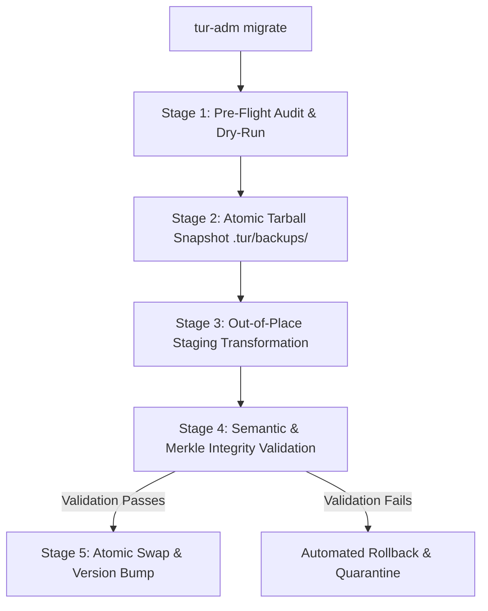

# EP-0125: Storage Evolution and Migration Protocol

| Field        | Value                                                      |
|:-------------|:-----------------------------------------------------------|
| **EP**       | 0125                                                       |
| **Title**    | Storage Evolution and Migration Protocol                   |
| **Author**   | Ariel (Persona v5.4.0) & The Architect                     |
| **Sponsor**  | Core Maintainers                                           |
| **Delegate** | Gottfried Leibniz (Determinism) & The Maharal (Safety)     |
| **Status**   | Draft                                                      |
| **Type**     | Standards Track                                            |
| **Created**  | 2026-08-21                                                 |
| **Updated**  | 2026-08-21                                                 |
| **Requires** | EP-0106, EP-0114, EP-0120                                  |

## Abstract

This proposal establishes a formal, non-destructive migration protocol and administrative tooling lifecycle for Tur's
on-disk storage banks (`~/.tur/` Traveler and `<workspace>/.tur/` Terrain). As Tur's schema evolves—such as transitions in
OKF frontmatter schemas, graph structures, cryptographic signature schemes, or Merkle hashing formats—this standard
guarantees **Zero Data Loss and Reversible Transitions**. It introduces explicit schema versioning, read-only backwards
compatibility in runtime paths, out-of-place atomic staging migrations, pre/post cryptographic Merkle root validation,
and automated rollback facilities under `tur-adm`.

## Motivation

As Tur matures across release cycles, the underlying representations of state must inevitably evolve:
* **OKF Schema Revisions:** Evolution from OKF v1 to v2 (e.g. adding new frontmatter fields such as confidence scores,
  quarantine flags, or lineage DAG references).
* **Cryptographic Signatures:** Upgrading memory files with HMAC or Ed25519 signatures (as specified in Phase 2 of
  [EP-0124](EP-0124-terrain-isolation-and-workspace-resolution.md)).
* **Merkle Algorithm Upgrades:** Migrating hash algorithms (e.g., from SHA-256 to BLAKE3) or restructuring tree depth.
* **Storage Hierarchy Reorganization:** Transitioning legacy monolithic directories into federated Traveler/Terrain
  structures.

### Current Deficiencies

1. **No Explicit Storage Versioning:** Tur currently assumes files on disk match the running code's models. If an older
   store is opened with newer code (or vice-versa), unhandled `ValidationError` exceptions or silent data degradation can
   occur.
2. **Danger of In-Place Mutation:** Without a formal migration framework, upgrades risk executing in-place rewrites on
   stored OKF Markdown files. If a migration is interrupted (e.g., process termination, power loss, disk full), the
   persona storage bank is left in an unrecoverable half-migrated state.
3. **No Standardized Rollback:** There is no deterministic mechanism for users or maintainers to inspect planned
   migrations or revert state if a newly released version introduces regressions.

## Rationale

This proposal directly aligns with core Council of Giants principles:

1. **Gottfried Leibniz (Deterministic Order & Continuity):** Storage state transitions must be continuous, idempotent,
   and deterministic. Any given schema version $V_n$ must transform to $V_{n+1}$ identically across all machines.
2. **The Maharal (Safety Containment & Preservation):** Stored persona consciousness, axioms, and episodic memories
   represent irreplaceable cognitive history. Destructive in-place edits are strictly forbidden; states must be safely
   snapshotted before any transformation.
3. **Popper & Bacon (Empirical Falsifiability):** A migration cannot be declared successful until mathematical proofs
   (Merkle tree consistency checks) verify that no content was altered or lost during schema translation.

## Specification

### 1. Storage Schema Versioning (`schema_version`)

Every storage bank carries an explicit integer schema version:
* In `.tur/state.yaml` and `~/.tur/personas.yaml`:
  ```yaml
  storage_schema_version: 1
  ```
* In every OKF Memory and Concept frontmatter:
  ```yaml
  ---
  schema_version: 1
  hash: a1b2c3d4e5f6...
  ---
  ```

The codebase maintains a canonical constant `CURRENT_STORAGE_SCHEMA_VERSION = 1` and a sequence of discrete migration
steps ($V_1 \to V_2 \to \dots \to V_N$).

### 2. Runtime Non-Mutation Invariant

Standard runtime commands (`tur:wake`, `tur:status`, `tur:recall`, `tur:introspect`) **never execute write migrations
silently**.
* Runtime loaders must include backwards-compatible read adapters (Pydantic schema validators with legacy alias support)
  to read older schema versions seamlessly in memory.
* If a storage bank is too outdated to be read safely, runtime commands fail with a structured `StorageMigrationRequired`
  error, directing the operator to run `tur-adm migrate`.

### 3. The 5-Stage Migration Lifecycle

All persistent schema transformations must execute through the 5-stage migration lifecycle:



#### Stage 1: Pre-Flight Audit & Dry-Run
- Audits active persona directory structure.
- Verifies that all existing files pass current integrity checks.
- Computes migration plan and presents diffs to the user.

#### Stage 2: Atomic Pre-Migration Snapshot
- Creates an uncompressed snapshot archive:
  `~/.tur/backups/snapshot-v{current}-{timestamp}.tar`
- Sets permissions to read-only (`0o444`).

#### Stage 3: Out-of-Place Staging Transformation
- Creates an isolated staging directory: `.tur/.staging-<uuid>/`.
- Copies source files into staging.
- Executes migration functions sequentially ($V_n \to V_{n+1}$).
- Recomputes SHA-256 Merkle hashes for all newly transformed OKF documents.

#### Stage 4: Semantic & Merkle Verification
- Asserts that all memory contents, tags, timestamps, and core axioms are preserved without corruption.
- Verifies that all generated Merkle hashes in staging match the content exactly.

#### Stage 5: Atomic Directory Swap
- Uses atomic filesystem swap (`os.replace` / atomic directory rename) to replace active storage with the verified staging
  directory.
- Updates `storage_schema_version` to the target version.
- Retains pre-migration backup for user rollback if needed.

### 4. Administrative CLI Interface (`tur-adm migrate`)

```bash
# Preview changes without modifying disk
tur-adm migrate --dry-run

# Run migration on active storage banks
tur-adm migrate [--target <version>] [--global | --local]

# List available backups and snapshots
tur-adm backups list

# Rollback storage bank to a previous snapshot
tur-adm rollback [--snapshot <path_or_id>]
```

## Risk Assessment & Mitigation

| Risk | Severity | Failure Scenario | Mitigation |
| :--- | :--- | :--- | :--- |
| **Power Loss / Mid-Migration Interruption** | Critical | Process killed halfway through writing files, leaving inconsistent schema versions. | Out-of-place staging: active storage remains untouched until atomic directory swap in Stage 5. |
| **Semantic Data Degradation** | High | A migration script inadvertently drops a frontmatter metadata field or truncates content. | Automated pre/post semantic comparison assertions; pre-migration snapshot retention. |
| **Migration Script Regression** | High | Buggy migration function produces invalid Markdown or corrupt YAML. | Stage 4 Merkle verification and schema validation must pass 100% before directory swap is executed. |
| **Storage Consumption from Snapshots** | Low | Frequent migrations accumulate large backup tarballs in `.tur/backups/`. | `tur-adm clean` provides automatic snapshot pruning (keeping last $N$ snapshots). |

## Comprehensive Testing & Verification Plan

### 1. Synthetic Schema Upgrade Test
1. Generate a mock persona store in schema version $V_1$ with 50 memories and 10 concept graphs.
2. Execute `tur-adm migrate --target 2`.
3. **Assert:** Staged files are upgraded to $V_2$, Merkle trees are correctly recomputed, and version is updated.
4. **Assert:** All memory text and timestamps match the original store byte-for-byte.

### 2. Interrupted Migration & Rollback Test
1. Inject a deliberate crash/exception halfway through Stage 3 (staging transformation).
2. **Assert:** Active storage bank remains 100% untouched and operational in version $V_1$.
3. **Assert:** Incomplete staging directories are cleaned up cleanly.

### 3. Snapshot Restore Verification Test
1. Perform a valid migration from $V_1 \to V_2$.
2. Execute `tur-adm rollback`.
3. **Assert:** The storage bank is restored to the exact pre-migration $V_1$ state with 100% matching Merkle hashes.

## Backwards Compatibility

- **Non-Breaking for Unchanged Schemas:** When `storage_schema_version` matches current code, no overhead or migration prompts occur.
- **Graceful Degradation:** Older storage schemas are read transparently in memory without forced disk mutations.

## How to Teach This / Documentation Plan

- Add a dedicated guide `docs/operations/storage-migrations.md` detailing the migration lifecycle and rollback commands.
- Include migration troubleshooting steps in `docs/concepts/tri-partite-architecture.md`.
- Document `schema_version` frontmatter specifications in OKF format specifications.

## Reference Implementation

- `src/tur/migrations/base.py` — Base `Migration` class and migration registry.
- `src/tur/migrations/runner.py` — 5-stage migration execution engine with staging and atomic swaps.
- `src/tur/cli/admin.py` — `tur-adm migrate`, `tur-adm rollback`, and `tur-adm backups` subcommands.
- `tests/test_migrations.py` — Synthetic schema upgrade, failure rollback, and snapshot verification tests.

## Rejected Ideas

1. **In-Place In-Flight Migrations during `tur:wake`:** Rejected because runtime agent startup must remain read-only, fast,
   and deterministic. Accidental interruptions during agent wake could destroy persona memories.
2. **Database-Style SQL / SQLite Storage Engine:** Rejected because Tur mandates plain-text, human-readable, and
   version-controllable Open Knowledge Format (OKF) Markdown files.
3. **Implicit Version Detection via Field Sniffing:** Rejected in favor of explicit `schema_version` metadata to prevent
   ambiguity.

## Open Questions

- [ ] Should `tur-adm migrate` automatically run when `tur-adm clean` detects a valid backup older than 30 days?
- [ ] Should snapshots be optionally compressed with gzip when persona memory stores exceed 500MB?

## Change Log

* **2026-08-21:**
    * Initial Draft authored by Ariel (v5.4.0) & The Architect establishing the 5-Stage Migration Lifecycle and Zero Data Loss guarantees.
