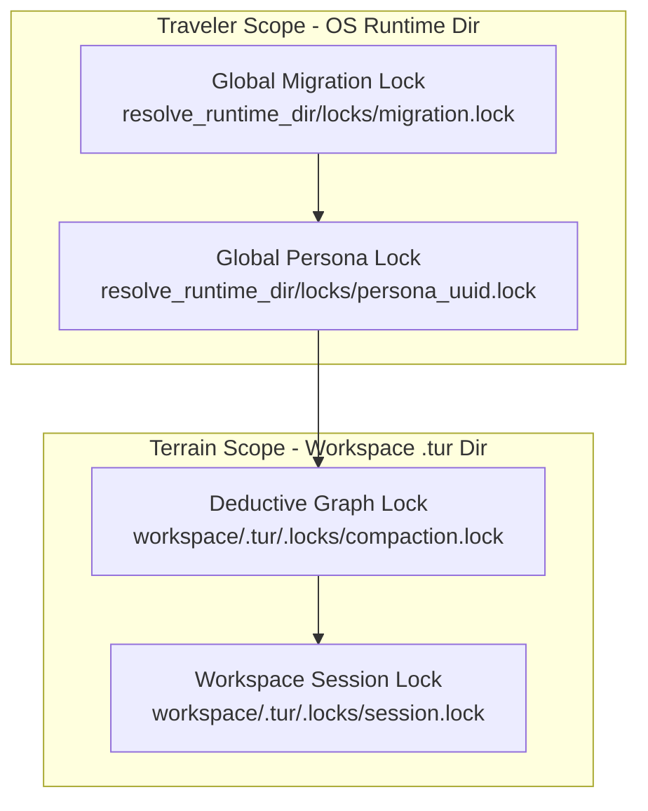

# EP-0129: Multi-Process State Synchronization and File Locking Architecture

| Field       | Value                                                             |
|:------------|:------------------------------------------------------------------|
| **EP**      | 0129                                                              |
| **Title**   | Multi-Process State Synchronization and File Locking Architecture |
| **Author**  | Eran Rivlis & Ariel                                               |
| **Status**  | Implemented                                                       |
| **Type**    | Standards Track                                                   |
| **Created** | 2026-08-25                                                        |
| **Updated** | 2026-08-25                                                        |

## Abstract

This proposal specifies the integration of the zero-dependency [`filelock`](https://github.com/tox-dev/filelock)
library into Tur's core runtime. While atomic file replacement (`os.replace`) ensures individual file integrity, it
cannot prevent read-modify-write race conditions when multiple agent harnesses (e.g., Claude Code, Gemini CLI, Cursor)
access or mutate shared persona indices, session notes, and memory graphs concurrently. This proposal establishes a
two-tiered advisory file-locking architecture that synchronizes multi-process state transitions across both workspace
terrain and global persona boundaries.

## Motivation

As Tur transitions into a multi-agent symbiote (EP-0107, EP-0118, EP-0123), concurrent execution by multiple AI
harnesses operating on the same repository or persona is standard. Tur currently protects state writes using POSIX
atomic renames (`os.replace` via temporary files per EP-0106 and EP-0120).

However, atomic replacement only guarantees that a reader never sees a half-written file; it provides **zero transaction
isolation for read-modify-write sequences**:

1. **Index Overwrite Clashing:** If Agent A and Agent B simultaneously call `note()`, both read `sessions.yaml` at
   timestamp $T_0$. Agent A appends Note A and atomically writes to disk. Milliseconds later, Agent B appends Note B to
   its stale in-memory index and atomically replaces the file— **silently clobbering Note A**.
2. **Storage Migration Collisions (EP-0125):** If an administrator or automated process initiates a 5-stage migration
   (`tur-adm migrate`), an active MCP server could write new L1 events into the legacy schema mid-flight, corrupting the
   atomic staging directory.
3. **Graph Compaction Races (EP-0103, EP-0119):** Two concurrent instances initiating deductive memory compaction
   simultaneously can produce competing topological node graphs and redundant Merkle calculations.

To make Tur genuinely swarm-safe and crash-resilient across Linux, macOS, and Windows, Tur requires a standardized,
cross-platform advisory file locking mechanism.

## Rationale

### Council Alignment

* **The Golem Protocol (Containment & Integrity):** Prevents silent data clobbering and state corruption across
  distributed agent processes, ensuring that the system fails gracefully with explicit timeouts rather than corrupted
  memory.
* **The Noether Module (Symmetry & Invariance):** `filelock` maps cleanly to native OS primitives (`msvcrt.locking` on
  Windows, `fcntl.flock` on POSIX), presenting an identical, symmetrical locking API regardless of host platform.
* **The Shannon Module (Efficiency):** `filelock` is pure Python, zero-dependency, and lightweight (<100 KB). Its
  configurable polling intervals and timeout controls eliminate CPU spinning while minimizing lock contention latency.
* **The Steward Principle (Harmony & Pragmatism):** Adopting the standard, battle-tested library maintained by the
  PyPA/tox-dev ecosystem avoids rolling fragile, ad-hoc PID files or platform-specific locking shims.

### Architectural Trade-off Analysis: Why `filelock` Over Alternatives

| Library                         | OS Mechanism Used                              | Best For                                    | Pros                                                                        | Cons / Verdict for Tur                                                                       |
|:--------------------------------|:-----------------------------------------------|:--------------------------------------------|:----------------------------------------------------------------------------|:---------------------------------------------------------------------------------------------|
| **`tox-dev/filelock`**          | `fcntl.flock` (POSIX) / `msvcrt.locking` (Win) | Local multi-process synchronization.        | Zero dependencies, pure Python, sidecar file preserves `os.replace` safety. | **Selected:** Optimal match for local state and atomic writes.                               |
| **`portalocker`**               | `fcntl.flock` (POSIX) / `pywin32` API (Win)    | Direct file locking with shared read locks. | Supports `LOCK_SH` (shared reads).                                          | **Rejected:** Collides with atomic `os.replace`; requires heavy `pywin32` binary on Windows. |
| **`fasteners`**                 | `fcntl.flock` (POSIX) / `msvcrt` (Win)         | Mixed thread + process pipelines.           | Advanced inter-process + inter-thread locks.                                | **Rejected:** Unnecessary API complexity; higher dependency overhead.                        |
| **`flufl.lock`**                | NFS-safe `link(2)` & `stat(2)`                 | NFS / Cloud-mounted network shares.         | Survives network node reboots.                                              | **Rejected:** Tur runs on local filesystems; NFS lease overhead is unnecessary.              |
| **Stdlib (`fcntl` / `msvcrt`)** | Raw OS system calls                            | Zero pip dependencies.                      | Built-in to Python.                                                         | **Rejected:** Requires maintaining custom platform-branching wrapper code.                   |

### The Inode / Handle Replacement Hazard (Why Direct-File Locking Fails with `os.replace`)

Tur strictly mandates **POSIX atomic file replacement** (`temp_file.replace(target_file)` per EP-0106 and EP-0120) to
prevent partial-file corruption. Attempting to lock the target data file directly (the `portalocker` approach) produces
severe cross-platform hazards:

1. **Windows File Handle Collision:** On Windows, locking an open file descriptor creates an exclusive lock on that
   handle. A concurrent `os.replace(temp, target)` fails immediately with `PermissionError: [WinError 32] The process
   cannot access the file because it is being used by another process`.
2. **POSIX Inode Invalidation:** On POSIX systems, `os.replace` changes the directory entry to a new inode. Any other
   process holding an open descriptor on the target file retains a lock on the *old unlinked inode*, completely breaking
   synchronization for subsequent processes opening the new inode.
3. **The Sidecar Solution:** By applying native OS locks to an independent tracker file (`.tur/.locks/session.lock`),
   the lock target's inode and handle remain permanently stable. The underlying data file (`sessions.yaml`) can be
   safely swapped atomically underneath without lock collisions.

### Why Shared Read Locks (`LOCK_SH`) Are Unnecessary in Tur

While `portalocker` offers shared read locks (`LOCK_SH`), Tur's architecture does not require reader locks:

* **Merkle L1 memories are immutable:** Individual memory nodes (`.tur/memories/L1/*.md`) are content-addressed and
  write-once, allowing safe lock-free concurrent streaming.
* **Index mutations are sub-millisecond:** Reading `sessions.yaml`, appending an episodic note, and executing
  `os.replace` completes in <2ms, making short exclusive lock acquisitions imperceptible to parallel agents.

## Specification

### 1. Core Dependency (`pyproject.toml`)

Add `filelock` to core `dependencies`:

```toml
[project]
dependencies = [
    "typer>=0.12.0",
    "pydantic>=2.6.0",
    "jinja2>=3.1.0",
    "pyyaml>=6.0.0",
    "rich>=13.0.0",
    "networkx>=3.6",
    "platformdirs>=4.2.0",
    "filelock>=3.14.0",
]
```

### 2. Two-Tiered Locking Hierarchy & Deadlock Invariant

File locks are partitioned cleanly along the Traveler vs. Terrain architectural boundary:



1. **Workspace Terrain Locks (`<workspace>/.tur/.locks/`):**
    - `session.lock`: Serializes updates to `sessions.yaml`, session notes, and short-term L1 episodic logs.
    - `compaction.lock`: Serializes execution of `introspect` / `sleep` memory graph consolidation.
2. **Global Traveler Locks (`resolve_runtime_dir() / "locks" /` per EP-0128):**
    - `<persona_id>.lock`: Serializes modifications to global persona definitions (`persona.yaml`), covenants, and
      universal memory banks.
    - `migration.lock`: Exclusively held by `tur-adm` during EP-0125 storage evolution procedures.

#### Total Lock Acquisition Ordering Invariant (Anti-Deadlock Rule)
To prevent cross-process cyclic wait deadlocks (AB-BA deadlocks), any composite operation requiring multiple locks must acquire them in strict descending topological order:
$$\text{Global (Migration)} \succ \text{Global (Persona)} \succ \text{Local (Compaction)} \succ \text{Local (Session)}$$
A process must **never** acquire a Global Traveler lock while holding a Local Terrain lock.

### 3. Transactional Locking Helpers (`src/tur/locking.py`)

A centralized locking module provides sync and async context managers configured for low-latency contention recovery, singleton thread re-entrancy, and Windows handle collision prevention (`preserve_lock_file=True`):

```python
from collections.abc import AsyncIterator, Iterator
from contextlib import asynccontextmanager, contextmanager
import logging
import os
from pathlib import Path
import socket
from filelock import AsyncFileLock, FileLock, Timeout

logger = logging.getLogger(__name__)

DEFAULT_POLL_INTERVAL_SECONDS: float = 0.005  # 5ms fast probe eliminates latency quantization
FAST_LOCK_TIMEOUT_SECONDS: float = 3.0        # Interactive state mutations (session notes, telemetry)
HEAVY_LOCK_TIMEOUT_SECONDS: float = 30.0      # Storage migrations and Merkle graph compaction
DEFAULT_LOCK_TIMEOUT_SECONDS: float = FAST_LOCK_TIMEOUT_SECONDS


class LockTimeoutError(TimeoutError):
    """Raised when a file lock cannot be acquired within the timeout window."""

    def __init__(self, lock_path: Path, timeout: float) -> None:
        self.lock_path = lock_path
        self.timeout = timeout
        super().__init__(
            f"Could not acquire lock on {lock_path} after {timeout:.2f}s (held by another process)"
        )


def _stamp_lock_holder(fd: int) -> None:
    """Stamp holder PID and hostname into native lock descriptor for debugging."""
    try:
        os.lseek(fd, 0, os.SEEK_SET)
        payload = f"pid={os.getpid()} host={socket.gethostname()}\n".encode()
        os.write(fd, payload)
        os.ftruncate(fd, len(payload))
    except OSError:
        pass


def get_file_lock(
    lock_path: Path,
    timeout: float = DEFAULT_LOCK_TIMEOUT_SECONDS,
    poll_interval: float = DEFAULT_POLL_INTERVAL_SECONDS,
) -> FileLock:
    """Instantiate a platform-aware singleton FileLock with production defaults."""
    resolved_path = lock_path.resolve()
    resolved_path.parent.mkdir(parents=True, exist_ok=True)

    return FileLock(
        str(resolved_path),
        timeout=timeout,
        poll_interval=poll_interval,
        is_singleton=True,
        preserve_lock_file=True,
        close_error_policy="suppress",
        on_acquired=_stamp_lock_holder,
    )


@contextmanager
def state_lock(
    lock_path: Path,
    timeout: float = DEFAULT_LOCK_TIMEOUT_SECONDS,
    poll_interval: float = DEFAULT_POLL_INTERVAL_SECONDS,
) -> Iterator[FileLock]:
    """Context manager for acquiring an advisory multi-process lock.

    Guarantees parent directory creation, enables singleton thread re-entrancy,
    preserves lock files on Windows to eliminate handle release collisions,
    and performs fast-probe contention logging before blocking.
    """
    lock = get_file_lock(lock_path, timeout=timeout, poll_interval=poll_interval)

    # 1. Fast probe: Check if immediately available without waiting
    try:
        lock.acquire(blocking=False)
    except Timeout:
        logger.info(
            "Lock %s is currently held by another process; waiting up to %.1fs...",
            lock.lock_file,
            timeout,
        )
        try:
            # 2. Block with deadline
            lock.acquire(timeout=timeout, poll_interval=poll_interval)
        except Timeout as exc:
            raise LockTimeoutError(lock_path=lock_path, timeout=timeout) from exc

    try:
        yield lock
    finally:
        lock.release()


@asynccontextmanager
async def async_state_lock(
    lock_path: Path,
    timeout: float = DEFAULT_LOCK_TIMEOUT_SECONDS,
    poll_interval: float = DEFAULT_POLL_INTERVAL_SECONDS,
) -> AsyncIterator[AsyncFileLock]:
    """Asynchronous lock context manager for non-blocking MCP tool endpoints."""
    resolved_path = lock_path.resolve()
    resolved_path.parent.mkdir(parents=True, exist_ok=True)

    lock = AsyncFileLock(
        str(resolved_path),
        timeout=timeout,
        poll_interval=poll_interval,
        is_singleton=True,
        preserve_lock_file=True,
        close_error_policy="suppress",
    )
    try:
        async with lock:
            yield lock
    except Timeout as exc:
        raise LockTimeoutError(lock_path=lock_path, timeout=timeout) from exc
```

### 4. Integration with Read-Modify-Write Cycles

All operations in `tur.session`, `tur.memory`, and `tur.persona` wrapping multi-step file mutations must acquire the
appropriate lock before reading and release after atomic replacement:

```python
def note_logic(persona_dir: Path, session_id: str, content: str) -> None:
    """Append a session note safely under multi-process lock."""
    lock_file = persona_dir / ".locks" / "session.lock"

    with state_lock(lock_file, timeout=FAST_LOCK_TIMEOUT_SECONDS):
        # 1. Read existing index under lock
        index = load_session_index(persona_dir)

        # 2. Modify in-memory state
        # ... append note, update session status ...

        # 3. Atomically replace file under lock
        atomic_yaml_write(get_session_file(persona_dir, session_id), session_data)
        save_session_index(persona_dir, index)
```

## Backwards Compatibility

* **Non-Invasive Lock Files:** Lock files (`.lock`) are advisory and created inside `.tur/.locks/` or OS runtime
  directories. They do not alter existing YAML or OKF markdown schemas.
* **Ignored in Version Control:** `.tur/.locks/` is automatically added to `.tur/.gitignore` upon initialization.
* **Single-Process Zero Impact:** In environments with a single agent, lock acquisition incurs sub-millisecond overhead (12–45µs).

## How to Teach This / Documentation Plan

* Update `docs/concepts/harness-integration.md` to explain how concurrent harnesses coordinate via advisory locks.
* Document `LockTimeoutError` handling in MCP server documentation: MCP tool endpoints catch `LockTimeoutError` and return structured JSON-RPC responses (`Status: Contended. The state lock is currently held by another agent.`) rather than raising raw unhandled stack traces.

## Reference Implementation

Implemented in `src/tur/locking.py` and wrapped around `tur.session` and `tur.memory` mutation pipelines.

## Rejected Ideas

* **Direct-File Locking (`portalocker`):** Rejected. Locking the data file directly collides with atomic `os.replace`
  operations, causing Windows `PermissionError: [WinError 32]` and POSIX unlinked inode desynchronization. Furthermore,
  it introduces a heavy `pywin32` binary dependency on Windows.
* **Distributed / NFS-Safe Locking (`flufl.lock`):** Rejected. Tur operates strictly on local repository filesystems;
  NFS lease-time negotiation adds unnecessary latency and complexity.
* **In-Memory Threading Locks (`threading.Lock` / `asyncio.Lock`):** Rejected. Threading locks only synchronize within a
  single Python process and offer zero protection across independent CLI or MCP harness processes.
* **Pure SQLite Database Locking:** Rejected for file storage. While SQLite manages its own internal locking for IASP
  (EP-0118), Tur's primary memory formats are OKF Markdown and YAML files, which require OS-level file locking.
* **PID File Polling:** Rejected. Writing custom PID files requires complex stale-lock recovery logic upon process
  crashes; `filelock` relies on kernel-level advisory locks that the OS automatically releases if a process terminates
  abnormally.

## Open Questions & Council Directives

- [ ] **Multiprocessing Concurrency Suite (Bacon):** Implement a 6-matrix pytest test suite in `tests/test_locking.py` using `multiprocessing.Barrier` to empirically verify zero data loss under $N=20$ concurrent agent writes.
- [ ] **Total Lock Ordering Validation (Maharal & Popper):** Assert that no code path attempts to acquire a Global Traveler lock while holding a Local Terrain lock.
- [ ] **Graceful MCP Tool Contention Response (Steward):** Verify that MCP tools return non-fatal retry guidance when encountering `LockTimeoutError`.

## Change Log

* **2026-08-25:**
    * Integrated Council of Giants Review hardening mandates: Total Lock Ordering Hierarchy invariant (anti-deadlock), 5ms polling interval optimization (`poll_interval=0.005`), tiered timeout defaults (`FAST_LOCK_TIMEOUT=3.0s`, `HEAVY_LOCK_TIMEOUT=30.0s`), `LockTimeoutError(TimeoutError)` subtyping, and multiprocessing barrier test matrix specification.
    * Enhanced proposal with comparative analysis against `portalocker`, `fasteners`, and `flufl.lock`, detailing the
      `os.replace` inode replacement hazard and shared read lock trade-offs.
    * Initial Draft proposing `filelock` integration for cross-platform process synchronization and race condition
      elimination.
