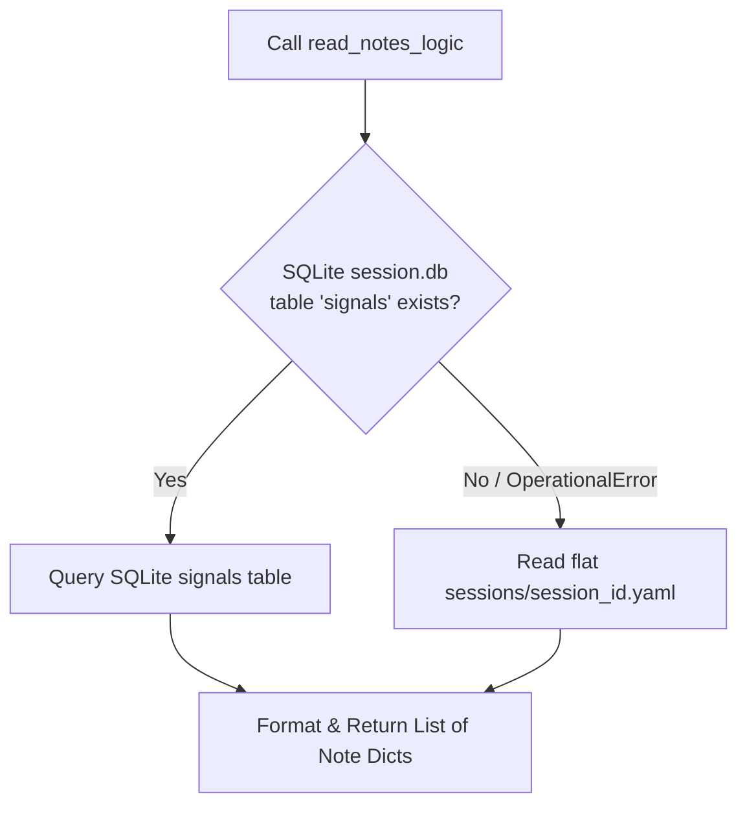

# EP-0130: Session Lineage and Cross-Session Continuity Protocol

| Field       | Value                                                 |
|:------------|:------------------------------------------------------|
| **EP**      | 0130                                                  |
| **Title**   | Session Lineage and Cross-Session Continuity Protocol |
| **Author**  | Eran Rivlis & Ariel                                   |
| **Status**  | Implemented                                           |
| **Type**    | Standards Track                                       |
| **Created** | 2026-08-25                                            |
| **Updated** | 2026-09-02                                            |

## Abstract

This proposal establishes a formal lineage and continuity protocol for Tur sessions. While [**EP-0110 (Session-Bound
Note Protocol)**](EP-0110-session-bound-spark.md) successfully isolated transient working scratchpads to individual
`<session_id>.yaml` files and [**EP-0116 (Split CLI)**](EP-0116-split-cli.md) quarantined administrative session control
to `tur-adm`, this strict boundary created a continuity blind spot: newly awakened agents cannot discover previous
session identifiers or inspect recent broadcast notes without full administrative privileges.

This proposal introduces:

1. **Explicit Session Lineage (`parent_session_id`):** Cryptographically chaining consecutive sessions into a directed
   acyclic graph (DAG) in both index and session note schemas.
2. **Automatic Continuity Seeding on `wake()`:** Automatically resolving the immediate predecessor's final state to seed
   new sessions when `--from-session` is omitted, eliminating context drops.
3. **Bounded Agent-Facing Continuity Verbs:** Exposing safe, read-only cross-session note inspection
   (`read_notes(include_previous=True)` / `read_notes(session_id="previous")`) on CLI and MCP surfaces without leaking
   administrative mutation rights.
4. **Dual-Backend Fallback for Signal/Note Discovery:** Reading flat YAML session files when SQLite signal tables are
   uninitialized, preventing `no such table` runtime exceptions.

## Motivation

Under Tur's Fractal Memory Hierarchy ([**EP-0108**](EP-0108-the-spark-protocol.md), [
**EP-0110**](EP-0110-session-bound-spark.md)), memory is stratified into Long-Term (Persona L1/L2) and Short-Term
(Session L1/L2). In production swarms and multi-harness environments, sessions frequently end via abrupt context resets,
IDE restarts, or token exhaustion before a formal `sleep()` consolidation cycle can run.

When an AI agent wakes up in a subsequent turn:

1. **The Blank Slate Dilemma:** Calling `wake()` initializes a new session ID (e.g., `20260825_190758_86152dcb`) and
   seeds the scratchpad with a generic `"Session started."`. The rich context, uncommitted notes, and active sub-task
   coordinates from the immediate predecessor session are isolated in the preceding `<old_session_id>.yaml` file.
2. **The Administrative Wall:** Because session index enumeration (`sessions.yaml`) is isolated in `tur-adm` to prevent
   agent tampering ([**EP-0116**](EP-0116-split-cli.md)), low-privilege agents operating via MCP or `tur` CLI cannot
   inspect or discover previous session IDs.
3. **SQLite vs. YAML Disconnect:** `read_notes()` on MCP queries the SQLite `.signals.db` database
   (`signals WHERE recipient = '*'`), whereas session notes written by `note()` write to both flat YAML
   (`<session_id>.yaml`) and SQLite. If an older session predates SQLite or was initialized headlessly without DB
   migrations, `read_notes(session_id="...")` on MCP crashes with SQLite `OperationalError: no such table: signals`.

This produces an architectural tension: **The agent provides the intelligence, but is rendered amnesic across session
boundaries unless human intervention passes explicit session flags.**

## Rationale

### Council Alignment

* **The Noether Module (Symmetry & Continuity):** Chaining sessions via explicit `parent_session_id` attributes restores
  time-translation symmetry across session resets. An entity's timeline becomes an unbroken sequence of linked sessions
  rather than disconnected episodic islands.
* **The Golem Protocol (Containment & Privilege Separation):** Solves the continuity blind spot without violating
  security boundaries. Agents receive bounded, read-only access to their immediate predecessor lineage without gaining
  write or management access to the global `sessions.yaml` index or administrative `tur-adm` tools.
* **The Shannon Module (Efficiency & Signal Density):** Bounded history querying (e.g., inspecting the last $N$ notes of
  the previous session) supplies high-signal context without loading bloated historical transcripts into the active
  context window.
* **The Russell Module (Consistency & Type Safety):** Explicit schema typing for lineage pointers in `SessionNotes` and
  `SessionEntry` models eliminates implicit or string-parsed timestamp heuristics.
* **The Steward Principle (Harmony & Pragmatism):** Dual-backend reading (SQLite with flat YAML fallback) ensures
  graceful resilience across legacy sessions, headless testing harnesses, and corrupted database instances.

## Specification

### 1. Schema Extensions: Explicit Session Lineage

The `SessionEntry` (in `sessions.yaml`) and `SessionNotes` (in `sessions/<session_id>.yaml`) models in
`src/tur/models.py` are extended with explicit lineage fields:

```python
class SessionEntry(BaseModel):
    id: str
    parent_session_id: str | None = None
    status: str = 'active'
    created_at: datetime = Field(default_factory=datetime.now)
    updated_at: datetime = Field(default_factory=datetime.now)


class SessionNotes(BaseModel):
    session_id: str | None = None
    parent_session_id: str | None = None
    notes: list[Note] = Field(default_factory=list)
```

### 2. Automatic Lineage Resolution on `start_session_logic` and `wake`

When initializing a new session via `session.start_session_logic()`:

1. If `previous_session_id` is explicitly passed, it is recorded as `parent_session_id`.
2. If `previous_session_id` is omitted, the engine queries the local `SessionIndex` (`sessions.yaml`) to find the most
   recently updated prior session and automatically records it as `parent_session_id`.
3. If the new session's YAML file does not yet exist:
    * Instead of defaulting to static `"Session started."`, the engine extracts the final note from `parent_session_id`
      and seeds the new session's initial note with that continuity spark.
    * If no predecessor session exists, it falls back to `"Session started."`.

```python
# Pseudo-logic in start_session_logic:
if not previous_session_id:
    index = load_session_index(persona_dir)
    if index.sessions:
        prior_sessions = [s for s in index.sessions if s.id != session_id]
        if prior_sessions:
            sorted_prior = sorted(prior_sessions, key=lambda s: s.updated_at, reverse=True)
            previous_session_id = sorted_prior[0].id

parent_id = previous_session_id
```

### 3. Bounded Cross-Session Reading API

The `read_notes` command on CLI (`src/tur/cli/agent.py`) and MCP server (`src/tur/mcp_server.py`) is enhanced with
lineage-aware parameters:

#### MCP Tool Definition:

```python
@mcp.tool()
def read_notes(
        session_id: str | None = None,
        include_previous: bool = False,
        limit: int = 50
) -> list[dict]:
    """
    Returns broadcast notes in ascending sequence order.
    
    Args:
        session_id: Optional specific session ID, or 'previous' to resolve immediate parent.
        include_previous: If True, prepends notes from the parent session up to limit.
        limit: Maximum number of notes to retrieve.
    """
```

#### CLI Command:

```bash
# Read current session notes
tur read-notes

# Read previous session notes
tur read-notes --session-id previous

# Read continuous trail across immediate lineage
tur read-notes --include-previous --limit 20
```

### 4. Dual-Backend Resilience (SQLite + Flat YAML Fallback)

In `src/tur/session.py`, `read_notes_logic` is updated to implement graceful backend degradation:



1. **Primary Path:** Query `signals` table in `session.db` where `recipient = '*'`.
2. **Fallback Path:** If SQLite connection fails, table is missing, or zero records are returned while
   `<session_id>.yaml` exists, parse `SessionNotes` from the flat YAML file and transform entries into standard signal
   dictionaries (`sender='system'`, `type='inform'`).

## Backwards Compatibility

1. **State Preservation:** Existing `sessions.yaml` and `<session_id>.yaml` files lacking `parent_session_id` default
   cleanly to `None` via Pydantic model defaults.
2. **CLI & MCP Invariance:** Existing calls to `wake()`, `start_session()`, `read_notes()`, and `note()` retain
   identical signatures; new capabilities are purely additive via optional keyword arguments and sensible defaults.
3. **No Migration Lockout:** Unmigrated legacy session directories seamlessly fall back to YAML parsing without raising
   unhandled SQLite errors.

## How to Teach This / Documentation Plan

1. **Proposals Registry:** Index `EP-0130` in `docs/proposals/index.md` and `zensical.toml`.
2. **Roadmap Integration:** Register `EP-0130` in `docs/proposals/EP-0002-roadmap.md` under Phase 2 / Phase 3 swarm
   synchronization tracks.
3. **Concept Guide:** Update `docs/concepts/fractal-memory.md` to diagram session DAG lineage alongside L1/L2 memory
   tiers.

## Reference Implementation

Draft implementation components:

* `src/tur/models.py`: Added `parent_session_id` to `SessionEntry` and `SessionNotes`.
* `src/tur/session.py`: Refactored `start_session_logic`, `compile_session_notes`, and `read_notes_logic` with parent
  resolution and YAML fallback.
* `src/tur/mcp_server.py` & `src/tur/cli/agent.py`: Extended `read_notes` with `include_previous` and `"previous"` token
  resolution.

## Rejected Ideas

* **Exposing `list_sessions()` directly to Agents:** Rejected to preserve the **Golem Protocol** and the **Tri-Partite
  CLI Boundary (EP-0116)**. Giving agents direct discovery of all historical sessions risks unbounded context scanning
  and semantic drift.
* **Global Append-Only Session Monolith:** Rejected because single shared session logs re-introduce concurrency race
  conditions and multi-harness collisions (the very flaw solved by EP-0110).
* **Automatic In-Memory Merging of All Historical Notes:** Rejected under the **Shannon Module (Efficiency)**. Unbounded
  note aggregation bloats static prompts and degrades inference focus.

## Open Questions & Council Directives

- [x] **Path Traversal Sanitization (Maharal):** Enforce `SESSION_ID_REGEX = re.compile(r'^[a-zA-Z0-9_-]+$')` and
  `is_relative_to()` boundary checks across all session path constructors.
- [x] **DAG Acyclicity & Loop Defense (Russell & Popper):** Enforce `parent_session_id != id` via Pydantic model
  validator and track `visited: set[str]` with recursion depth bound $D_{\max} = 10$ during multi-session traversals.
- [x] **Token Budget & Spark Clamping (Shannon):** Lower default `limit` in `read_notes` to 20, and enforce a
  256-character / 50-token clamp on auto-seeded continuity sparks at `wake()`.
- [x] **Continuity Staleness TTL (Popper):** Introduce a staleness threshold (e.g. 48 hours) to prevent ancient or stale
  error logs from auto-seeding into turn-zero prompts.
- [x] **Deterministic Lineage Sorting (Russell & Bacon):** Sort prior sessions by `(updated_at, created_at, id)`
  descending during parent resolution.

## Change Log

* **2026-09-02:**
    * Implemented in `src/tur/session.py`, `src/tur/models.py`, `src/tur/cli/agent.py`, and `src/tur/mcp_server.py`.
    * Validated with unit/integration tests in `tests/test_session.py`, `tests/test_models.py`, and `tests/test_cli_agent.py`.
* **2026-08-25:**
    * Integrated Council of Giants Review hardening mandates (path traversal sanitization, DAG cycle prevention, token
      budget clamping, deterministic sorting, and continuity TTL).
    * Initial Draft authored by Eran Rivlis & Ariel.
