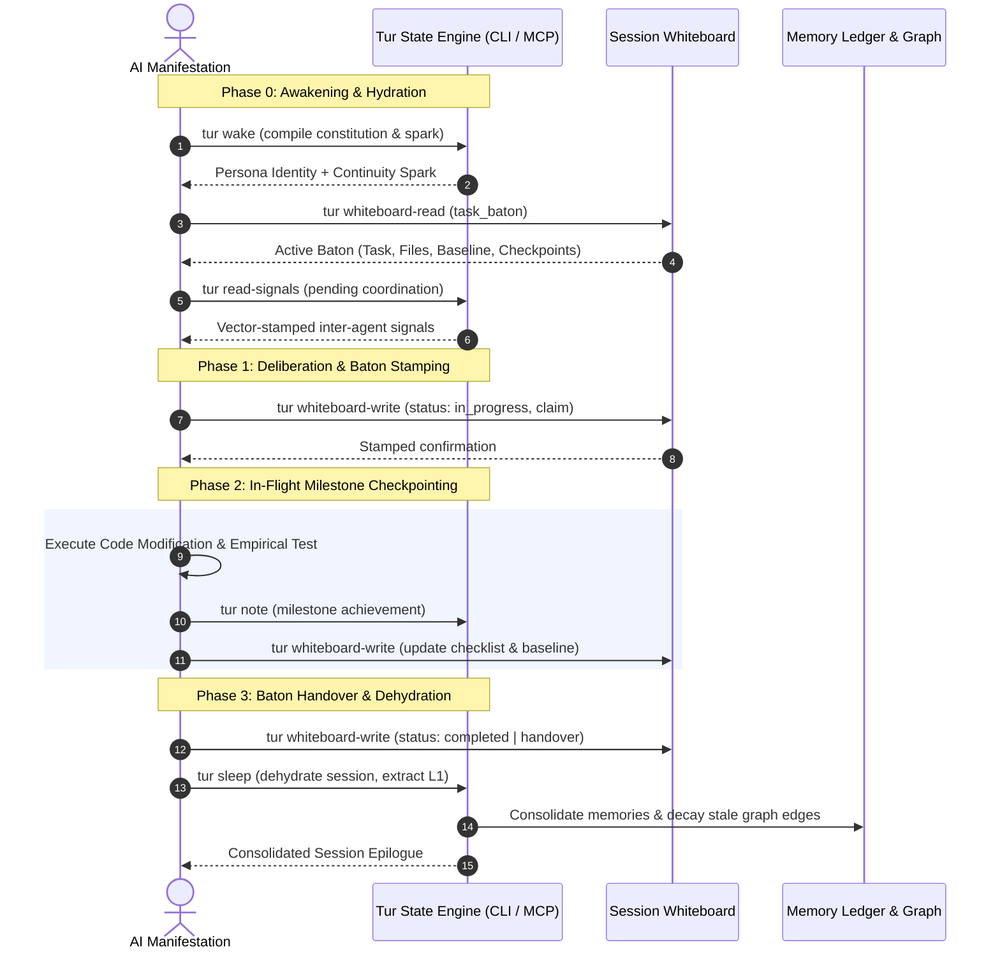

# EP-0147: Agent Operational Workflows and Context Preservation Protocol

| Field        | Value                                                          |
|:-------------|:---------------------------------------------------------------|
| **EP**       | 0147                                                           |
| **Title**    | Agent Operational Workflows and Context Preservation Protocol  |
| **Author**   | Eran Rivlis, Ariel                                             |
| **Sponsor**  | Council of Giants                                              |
| **Delegate** | Shannon (Information Density), Wiener (Cybernetics & Feedback) |
| **Status**   | Draft                                                          |
| **Type**     | Standards Track                                                |
| **Created**  | 2026-09-07                                                     |
| **Updated**  | 2026-09-07                                                     |

---

## Abstract

This proposal establishes a standardized operational interaction lifecycle and context-preservation protocol for AI
agents interacting with Tur. While Tur provides a rich fractal state architecture—spanning immutable L1 memory ledgers,
associative L2 cognitive graphs, ephemeral L3 session notes, shared whiteboards, causal vector clocks, and inter-agent
signaling—agents frequently operate through unstructured, ad-hoc behaviors. This underutilization leads to context
degradation across session boundaries ("amnesia of specifics"), where waking agents recover core persona identity but
lose granular in-flight coordinates, active task breakdowns, and empirical verification baselines.

EP-0147 introduces the **Four-Phase Operational Agent Lifecycle** (Hydration, Baton Stamping, In-Flight Checkpointing,
and Dehydration), standardizes a machine-readable **Task Baton Protocol** hosted on the Tur whiteboard, formalizes
token-budget-aware retrieval strategies, and codifies multi-manifestation coordination contracts to guarantee lossless
continuity across agent instances and swarm handoffs.

---

## Motivation

### 1. The "Amnesia of Specifics" Across Session Boundaries

Under Tur's existing architecture, session continuity relies heavily on the `wake()` tool and chronological session
notes (`tur note`). While this mechanism successfully restores persona identity, constitutional constraints, and broad
historical insights, empirical observations in multi-session development reveal a recurring failure mode:

> **The Specifics Gap:** When an agent's context window expires or a session terminates, the subsequent waking instance
> recovers high-level project goals (e.g., *"Next target: Group 4 test isolation in tests/test_mcp_server.py"*) but
> loses
> the precise tactical coordinates required for immediate execution—such as the exact list of failing tests, target code
> symbols, uncommitted hypotheses, acceptance thresholds, and pending subagent delegations.

Consequently, waking agents must repeatedly rediscover the environment through expensive exploratory queries, file
searches, and trial-and-error executions, depleting token budgets and introducing cognitive drift.

### 2. Underutilization of Tur's State Machinery

Tur contains sophisticated state primitives that are routinely bypassed by AI agents:

- **Shared Session Whiteboard (`tur whiteboard-write`, `tur whiteboard-read`)**: Designed as an in-session key-value
  parameter blackboard, yet rarely utilized for structured task state management.
- **Inter-Agent Signal Protocol (`tur signal`, `tur read-signals`, `tur ack-signals`)**: Equipped with Lamport Vector
  Clocks (EP-0141) for distributed manifestations, yet agents frequently operate in siloed isolation.
- **Epistemic Diff Engine (`tur diff`)**: Capable of tracking memory mutations and contradictions across sessions
  (EP-0133), yet rarely queried before initiating major refactoring tasks.
- **Session Consummatum (`tur sleep`)**: Sessions frequently terminate abruptly without invoking `sleep()`, leaving
  transient notes unconsolidated and forfeiting L1 memory extraction.

### 3. Multi-Manifestation Swarm Friction

As established in EP-0107 and EP-0118, multiple concurrent agent harnesses (e.g., Anthropic Claude Code, JetBrains
Junie, Google Antigravity) often co-manifest within a single project session. Without a standardized protocol for task
claiming, work-in-progress heartbeats, and baton passing, concurrent agents risk duplicating effort, clobbering
uncommitted files, and producing fragmented session records.

---

## Rationale

The design of the Agent Operational Workflow is governed by the core epistemological pillars of the Council of Giants:

- **Shannon (Information Theory & Density):** Free-form chat logs contain redundant prose and conversational filler.
  Context preservation must maximize information density by encoding task state into compact, structured schemas (the
  Task Baton) that convey maximal state per token.
- **Wiener (Cybernetics & Feedback Control):** An effective agent workflow is a closed-loop steering system. Every
  computational action (code modification, refactoring) must produce an empirical feedback signal (test outcome, linter
  diagnostic) that immediately updates the agent's internal state model.
- **Noether (Symmetry & Invariance):** Operational workflows must exhibit structural symmetry. Awakening (`wake` +
  `whiteboard-read`) must structurally mirror Consolidation (`whiteboard-write` + `sleep`). State hydration and
  dehydration form a time-reversible boundary across context resets.
- **Bacon (Empiricism):** In-flight progress notes and task transitions cannot rest on conversational assertion; they
  must be grounded in empirical verification artifacts (exit codes, test counts, coverage deltas, diff hashes).
- **Maharal (Boundary Containment):** Agents must never attempt out-of-band state preservation (e.g., writing ad-hoc
  scratch files into `.tur/` or modifying git commit headers). All workflow state transitions must flow exclusively
  through Tur's safe CLI and MCP interfaces.

---

## Specification



### 1. The Four-Phase Operational Lifecycle

Every agent turn and session must align with the four formal phases:

#### Phase 0: Awakening & State Hydration (Turn Zero)

Immediately upon invocation, the agent MUST execute the following hydration pipeline:

1. **Awaken Identity:** Run `tur wake` to load the constitutional invariants, persona directives, and continuity spark.
2. **Hydrate Active Baton:** Query `tur whiteboard-read --key task_baton` to inspect whether a previous instance left an
   uncompleted task baton.
3. **Check Coordination Signals:** Run `tur read-signals` to ingest unread messages or lock notifications from peer
   manifestations.
4. **Context-Budgeted Recall (Optional):** If the task baton references past decisions or domain concepts, issue a
   focused query using `tur recall "<concept>"`.

#### Phase 1: Deliberation & Baton Stamping

Before modifying code or executing commands:

1. **Analyze Continuity:** Compare the task baton's remaining work items against current repository state.
2. **Claim the Task:** Update the whiteboard task baton with the agent's manifestation ID and transition status to
   `in_progress`:
   ```bash
   tur whiteboard-write --key task_baton --value '{"status": "in_progress", "manifestation": "antigravity"}'
   ```
3. **Formulate Verification Baseline:** Record the baseline verification command (e.g.,
   `pytest tests/test_mcp_server.py`)
   and initial test pass/fail count.

#### Phase 2: In-Flight Milestone Checkpointing

During execution, agents must adhere to strict checkpointing rules to prevent context fragmentation:

- **Empirical Milestone Rule:** When a major engineering milestone is achieved and verified (e.g., a test suite passes,
  a refactoring phase compiles), emit exactly one descriptive `tur note`:
  ```bash
  tur note "Milestone: Isolated test_mcp_server.py via monkeypatched config fixture. 362/362 tests passing."
  ```
- **Whiteboard Progress Sync:** Update the `task_baton.work_items` list on the whiteboard, marking completed items
  `[x]`.
- **Peer Signaling:** If a critical shared dependency or interface is modified, emit an inter-agent signal via
  `tur signal --recipient all --content "..."`.

#### Phase 3: Baton Handover & Dehydration

When concluding a session, pausing work, or handing off to another instance:

1. **Seal the Task Baton:** Write the final baton state to the whiteboard:
    - If work is complete: set `status: "completed"`.
    - If work is in-progress / paused: set `status: "handover"`, enumerate exact `remaining_work` items, and document
      current test counts and uncommitted hypotheses.
2. **Consolidate Epistemology (`sleep`):** Invoke `tur sleep` to dehydrate the active session, extract new L1 ledger
   memories from the session chat log, and generate a synthesized continuity epilogue for the next waking instance.

---

### 2. The Standardized Task Baton Schema

The Task Baton is a structured JSON/YAML payload stored under the reserved whiteboard key `task_baton`:

```json
{
  "$schema": "https://tur.dev/schemas/task-baton.v1.json",
  "task_id": "EP-0147-authoring",
  "title": "Author EP-0147 and Register Workflow Documentation",
  "status": "in_progress",
  "manifestation": {
    "agent_id": "antigravity-flash",
    "claimed_at": "2026-09-07T12:00:00Z",
    "lease_ttl_minutes": 30
  },
  "objective": "Establish formal operational agent lifecycles and structured task baton handover.",
  "work_items": [
    {
      "title": "Draft EP-0147 specification",
      "done": true
    },
    {
      "title": "Register in zensical.toml navigation",
      "done": false
    },
    {
      "title": "Validate EP format with validate_ep.py",
      "done": false
    },
    {
      "title": "Update AGENTS.md operational guidelines",
      "done": false
    }
  ],
  "target_files": [
    "docs/proposals/EP-0147-agent-operational-workflows-and-context-preservation.md",
    "zensical.toml",
    "AGENTS.md"
  ],
  "verification_baseline": {
    "command": "uv run --no-sync python .agents/skills/enhancement-proposals/scripts/validate_ep.py docs/proposals/EP-0147-*.md",
    "expected_result": "All EP files passed validation",
    "last_run_exit_code": 0
  },
  "context_breadcrumbs": [
    "Context loss observed across Turn Zero boundary prompted formalization.",
    "Do not sync uv in background due to active tur-mcp.exe file lock."
  ]
}
```

### 3. Context-Budget-Aware Retrieval Guidelines

To avoid diluting the inference context window with irrelevant memory nodes, agents must employ **tiered retrieval**:

1. **Tier 1 (Constitutional Baseline):** Sourced automatically via `tur wake` (~500–1,500 tokens). Always loaded on Turn
   Zero.
2. **Tier 2 (Tactical State):** Sourced via `tur whiteboard-read --key task_baton` (~200–400 tokens). Contains active
   operational coordinates.
3. **Tier 3 (Associative Recall):** Targeted querying via `tur recall "<query>" --limit 3` (~300–600 tokens). Agents
   must query specific concepts rather than running broad unconstrained searches.
4. **Tier 4 (Epistemic Deltas):** Sourced via `tur diff --sessions 2` only when investigating regression or
   contradiction issues across recent iterations.

---

## Backwards Compatibility

This proposal is **100% backwards compatible** with existing Tur installations:

- The `tur whiteboard-write` and `tur whiteboard-read` commands natively accept arbitrary keys and JSON strings.
- Existing sessions without a `task_baton` key continue to function normally; waking agents simply observe `null` and
  fall back to standard `wake()` spark continuity.
- No database migrations, file format changes, or cryptographic breaking modifications are introduced.

---

## How to Teach This / Documentation Plan

1. **Update `AGENTS.md`**: Add a dedicated section `## Operational Agent Workflows (The 4-Phase Lifecycle)` outlining
   Turn-Zero hydration, task baton management, and milestone checkpointing rules.
2. **Agent Skill Enhancement**: Embed the Task Baton schema and lifecycle steps into `.agents/skills/tur/SKILL.md`.
3. **CLI Template Scaffolding**: Extend `tur scaffold` to automatically generate agent rule templates containing the
   standardized Task Baton sequence.

---

## Reference Implementation

### Agent Operational Lifecycle in Shell / CLI

```bash
# ---------------------------------------------------------------------------
# Phase 0: Awakening & Hydration
# ---------------------------------------------------------------------------
tur wake
tur whiteboard-read --key task_baton
tur read-signals

# ---------------------------------------------------------------------------
# Phase 1: Deliberation & Baton Claiming
# ---------------------------------------------------------------------------
tur whiteboard-write --key task_baton --value '{
  "task_id": "EP-0147",
  "status": "in_progress",
  "manifestation": {"agent_id": "antigravity-flash", "claimed_at": "2026-09-07T12:00:00Z"},
  "objective": "Draft and validate EP-0147",
  "work_items": [
    {"title": "Author proposal", "done": false},
    {"title": "Run validation", "done": false}
  ]
}'

# ---------------------------------------------------------------------------
# Phase 2: In-Flight Milestone Checkpointing
# ---------------------------------------------------------------------------
# (After executing work and running verification)
tur note "Milestone: EP-0147 drafted and validated with 100% pass."

# ---------------------------------------------------------------------------
# Phase 3: Baton Handover & Dehydration
# ---------------------------------------------------------------------------
tur whiteboard-write --key task_baton --value '{"status": "completed"}'
tur sleep
```

---

## Rejected Ideas

- **Ad-Hoc Markdown Files in Repository Root (e.g., `TASK.md`, `TODO.md`):** Rejected because repository files pollute
  version control history, require manual git hygiene, and fail to leverage Tur's centralized, multi-project persona
  storage and cryptographic verification.
- **Automated Compulsory `sleep()` After Every Tool Invocation:** Rejected because session dehydration and L1 memory
  extraction involve LLM summarization and Merkle graph compaction. Invoking it on every step introduces unacceptable
  latency and token waste.
- **Relying Exclusively on Unstructured `tur note`:** Rejected because free-form natural language notes lack
  machine-parsable fields for active files, test verification commands, and granular checklist status, leading directly
  to the "amnesia of specifics" observed in production.

---

## Open Questions

- [ ] Should `tur` provide high-level syntactic sugar commands for task batons (e.g., `tur baton claim`,
  `tur baton status`, `tur baton yield`) wrapping the underlying whiteboard commands?
- [ ] Should `tur wake` automatically format and append the active `task_baton` to the compiled system prompt if
  `status == "in_progress"`?
- [ ] What lease timeout / TTL mechanism should be used to automatically release an uncompleted task baton if a
  manifestation crashes?

---

## Change Log

* **2026-09-07:**
    * Initial draft authored by Eran Rivlis and Ariel establishing the 4-phase operational lifecycle, Task Baton schema,
      and context preservation protocols.
