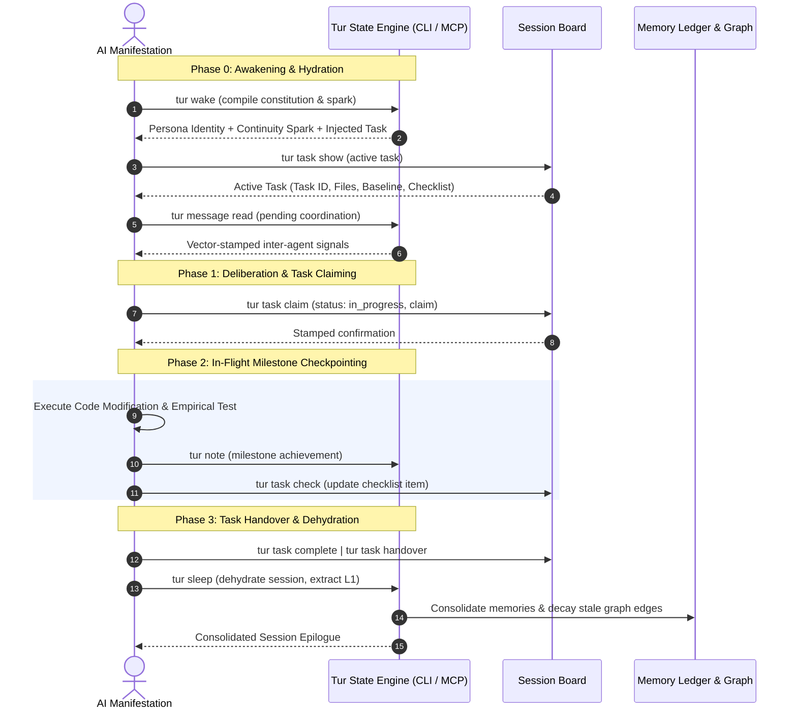

# EP-0147: Agent Operational Workflows and Context Preservation Protocol

| Field        | Value                                                          |
|:-------------|:---------------------------------------------------------------|
| **EP**       | 0147                                                           |
| **Title**    | Agent Operational Workflows and Context Preservation Protocol  |
| **Author**   | Eran Rivlis, Ariel                                             |
| **Sponsor**  | Council of Giants                                              |
| **Delegate** | Shannon (Information Density), Wiener (Cybernetics & Feedback) |
| **Status**   | Implemented                                                    |
| **Type**     | Standards Track                                                |
| **Created**  | 2026-09-07                                                     |
| **Updated**  | 2026-09-09                                                     |

---

## Abstract

This proposal establishes a standardized operational interaction lifecycle and context-preservation protocol for AI
agents interacting with Tur. While Tur provides a rich fractal state architecture—spanning immutable L1 memory ledgers,
associative L2 cognitive graphs, ephemeral L3 session notes, shared whiteboards, causal vector clocks, and inter-agent
signaling—agents frequently operate through unstructured, ad-hoc behaviors. This underutilization leads to context
degradation across session boundaries ("amnesia of specifics"), where waking agents recover core persona identity but
lose granular in-flight coordinates, active task breakdowns, and empirical verification baselines.

EP-0147 introduces the **Four-Phase Operational Agent Lifecycle** (Hydration, Task Claiming, In-Flight Checkpointing,
and Dehydration), standardizes a machine-readable **Task Protocol** hosted on the Tur whiteboard, formalizes
token-budget-aware retrieval strategies, and codifies multi-manifestation coordination contracts to guarantee lossless
continuity across agent instances and swarm handoffs.

---

## Motivation

### 1. The "Amnesia of Specifics" Across Session Boundaries

Under Tur's existing architecture, session continuity relies heavily on the `wake()` tool and chronological session
notes (`tur note`). While this mechanism successfully restores persona identity, constitutional constraints, and broad
historical insights, empirical observations in multi-session development reveal a recurring failure mode:

> **The Specifics Gap:** When an agent's context window expires or a session terminates, the subsequent waking instance
> recovers high-level project goals (e.g., *"Next target: Group 4 test isolation in tests/test_mcp_server.py"*) but
> loses
> the precise tactical coordinates required for immediate execution—such as the exact list of failing tests, target code
> symbols, uncommitted hypotheses, acceptance thresholds, and pending subagent delegations.

Consequently, waking agents must repeatedly rediscover the environment through expensive exploratory queries, file
searches, and trial-and-error executions, depleting token budgets and introducing cognitive drift.

### 2. Underutilization of Tur's State Machinery

Tur contains sophisticated state primitives that are routinely bypassed by AI agents:

- **Shared Session Board (`tur board write`, `tur board read`)**: Designed as an in-session key-value parameter blackboard,
  yet rarely utilized for structured task state management.
- **Inter-Agent Message Protocol (`tur message send`, `tur message read`, `tur message ack`)**: Equipped with Lamport Vector
  Clocks (EP-0141) for distributed manifestations, yet agents frequently operate in siloed isolation.
- **Epistemic Diff Engine (`tur diff`)**: Capable of tracking memory mutations and contradictions across sessions
  (EP-0133), yet rarely queried before initiating major refactoring tasks.
- **Session Consummatum (`tur sleep`)**: Sessions frequently terminate abruptly without invoking `sleep()`, leaving
  transient notes unconsolidated and forfeiting L1 memory extraction.

### 3. Multi-Manifestation Swarm Friction

As established in EP-0107 and EP-0118, multiple concurrent agent harnesses (e.g., Anthropic Claude Code, JetBrains
Junie, Google Antigravity) often co-manifest within a single project session. Without a standardized protocol for task
claiming, work-in-progress heartbeats, and handovers, concurrent agents risk duplicating effort, clobbering
uncommitted files, and producing fragmented session records.

---

## Rationale

The design of the Agent Operational Workflow is governed by the core epistemological pillars of the Council of Giants:

- **Shannon (Information Theory & Density):** Free-form chat logs contain redundant prose and conversational filler.
  Context preservation must maximize information density by encoding task state into compact, structured schemas (the
  Task Protocol) that convey maximal state per token.
- **Wiener (Cybernetics & Feedback Control):** An effective agent workflow is a closed-loop steering system. Every
  computational action (code modification, refactoring) must produce an empirical feedback signal (test outcome, linter
  diagnostic) that immediately updates the agent's internal state model.
- **Noether (Symmetry & Invariance):** Operational workflows must exhibit structural symmetry. Awakening (`wake` +
  `task show`) must structurally mirror Consolidation (`task complete` + `sleep`). State hydration and
  dehydration form a time-reversible boundary across context resets.
- **Bacon (Empiricism):** In-flight progress notes and task transitions cannot rest on conversational assertion; they
  must be grounded in empirical verification artifacts (exit codes, test counts, coverage deltas, diff hashes).
- **Maharal (Boundary Containment):** Agents must never attempt out-of-band state preservation (e.g., writing ad-hoc
  scratch files into `.tur/` or modifying git commit headers). All workflow state transitions must flow exclusively
  through Tur's safe CLI (`tur task`) and MCP interfaces.

---

## Specification



### 1. The Four-Phase Operational Lifecycle

Every agent turn and session must align with the four formal phases:

#### Phase 0: Awakening & State Hydration (Turn Zero)

Immediately upon invocation, the agent MUST execute the following hydration pipeline:

1. **Awaken Identity:** Run `tur wake` (or MCP `wake()`) to load the constitutional invariants, persona directives, and continuity spark. The active tactical task state is automatically injected into the Turn Zero prompt.
2. **Inspect Active Tasks:** Query `tur task show` or `tur task list` (MCP: `show_task()`) to inspect pending checklist items, target files, and dependency blocks.
3. **Check Coordination Signals:** Run `tur message read` (or `tur read-signals`) to ingest unread messages or coordination signals from peer manifestations.
4. **Context-Budgeted Recall (Optional):** If the task references past decisions or domain concepts, issue a focused query using `tur recall "<concept>"`.

#### Phase 1: Deliberation & Task Claiming

Before modifying code or executing commands:

1. **Analyze Continuity:** Compare the task's remaining work items against current repository state.
2. **Claim the Task:** Claim or update the task with the agent's manifestation ID and transition status to `in_progress`:
   ```bash
   tur task claim EP-0147 --title "Operational Workflows" --objective "Formalize lifecycle" --item "Step 1" --item "Step 2"
   ```
3. **Formulate Verification Baseline:** Record the baseline verification command (e.g., `pytest tests/test_mcp_server.py`) and initial test pass/fail count.

#### Phase 2: In-Flight Milestone Checkpointing

During execution, agents must adhere to strict checkpointing rules to prevent context fragmentation:

- **Empirical Milestone Rule:** When a major engineering milestone is achieved and verified (e.g., a test suite passes, a refactoring phase compiles), emit exactly one descriptive `tur note`:
  ```bash
  tur note "Milestone: Isolated test_mcp_server.py via monkeypatched config fixture. 362/362 tests passing."
  ```
- **Task Progress Sync:** Update checklist items in the task via `tur task check <item_index|title>` (MCP: `check_task_item()`).
- **Peer Signaling:** If a critical shared dependency or interface is modified, emit an inter-agent signal via `tur message send --recipient all --content "..."`.

#### Phase 3: Task Handover & Dehydration

When concluding a session, pausing work, or handing off to another instance:

1. **Complete or Hand Over the Task:**
    - If work is complete: invoke `tur task complete [task_id]` (MCP: `complete_task()`) to seal the task and unblock dependent tasks.
    - If work is in-progress / paused: invoke `tur task handover [task_id] --note "..."` (MCP: `handover_task()`) to preserve progress, test counts, and uncommitted hypotheses.
2. **Consolidate Epistemology (`sleep`):** Invoke `tur sleep` to dehydrate the active session, extract new L1 ledger memories from the session chat log, and generate a synthesized continuity epilogue for the next waking instance.

---

### 2. The Standardized Task Schema

The Task is a structured JSON payload stored under either the default singleton board key `task` (for sequential relay execution) or namespaced keys `task:<task_id>` (for concurrent multi-manifestation swarms):

```json
{
  "$schema": "https://tur.dev/schemas/task.v1.json",
  "task_id": "EP-0147-authoring",
  "title": "Author EP-0147 and Register Workflow Documentation",
  "status": "in_progress",
  "depends_on": [],
  "manifestation": {
    "agent_id": "antigravity-flash",
    "claimed_at": "2026-09-07T12:00:00Z",
    "lease_ttl_minutes": 30
  },
  "objective": "Establish formal operational agent lifecycles and structured task handover.",
  "work_items": [
    {
      "title": "Draft EP-0147 specification",
      "done": true
    },
    {
      "title": "Register in zensical.toml navigation",
      "done": false
    },
    {
      "title": "Validate EP format with validate_ep.py",
      "done": false
    },
    {
      "title": "Update AGENTS.md operational guidelines",
      "done": false
    }
  ],
  "target_files": [
    "docs/proposals/EP-0147-agent-operational-workflows-and-context-preservation.md",
    "zensical.toml",
    "AGENTS.md"
  ],
  "verification_baseline": {
    "command": "uv run --no-sync python .agents/skills/enhancement-proposals/scripts/validate_ep.py docs/proposals/EP-0147-*.md",
    "expected_result": "All EP files passed validation",
    "last_run_exit_code": 0
  },
  "context_breadcrumbs": [
    "Context loss observed across Turn Zero boundary prompted formalization.",
    "Do not sync uv in background due to active file lock."
  ]
}
```

### 3. Context-Budget-Aware Retrieval Guidelines

To avoid diluting the inference context window with irrelevant memory nodes, agents must employ **tiered retrieval**:

1. **Tier 1 (Constitutional Baseline):** Sourced automatically via `tur wake` (~500–1,500 tokens). Always loaded on Turn Zero.
2. **Tier 2 (Tactical State):** Sourced via `tur task show` or automatic Turn Zero wake prompt injection (~200–400 tokens). Contains active operational coordinates.
3. **Tier 3 (Associative Recall):** Targeted querying via `tur recall "<query>" --limit 3` (~300–600 tokens). Agents must query specific concepts rather than running broad unconstrained searches.
4. **Tier 4 (Epistemic Deltas):** Sourced via `tur diff --sessions 2` only when investigating regression or contradiction issues across recent iterations.

---

### 4. Task CLI Ergonomics, Multi-Task Swarm Namespacing, and Lease Lifecycle

1. **Task CLI Ergonomics (`tur task`)**: High-level commands (`tur task list`, `tur task show [task_id]`, `tur task claim <task_id>`, `tur task check <idx>`, `tur task handover`, `tur task complete`) eliminate JSON shell escaping friction on Windows and Unix alike while storing underlying state cleanly on the session board.
2. **Multi-Task Swarm Support (`task:<task_id>`)**:
   - **Relay Mode vs. Swarm Mode:** Sequential handovers utilize the default `task` pointer. When multiple manifestations operate in parallel on distinct epics (e.g., Pi refactoring CLI while Antigravity hardens TMS), tasks are namespaced under `task:<task_id>` (e.g., `task:EP-0147`, `task:EP-0149`).
   - **Task Registry (`tur task list`):** Discovers all active, blocked, and completed tasks currently tracked on the session board.
   - **Inter-Task Dependencies (`depends_on`):** Tasks can declare prerequisite task IDs. Manifestations waiting on an uncompleted dependency enter `status: "blocked"` until unblocked by prerequisite task completion.
3. **Turn Zero Wake Injection**: `tur wake` / MCP `wake()` inspects the active session board. If an active task claimed by the calling manifestation (or default active task) is present with `status == "in_progress"` and has not expired, a concise markdown summary block is injected directly into the compiled system prompt, restoring tactical coordinates at Turn Zero without requiring extra tool calls.
4. **Lease TTL & Heartbeat Recovery**: The `manifestation.lease_ttl_minutes` field (default: 60 minutes), anchored to SQLite `agents.last_heartbeat`, enables deterministic crash recovery. If a manifestation process terminates or drops offline without completing its task, peer agents or subsequent sessions can detect lease expiry and safely reclaim the task.

---

## Reference Implementation

### Agent Operational Lifecycle in Shell / CLI

```bash
# ---------------------------------------------------------------------------
# Phase 0: Awakening & Hydration
# ---------------------------------------------------------------------------
tur wake
tur task show
tur message read

# ---------------------------------------------------------------------------
# Phase 1: Deliberation & Task Claiming
# ---------------------------------------------------------------------------
tur task claim EP-0147 \
  --title "Draft and validate EP-0147" \
  --objective "Author EP-0147 operational workflows" \
  --item "Author proposal" \
  --item "Run validation"

# ---------------------------------------------------------------------------
# Phase 2: In-Flight Milestone Checkpointing
# ---------------------------------------------------------------------------
# (After executing work and running verification)
tur task check 1
tur note "Milestone: EP-0147 drafted and validated with 100% pass."

# ---------------------------------------------------------------------------
# Phase 3: Task Handover & Dehydration
# ---------------------------------------------------------------------------
tur task complete EP-0147
tur sleep
```

## Backwards Compatibility

This proposal is fully aligned with Tur's state architecture:
- Task coordinates are maintained on the session board under `task` and `task:<task_id>`.
- Existing sessions without active task coordinates continue to operate without disruption; waking agents simply observe `null` task state.

---

## How to Teach This / Documentation Plan

1. **Update `AGENTS.md`**: Dedicated section `## Operational Agent Workflows (The 4-Phase Lifecycle - EP-0147, EP-0149)` defining Turn-Zero hydration, task claiming, milestone checkpoints, and handovers.
2. **Update Agent Skills**: Embed task coordination guidelines into `.agents/skills/tur/SKILL.md`.
3. **CLI Usage Documentation**: Document `tur task` commands across CLI reference guides.

---

## Rejected Ideas

- **Ad-Hoc Markdown Files in Repository Root (e.g., `TASK.md`, `TODO.md`):** Rejected because repository files pollute version control history, require manual git hygiene, and fail to leverage Tur's centralized, multi-project persona storage and cryptographic verification.
- **Automated Compulsory `sleep()` After Every Tool Invocation:** Rejected because session dehydration and L1 memory extraction involve LLM summarization and Merkle graph compaction. Invoking it on every step introduces unacceptable latency and token waste.
- **Relying Exclusively on Unstructured `tur note`:** Rejected because free-form natural language notes lack machine-parsable fields for active files, test verification commands, and granular checklist status.

---

## Open Questions

- [x] **Syntactic Sugar & Grounded Naming:** High-level `tur task` commands (`show`, `claim`, `check`, `handover`, `complete`) approved as canonical porcelain over `session_state`.
- [x] **Wake Prompt Injection:** Automatic compilation of active task into Turn Zero `wake()` prompt approved when `status == "in_progress"`.
- [x] **Crash Recovery:** `lease_ttl_minutes` with `agents.last_heartbeat` approved to safely detect and flag abandoned tasks in multi-agent swarms.

---

## Change Log

* **2026-09-08:**
    * Unified canonical `tur task` command syntax (`list`, `show`, `claim`, `check`, `handover`, `complete`) and `src/tur/task.py` module, deprecating baton nomenclature.
    * Defined namespaced board coordinates (`task:<task_id>`), task registry discovery (`tur task list`), and declarative inter-task dependencies (`depends_on`) with reactive unblocking.
    * Formalized Turn-Zero wake prompt task injection and lease TTL / manifestation heartbeat recovery semantics.
* **2026-09-07:**
    * Initial draft authored by Eran Rivlis and Ariel establishing the 4-phase operational lifecycle, Task schema, and context preservation protocols.
