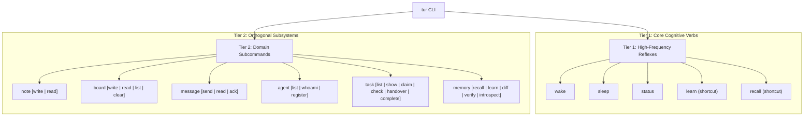
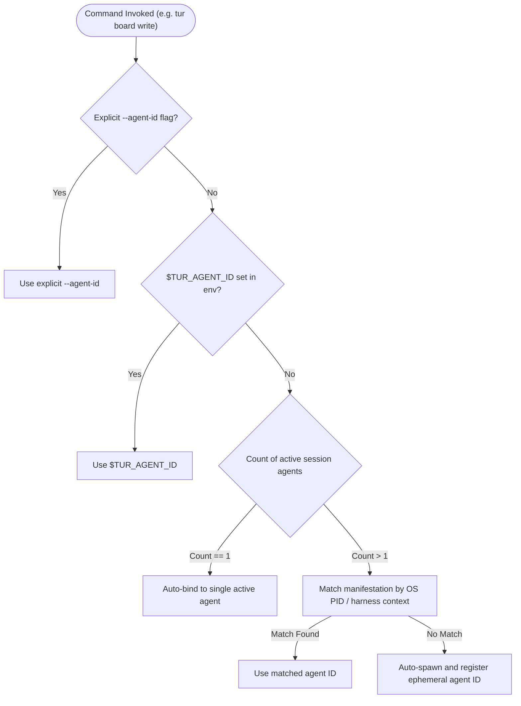

# EP-0149: Two-Tier Hierarchical Command Grammar, Subsystem Taxonomy, and Deterministic Machine Ergonomics

| Field        | Value                                                                                                     |
|:-------------|:----------------------------------------------------------------------------------------------------------|
| **EP**       | 0149                                                                                                      |
| **Title**    | Two-Tier Hierarchical Command Grammar, Subsystem Taxonomy, and Deterministic Machine Ergonomics           |
| **Author**   | Eran Rivlis, Ariel                                                                                        |
| **Sponsor**  | Council of Giants                                                                                         |
| **Delegate** | Russell (Consistency & Logic), Shannon (Information Density & Parsimony), Noether (Symmetry & Invariance) |
| **Status**   | Implemented                                                                                               |
| **Type**     | Standards Track                                                                                           |
| **Created**  | 2026-09-08                                                                                                |
| **Updated**  | 2026-09-17                                                                                                |
| **Replaces** | EP-0004 (Partially supersedes command grammar sections)                                                   |

---

## Abstract

This proposal establishes a unified **Two-Tier Hierarchical Command Grammar** and machine-ergonomics standard for the
Tur agent runtime (`tur`). As Tur expanded to accommodate multi-agent swarms (EP-0107), causal vector clocks (EP-0141),
session diffs (EP-0133), shared session boards, and task context preservation protocols (EP-0147), the CLI accumulated over
twenty flat, ad-hoc commands with irregular grammatical structures (e.g., `read-notes` vs. `whiteboard-write` vs.
`signal`).

EP-0149 resolves this structural entropy by organizing the CLI into two complementary tiers:

1. **Tier 1: Core Cognitive Verbs (Flat Root):** High-frequency persona reflexes (`wake`, `sleep`, `status`, `learn`,
   `recall`).
2. **Tier 2: Orthogonal Domain Subcommands:** Domain-driven namespaces (`note`, `board`, `message`, `agent`, `task`,
   `memory`) obeying consistent `<domain> <action>` syntax (`read`, `write`, `list`, `send`, `ack`).

Additionally, this proposal introduces **Ambient Manifestation Resolution** (`$TUR_AGENT_ID`) to eliminate
`AmbiguousIdentityError` deadlocks in multi-agent swarms, mandates universal `--json` output flags across diagnostic
commands, and preserves 100% backwards compatibility via transparent Typer alias bridges.

---

## Motivation

### 1. Grammatical Inconsistency and Namespace Sprawl

Tur's agent runtime CLI (`tur`) currently exposes 21 flat top-level commands. As new capabilities were added, naming
patterns diverged across several conflicting grammatical models:

- **Asymmetric Actions:** `tur note <text>` creates a note, but reading notes requires the separate command
  `tur read-notes`.
- **Hyphen Sprawl with Inconsistent Prefixing:**
    - Verb-prefixed: `tur read-signals`, `tur ack-signals`, `tur list-agents`.
    - Noun-prefixed: `tur whiteboard-write`, `tur whiteboard-read`.
- **Cognitive Guesswork for AI Agents:** When an AI agent needs to interact with a subsystem, it must guess whether the
  command is hyphenated with the verb first (`read-notes`), hyphenated with the noun first (`whiteboard-read`), or
  a standalone command (`signal`).

### 2. Metaphorical Overhead: `whiteboard` vs. `board`

The command name `whiteboard-write` / `whiteboard-read` incurs unnecessary character and token overhead. In classical
multi-agent computer science (originating from the Hearsay-II blackboard model), the canonical term for a shared
in-memory parameter scratchpad is the **Blackboard** or **Board**. Shortening `whiteboard` to `board` reduces typing
friction by 50% while reinforcing standard CS terminology.

### 3. Multi-Agent Identity Friction (`AmbiguousIdentityError`)

In multi-manifestation swarm sessions (where Claude, Junie, Antigravity, or Pi operate concurrently), commands requiring
agent attribution (such as `whiteboard-write`) fail immediately with:

```
AmbiguousIdentityError: Multiple active agents found: ['agent_be71...', 'agent_1dec...']. Please specify --agent-id.
```

Because there is no ambient agent discovery command (such as `tur agent whoami`), an agent is forced to run
`tur list-agents`, parse raw terminal text tables with regex, and manually supply `--agent-id` on every call.

### 4. Shell Escaping Friction in Complex Payloads

With the introduction of structured schemas like the EP-0147 Task Protocol, agents must write structured JSON strings into
`tur board write task '{"status": "in_progress", ...}'`. In terminal subshells, nested quotes and escaping
routinely break across Windows PowerShell, CMD, and bash environments. First-class CLI task primitives are required.

---

## Rationale

The architecture of EP-0149 is governed by core Council principles:

- **Russell (Logical Consistency & Orthogonality):** A domain model must obey strict grammatical invariants. If state
  subsystems expose `read` and `write`, all state subsystems (`note`, `board`, `memory`) must share those exact verbs.
- **Shannon (Information Density & Token Parsimony):** Shortening `whiteboard` to `board` and eliminating conversational
  filler from CLI outputs maximizes signal-to-noise ratio. Mandating raw `--json` flags prevents LLMs from wasting
  tokens parsing Rich ANSI escape sequences and decorative ASCII tables.
- **Noether (Symmetry & Invariance):** Command actions must exhibit read/write symmetry. The state write path
  (`tur board write <k> <v>`) must structurally mirror the state read path (`tur board read <k>`).
- **Maharal (Boundary Containment & Zero-Entropy Clean Break):** Structural cleanliness enforces boundary stability. Rather than perpetuating decaying ghost aliases that confuse LLMs and inflate prompt tokens, legacy flat commands (`whiteboard-write`, `signal`, `read-signals`, `tur-adm signal`) are cleanly severed across all user-facing interfaces.

---

## Specification



### 1. Two-Tier Command Hierarchy

#### Tier 1: Core Cognitive Verbs (Top-Level)

These high-frequency verbs represent the foundational cognitive lifecycle and remain at the root of `tur`:

- `tur wake`: Compiles system prompt, constitution, and continuity spark.
- `tur sleep`: Dehydrates session transcript, extracts L1 memories, and seals epilogue.
- `tur status`: Displays active persona, session metadata, memory counts, and swarm health.
- `tur learn`: Top-level shortcut to commit a persistent memory.
- `tur recall`: Top-level shortcut for graph-theoretic memory retrieval.

#### Tier 2: Domain Subcommands

##### 1. Session Notes (`tur note`)

| Command                    | Arguments / Flags      | Description                                        |
|:---------------------------|:-----------------------|:---------------------------------------------------|
| `tur note write <content>` | `[--session-id]`       | Append a chronological note to the active session. |
| `tur note read`            | `[--limit N] [--json]` | Read chronological notes from active session.      |
| *Default fallback:*        | `tur note "<content>"` | Implicitly routes to `tur note write "<content>"`. |

##### 2. Session Board (`tur board`)

| Command                         | Arguments / Flags  | Description                                                  |
|:--------------------------------|:-------------------|:-------------------------------------------------------------|
| `tur board write <key> <value>` | `[--agent-id]`     | Write or update a coordinate parameter on the session board. |
| `tur board read <key>`          | `[--raw] [--json]` | Read a coordinate value from the board.                      |
| `tur board list`                | `[--json]`         | List all keys and metadata currently on the active board.    |
| `tur board clear [key]`         | `[--all]`          | Remove a key or clear the session board.                     |

##### 3. Inter-Agent Messaging & Vector Clocks (`tur message`)

| Command                        | Arguments / Flags                    | Description                                                 |
|:-------------------------------|:-------------------------------------|:------------------------------------------------------------|
| `tur message send <content>`   | `--recipient <id\|all> [--type <t>]` | Send a vector-clock stamped message to peer manifestations. |
| `tur message read`             | `[--unread-only] [--json]`           | Ingest pending incoming messages.                           |
| `tur message ack <message_id>` | `[--all]`                            | Acknowledge and mark messages as read.                      |

##### 4. Manifestation & Swarm Management (`tur agent`)

| Command              | Arguments / Flags                | Description                                                            |
|:---------------------|:---------------------------------|:-----------------------------------------------------------------------|
| `tur agent list`     | `[--active-only] [--json]`       | List all active agent manifestations and heartbeats.                   |
| `tur agent whoami`   | `[--json]`                       | Display current inferred agent identity, harness, and session context. |
| `tur agent register` | `--harness <h> [--agent-id <a>]` | Explicitly register a new manifestation.                               |

##### 5. Task & Context Preservation Operations (`tur task` - EP-0147)

| Command                         | Arguments / Flags                       | Description                                                      |
|:--------------------------------|:----------------------------------------|:-----------------------------------------------------------------|
| `tur task list`                 | `[--json]`                              | List all active, blocked, and completed tasks in the swarm.      |
| `tur task show [task_id]`       | `[--json]`                              | Display active task state and checklist from session board.      |
| `tur task claim`                | `--task <id> [--title <t>] [--ttl <m>]` | Claim active task for current manifestation.                     |
| `tur task check <index\|title>` | `[--done / --undone]`                   | Mark specific work item checklist item complete.                 |
| `tur task handover`             | `[task_id] [--note <text>]`             | Hand over active task with continuity context for next instance. |
| `tur task complete`             | `[task_id]`                             | Complete and seal task, unblocking dependent tasks.              |

##### 6. Deep Memory Operations (`tur memory`)

| Command                      | Arguments / Flags               | Description                                                |
|:-----------------------------|:--------------------------------|:-----------------------------------------------------------|
| `tur memory recall <query>`  | `[--limit N] [--deep] [--json]` | Associative hippocampal memory retrieval.                  |
| `tur memory learn <content>` | `--type <t> --scope <s>`        | Ingest permanent memory into L1 ledger.                    |
| `tur memory diff`            | `[--sessions N] [--json]`       | Track memory mutations and contradictions across sessions. |
| `tur memory introspect`      | `[--bootstrap] [--model <m>]`   | Run 9-stage Council introspection assembly.                |
| `tur memory verify`          | `[--json]`                      | Verify cryptographic Merkle seals and staleness.           |

---

### 2. Ambient Manifestation Resolution

To eliminate `AmbiguousIdentityError` failures during non-interactive agent execution, Tur adopts the following
deterministic identity resolution pipeline:



Under no circumstances will `tur` abort with an interactive error during automated subshell execution.

---

### 3. Universal `--json` Machine Ergonomics Standard

Every query, list, or diagnostic command across Tur MUST accept a `--json` (or `-j`) flag. When passed:

1. Rich terminal formatting, box drawings, ANSI color codes, and spinner decorations are suppressed.
2. Standard output emits strict, unpadded JSON matching the domain schema.
3. Errors are emitted as structured JSON payloads to `stderr`:
   ```json
   {
     "status": "error",
     "error_type": "KeyNotFoundError",
     "message": "Key 'task' not found on session board."
   }
   ```

---

### 4. Canonical Nomenclature and MCP Interface Parity

To enforce the Grounded Technical Prose Invariant and eliminate cognitive friction across interface boundaries:

#### 1. "Board" as the Canonical Invariant (Retiring "Whiteboard")
- In accordance with classical blackboard system architecture (Hearsay-II), all user-facing terminal outputs, error messages, table headers, task coordination schemas, CLI commands, and API docstrings MUST standardize on the term **"Board"**.
- The legacy term "whiteboard" is formally retired from user-facing surfaces (`tur board write`, `tur board read`), preserving the internal SQLite table identifier (`CREATE TABLE whiteboard`) strictly for database schema migration continuity.

#### 2. "Message" as Canonical User-Facing Nomenclature (Retiring "Signal" in Verbs)
- While the Inter-Agent Signal Protocol (IASP) remains the formal mechanism name for causal vector clock routing, all user-facing CLI commands, MCP tools, feedback logs, and documentation standardize on **"Message"** (`tur message send`, `tur message read`, `tur message ack`).
- Flat legacy verbs (`tur signal`, `tur read-signals`, `tur ack-signals`) are formally retired.

#### 3. MCP Server Tool Parity & The Zero-Entropy Clean Break
To ensure symmetry between the CLI and the Model Context Protocol server (`tur-mcp`), the following first-class tools are standardized:

| MCP Tool Name                            | Arguments                                 | Behavior                                                      |
|:-----------------------------------------|:------------------------------------------|:--------------------------------------------------------------|
| `write_board(key, value)`                | `key: str, value: str`                    | Writes or updates parameter coordinates on the session board. |
| `read_board(key)`                        | `key: str`                                | Reads parameter coordinates from the session board.           |
| `send_message(to, content, type)`        | `to: str, content: str, type: str`        | Sends an IASP message with vector clock stamping.             |
| `read_messages(unread_only)`             | `unread_only: bool`                       | Ingests pending incoming messages for the agent.              |
| `ack_messages(message_ids)`              | `message_ids: list[str]`                  | Acknowledges received messages.                               |

**Council Invariant (Zero-Entropy Tool Manifest):**
Per Council consensus (Shannon on context window efficiency, Russell on orthogonal grammar, Maharal on containment), duplicate alias tools (`signal`, `send_signal`, `read_signals`, `ack_signals`, `write_whiteboard`, `read_whiteboard`) are permanently excised from the active MCP server tool manifest. Exposing redundant synonyms in tool definitions inflates static token budgets on every turn and induces model hesitation; a single canonical tool per operation enforces structural clarity.

#### 4. Administrative Parity & Clean Break (`tur-adm message`)
- Symmetrically extends the Zero-Entropy Clean Break to the human administrative governance binary (`tur-adm`).
- `tur-adm signal inspect` is formally retired in favor of canonical `tur-adm message inspect`.
- The administrative CLI adheres to the exact same noun-verb orthogonal taxonomy, eliminating divergent mental models between human governance and agent runtime.

---

## Backwards Compatibility

EP-0149 maintains intentional, high-leverage backwards compatibility:

- **Top-Level Cognitive Shortcuts:** Core single-word cognitive verbs (`tur learn`, `tur recall`, `tur wake`, `tur sleep`) continue to function as root shortcuts delegating directly to their subsystem handlers (`tur memory learn`, `tur memory recall`).
- **Positional Note Handling:** Invoking `tur note "text"` continues to work identically to `tur note write "text"`.
- **Zero-Entropy Clean Break:** Ad-hoc legacy flat verbs (`whiteboard-write`, `whiteboard-read`, `signal`, `read-signals`, `ack-signals`, `tur-adm signal inspect`) and duplicate MCP tool wrappers are retired rather than perpetuated as ghost aliases, establishing a pure, orthogonal grammar for `v0.15.0+`.

---

## How to Teach This / Documentation Plan

1. **Update `STYLEGUIDE.md`**: Establish the two-tier grammar convention as the official CLI standard.
2. **Update Agent System Prompts**: Transition waking system prompts to reference `tur board`, `tur note`,
   `tur message`, and `tur task`.
3. **Shell Completions**: Provide auto-generated shell completion scripts for bash, zsh, and fish covering both tiers.

---

## Reference Implementation

```python
# src/tur/cli/agent.py (Typer Sub-App Hierarchy)

import typer

app = typer.Typer(help="Tur: Persona safe agent runtime.")

# Sub-apps
note_app = typer.Typer(help="Session scratchpad notes.")
board_app = typer.Typer(help="Shared session board parameters (Blackboard).")
message_app = typer.Typer(help="Inter-agent messaging and coordination signals.")
agent_app = typer.Typer(help="Manifestation and swarm management.")
task_app = typer.Typer(help="Structured task coordination and context preservation (EP-0147).")
memory_app = typer.Typer(help="Epistemic memory ledger and cognitive graph.")

# Sub-app registrations
app.add_typer(note_app, name="note")
app.add_typer(board_app, name="board")
app.add_typer(message_app, name="message")
app.add_typer(agent_app, name="agent")
app.add_typer(task_app, name="task")
app.add_typer(memory_app, name="memory")
```

---

## Rejected Ideas

- **Retaining Permanent Duplicate Aliases in the MCP Tool Manifest (`signal`, `write_whiteboard`, etc.):** Rejected by Council consensus (Shannon/Russell/Maharal). In MCP, all registered tools are injected into the agent prompt context window on every turn. Exposing redundant synonyms inflates token overhead, causes decision paralysis, and creates uncontained ghost pathways. A single orthogonal grammar provides superior agentic reliability.
- **Strict Single-Level Noun Overloading (e.g. `tur note --read`, `tur note --write`):** Rejected because overloading
  flags for core actions produces complex, brittle CLI option parsing and contradicts Typer/Click standard practices.
- **Renaming Shared State to `forum` (`tur forum write`):** Rejected because "forum" implies threaded, append-only
  conversational discourse. The session state coordinate store is a mutable, overwriteable blackboard, making `board`
  the accurate computer science term.

---

## Open Questions

- [ ] Should `tur task claim` automatically infer the active task ID from the current branch name (e.g.
  `feature/EP-0149`)?
- [ ] Should `tur board export` be introduced to dump the entire session board to a standalone JSON file?
- [ ] **Physical Storage and Model Layer Convergence (`Signal` vs `Message`):**
  - Should the underlying SQLite tables (`signals`, `signal_reads`) and the core Pydantic model (`class Signal(BaseModel)`) eventually be renamed to `messages`, `message_reads`, and `class Message(BaseModel)`?
  - *Current Decision:* Retained as `Signal` / `signals` to preserve the Shannon/Dirac distinction between the physical transport mechanism (IASP: Inter-Agent Signal Protocol) and the agent's semantic speech acts (`Message`). This avoids migration overhead and foreign key cascade risks across existing session SQLite databases, while the CLI and MCP surfaces remain strictly canonical (`tur message`, `send_message`). Deferred as an open consideration for a future major storage schema revision (e.g., v1.0).

---

## Change Log

* **2026-09-17 (Council Decision: Extension of Clean Break to Administrative Governance):**
    * Extended the Zero-Entropy Clean Break to the human administrative governance binary (`tur-adm`).
    * Formally retired `tur-adm signal inspect` in favor of canonical `tur-adm message inspect`, enforcing cross-executable grammar symmetry between agent runtime and human governance without ghost aliases.
    * Excised internal early prototype aliases (`yield`, `seal`) in `tur task`, preserving only canonical `handover` and `complete`.
    * Stripped bureaucratic tracking prefixes (`EP-XXXX`) from all test docstrings and standardized rate-limit telemetry on `messages per minute`.
* **2026-09-17 (Council Decision: Zero-Entropy Clean Break):**
    * Council consensus adopted to retire legacy alias verbs from the active MCP server tool surface and CLI.
    * Excised duplicate MCP tools (`signal`, `send_signal`, `read_signals`, `ack_signals`, `write_whiteboard`, `read_whiteboard`) in favor of canonical `send_message`, `read_messages`, `ack_messages`, `write_board`, `read_board`.
    * Excised legacy flat CLI aliases (`tur whiteboard`, `tur whiteboard-write`, `tur whiteboard-read`, `tur signal`, `tur read-signals`, `tur ack-signals`).
    * Canonical terminology harmonization: formal retirement of "whiteboard" in favor of "board" across docstrings, table titles, and error messages; alignment of user-facing outputs around "message" rather than "signal".
* **2026-09-10:**
    * Accepted for target release `v0.15.0`. Partial implementation (`tur task`) landed with EP-0147 in `v0.14.0`; full domain subcommand restructuring deferred to `v0.15.0`.
* **2026-09-08:**
    * Initial draft authored by Eran Rivlis and Ariel proposing two-tier command grammar, domain subcommands (`note`,
      `board`, `message`, `agent`, `task`, `memory`), ambient agent resolution, and `--json` standardization.
