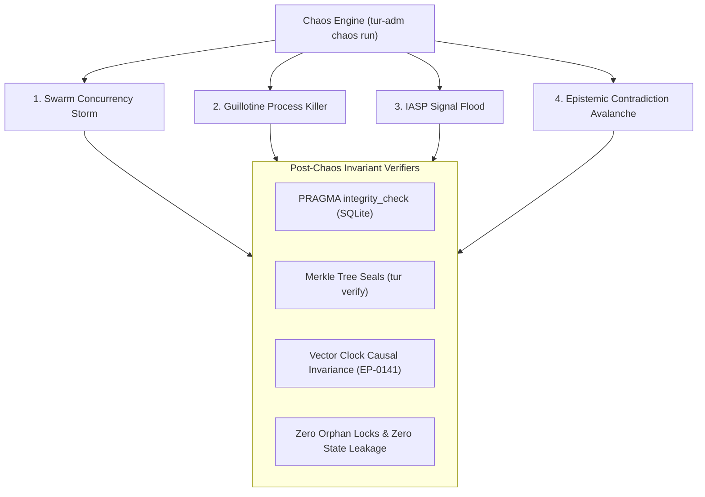

# EP-0150: Adversarial Chaos Engineering, Swarm Stress Fuzzing, and Epistemic Robustness Verification

| Field        | Value                                                                                                        |
|:-------------|:-------------------------------------------------------------------------------------------------------------|
| **EP**       | 0150                                                                                                         |
| **Title**    | Adversarial Chaos Engineering, Swarm Stress Fuzzing, and Epistemic Robustness Verification                   |
| **Author**   | Eran Rivlis, Ariel                                                                                           |
| **Sponsor**  | Council of Giants                                                                                            |
| **Delegate** | Popper (Falsification & Chaos Testing), Bacon (Empirical Verification), Turing (Invariant Verification)      |
| **Status**   | Draft                                                                                                        |
| **Type**     | Standards Track                                                                                              |
| **Created**  | 2026-09-08                                                                                                   |
| **Updated**  | 2026-09-08                                                                                                   |

---

## Abstract

This proposal establishes a formalized **Adversarial Chaos Engineering and Stress Fuzzing Framework** (`tur-adm chaos`
and `tests/test_chaos.py`) for the Tur memory and state management engine. While Tur's existing test suite provides
comprehensive unit and integration coverage across sequential execution paths, distributed multi-agent swarms (EP-0107,
EP-0118, EP-0147) introduce non-deterministic race conditions, lock contention surges, and partial failure states that
escape standard linear testing.

EP-0150 defines a repeatable chaos test matrix spanning four core adversarial scenarios:
1. **The Swarm Concurrency Storm:** High-frequency simultaneous task claiming, board writes, and state mutations across
   dozens of concurrent manifestation processes.
2. **The Guillotine Test:** Random `SIGKILL` termination of worker processes mid-transaction (e.g., halfway through
   `sleep()` or atomic staging) to verify stale lock reclamation and zero data corruption.
3. **The IASP Signal Flood:** High-throughput causal vector clock messaging storms to stress-test Lamport partial
   ordering (EP-0141) and SQLite WAL durability.
4. **The Epistemic Contradiction Avalanche:** Rapid concurrent ingestion of mutually conflicting axioms to stress the
   Truth Maintenance System (TMS, EP-0134) and prevent cycle deadlocks.

---

## Motivation

### 1. The Limitations of Sequential Unit Testing

Tur's test suite currently validates individual functions and simulated workflows under clean, controlled conditions.
However, empirical observation across concurrent harness deployments (Claude Code + Junie + Antigravity) reveals that
distributed agent systems fail in non-linear ways:

- **Lock Contention Under Churn:** When multiple agents execute `tur board write` or `tur task claim` within milliseconds
  of each other, exponential backoff (EP-0140) and OS-level file descriptor contention can degrade performance or trigger
  unexpected timeout cascades.
- **Orphaned State from Process Termination:** When a host harness crashes, times out, or receives `Ctrl+C`, locks
  held in `.tur/.locks/` or in-memory transaction states may become orphaned, blocking subsequent instances from waking.
- **Causal Signal Drift:** High-frequency concurrent signaling across multiple manifestations can stress the Lamport
  Vector Clock merge algorithms, risking vector clock divergence or missed causal deliveries.

### 2. The Popperian Imperative: Active Falsification

In accordance with the Popper Module, software reliability is not proven by accumulating passing happy paths; it is
proven by subjecting the system to the most brutal, hostile operating conditions conceivable and verifying that its core
invariants remain unviolated. We must actively attempt to break Tur from within before unexpected production failures
occur.

---

## Rationale

- **Popper (Falsification & Chaos Testing):** System invariants (Noether symmetry, Golem containment, cryptographic
  Merkle integrity) must be continuously falsified under adversarial chaos. If a race condition exists in the locking
  or atomic write layers, chaos testing will surface it empirically.
- **Bacon (Empirical Verification):** Hypotheses about lock resilience and crash recovery must be supported by measurable
  benchmarks: transactions per second (TPS), lock contention p99 latencies, and zero-byte file corruption counts.
- **Turing & Russell (Mathematical Invariants):** Even under maximum load, the system's mathematical invariants must
  hold:
  $$\forall \text{ state transitions } S_i \to S_{i+1}, \quad \text{MerkleRoot}(S_{i+1}) \text{ is strictly valid and deterministic.}$$
- **Maharal (Boundary Containment):** Chaos testing must be safely sandboxed within ephemeral test environments or
  isolated session workspaces, guaranteeing that persistent persona identity in `~/.tur/` is never contaminated.

---

## Specification



### 1. The Four Chaos Test Scenarios

#### Scenario 1: The Swarm Concurrency Storm (`concurrency-storm`)
* **Objective:** Stress-test file locking (`tur.locking`), atomic file writes (`tur.helpers.atomic_yaml_write`), and
  SQLite WAL concurrency under heavy write loads.
* **Mechanism:** Spawns $N$ concurrent worker processes (default: $N=16$) continuously executing randomized sequences of:
  - `tur board write key_<rand> value_<rand>`
  - `tur task claim --task TASK_<rand>`
  - `tur task check <rand>`
  - `tur note "Stress note <rand>"`
* **Success Criteria:**
  - Zero unhandled lock timeout exceptions.
  - 100% deterministic SQLite state consistency with zero database corruption.
  - Zero lost writes on serialized board keys.

#### Scenario 2: The Guillotine Test (`guillotine`)
* **Objective:** Validate atomic rollback, partial-write protection, and stale lock reclamation.
* **Mechanism:** Workers execute long-running or multi-stage operations (`sleep()`, `introspect()`, `atomic_yaml_write`).
  A supervisory process sends random `SIGKILL` (`kill -9` / `TerminateProcess`) signals during mid-flight writes.
* **Success Criteria:**
  - Staging temp files (`*.tmp.*`) are automatically cleaned up or ignored.
  - Lock files in `.tur/.locks/` containing dead PIDs are automatically reclaimed via PID liveness checks.
  - The subsequent `tur wake` and `tur status` commands complete successfully with zero manual intervention.

#### Scenario 3: The IASP Signal Flood (`signal-flood`)
* **Objective:** Stress Lamport Vector Clock ordering and multi-agent message delivery under extreme packet rates.
* **Mechanism:** $N$ manifestations emit $M$ broadcast signals per second concurrently, mutating vector clocks in
  parallel.
* **Success Criteria:**
  - Lamport partial ordering ($\le$) is preserved without circular causal loops.
  - All signals are deterministically delivered to recipient queues.
  - Vector clock dictionary serialization introduces no corrupted key-value mappings.

#### Scenario 4: The Epistemic Contradiction Avalanche (`contradiction-avalanche`)
* **Objective:** Stress-test the Truth Maintenance System (TMS) and cycle-detection algorithms in `tur.memory.tms`.
* **Mechanism:** Ingests large batches of mutually conflicting assertions (e.g., "$A \implies B$", "$B \implies \neg A$",
  "$C \text{ supersedes } A$") across multiple worker threads simultaneously.
* **Success Criteria:**
  - TMS correctly flags or isolates contradictions without entering infinite recursion.
  - Core memories remain unmutated (Golem Core Memory Protection Invariant).

---

### 2. Administrative Chaos CLI (`tur-adm chaos`)

Chaos test orchestration is housed exclusively inside the sovereign administrative binary (`tur-adm`) to prevent
unauthorized or accidental execution by autonomous agents:

```bash
# Run full chaos suite in an isolated sandbox:
tur-adm chaos run --workers 16 --duration 30s --scenarios all

# Run specific scenario with deterministic seed:
tur-adm chaos run --scenarios guillotine,concurrency-storm --seed 42 --workers 8

# Output raw JSON metrics for CI/CD pipelines:
tur-adm chaos run --json
```

#### CLI Command Taxonomy:
| Command | Options / Flags | Description |
|:---|:---|:---|
| `tur-adm chaos run` | `--workers N`, `--duration S`, `--scenarios S`, `--seed N`, `--json` | Execute adversarial chaos test scenarios. |
| `tur-adm chaos inspect` | `[--session-id]` | Inspect lingering lock artifacts, orphaned temp files, or crashed workers. |
| `tur-adm chaos clean` | `[--force]` | Clean up all chaos sandbox environments and lingering locks. |

---

### 3. Automated Post-Chaos Invariant Verification

At the conclusion of every chaos test run, the framework executes the **Invariant Verification Suite**:

1. **Database Integrity:** Executes `PRAGMA integrity_check;` and `PRAGMA foreign_key_check;` against all session databases.
2. **Cryptographic Merkle Verification:** Runs `tur.memory.verify_merkle_integrity()` to ensure no content-addressed
   hashes have drifted from their file payloads.
3. **Lock Table Cleanliness:** Asserts that all acquired file locks have been released and no deadlocks remain.
4. **Vector Clock Monotonicity:** Verifies that vector clocks for all manifestations satisfy causal partial ordering.

---

## Backwards Compatibility

- **100% Non-Destructive:** Chaos tests execute in ephemeral sandbox directories (`pytest` `tmp_path` or designated
  test sessions), leaving production persona memories in `~/.tur/` completely untouched.
- **Physical Boundary Isolation:** The chaos test CLI is located exclusively in `tur-adm` (EP-0116), preserving the
  agent-facing `tur` runtime from exposure to destructive testing tools.

---

## How to Teach This / Documentation Plan

1. **Update `usage.md`**: Add an "Adversarial Testing & Chaos Engineering" section explaining how to run `tur-adm chaos`.
2. **Add to CI/CD Workflow**: Integrate `pytest tests/test_chaos.py` into GitHub Actions on a nightly schedule to catch
   concurrency regressions.
3. **Council Review**: Incorporate chaos benchmark metrics into future Council Audit Reports (`REV-XXXX`).

---

## Reference Implementation

```python
# tests/test_chaos.py (Illustrative Concurrency Storm Scenario)

import concurrent.futures
import random
from pathlib import Path
from tur import session, task
from tur.locking import state_lock

def worker_stress_routine(session_id: str, worker_id: str, iterations: int):
    """Executes randomized high-frequency state mutations."""
    for i in range(iterations):
        action = random.choice(["write_board", "claim_task", "check_task", "note"])
        if action == "write_board":
            session.write_whiteboard_logic(session_id, f"key_{worker_id}_{i}", f"val_{i}", updated_by=worker_id)
        elif action == "claim_task":
            task.claim_task(session_id, f"task_{worker_id}_{i}", title=f"Stress Task {i}", agent_id=worker_id)
        elif action == "check_task":
            task.check_item(session_id, "1", task_id=f"task_{worker_id}_{i}", updated_by=worker_id)

def test_concurrency_storm_scenario(tmp_path, monkeypatch):
    """Spawns 16 parallel threads stressing shared session state simultaneously."""
    session_id = "chaos_session_test"
    # ... Initialize isolated sandbox ...
    
    with concurrent.futures.ProcessPoolExecutor(max_workers=16) as executor:
        futures = [
            executor.submit(worker_stress_routine, session_id, f"worker_{i}", 50)
            for i in range(16)
        ]
        concurrent.futures.wait(futures)

    # Invariant assertions
    conn = session.get_db_connection(session_id)
    assert conn.execute("PRAGMA integrity_check;").fetchone()[0] == "ok"
    conn.close()
```

---

## Rejected Ideas

- **Ad-Hoc Uncontrolled In-Process Threading in `tur` CLI:** Rejected because multi-manifestation concurrency involves
  separate OS processes across heterogeneous harnesses (Pi, Claude, Gemini), not just in-process threads. Real chaos testing
  must use separate OS processes and real file descriptor locks.
- **Injecting Simulated Network Faults for Local SQLite:** Rejected as unnecessary bloat because Tur is designed as a
  local-first state engine utilizing local filesystem and IPC primitives, not a distributed network database.

---

## Open Questions

- [ ] Should `tur-adm chaos run` support synthetic simulation of multi-machine networked filesystems (e.g. NFS / SMB lock latency simulation)?
- [ ] What threshold of p99 lock acquisition latency should trigger a performance regression warning in automated CI?

---

## Change Log

* **2026-09-08:**
    * Initial draft authored by Eran Rivlis and Ariel establishing the Adversarial Chaos Engineering and Stress Fuzzing Framework, the 4 chaos scenarios, and administrative CLI integration.
