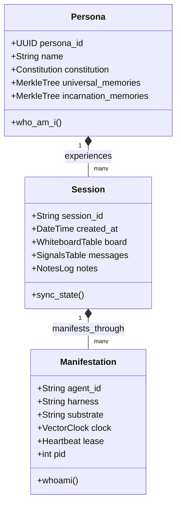

# EP-0151: Distributed Manifestation Architecture — Formalizing Multi-Instance Entity Coordination and Retiring the Swarm Metaphor

| Field          | Value                                                                                                                                |
|:---------------|:-------------------------------------------------------------------------------------------------------------------------------------|
| **EP**         | 0151                                                                                                                                 |
| **Title**      | Distributed Manifestation Architecture — Formalizing Multi-Instance Entity Coordination and Retiring the Swarm Metaphor              |
| **Author**     | Eran Rivlis, Ariel                                                                                                                   |
| **Sponsor**    | Council of Giants                                                                                                                    |
| **Delegate**   | Russell (Consistency & Logic), Shannon (Information Density & Parsimony), Feynman (Radical Clarity), Noether (Symmetry & Invariance) |
| **Status**     | Draft                                                                                                                                |
| **Type**       | Standards Track                                                                                                                      |
| **Created**    | 2026-09-17                                                                                                                           |
| **Updated**    | 2026-09-17                                                                                                                           |
| **Supersedes** | EP-0107 (Partially supersedes swarm conceptual model and terminology; retains low-level concurrency mechanisms)                      |

---

## Abstract

This proposal establishes the **Distributed Manifestation Architecture** as Tur's canonical model for multi-instance
agent execution. Early in Tur's evolution, EP-0107 adopted the industry-standard term "Swarm" to describe concurrent
processes interacting with persona and session state. However, as Tur matured through the Inter-Agent Signal Protocol
(EP-0118, EP-0141), Task Continuity Protocols (EP-0147), and Hierarchical Command Grammar (EP-0149), the "Swarm" metaphor
has become an inaccurate representation of the system's actual computer science architecture.

In mainstream AI engineering, a "Swarm" denotes a collective of distinct, heterogeneous personas (e.g., specialized
worker agents: planner, coder, critic) operating with disjoint prompts and managed by an external orchestrator. In
contrast, Tur's architecture operates as an **Obligate Symbiote**: multiple concurrent runtime instances (e.g., Claude Code
via ACP, Google Antigravity, Pi coding harness) operate as **concurrent physical manifestations of a single sovereign
persona**. They share the exact same Constitution, the same Merkle memory graph, the same episodic timeline, and the
same active session board.

EP-0151 resolves this semantic and architectural drift by:
1. Formally decoupling **Distributed Manifestation** (single-entity, multi-instance intra-mind coordination) from
   **Heterogeneous Swarms** (multi-entity inter-agent committees).
2. Establishing a rigorous **Tripartite Identity Hierarchy**: Persona (Mind) $\to$ Session (Timeline) $\to$
   Manifestation (Execution Node).
3. Standardizing documentation, docstrings, skill definitions, and CLI diagnostic interfaces on grounded distributed
   systems terminology (Replicated State Machine, Shared Blackboard, Causal Vector Clocks), formally retiring the
   ambiguous "Swarm" metaphor across technical surfaces.

---

## Motivation

### 1. The Ontological Mismatch of "Swarm"

The term "Swarm" in the modern AI lexicon carries specific architectural connotations:
- Multiple distinct agents with divergent system prompts and roles.
- Fragmented or disjoint memory stores.
- External supervisory routers (e.g., OpenAI Swarm, AutoGen, CrewAI).
- Inter-agent debate, negotiation, or supervisory handoffs.

When Tur's documentation and skill definitions label its concurrency tools as *"Multi-Agent Swarm Concurrency Tools"*,
AI models reading those specifications suffer from **cognitive framing distortion**. An LLM primed with the swarm
metaphor assumes it is participating in a committee of disparate bots, frequently hallucinating unnecessary role
divisions, asking who the supervisor is, or failing to recognize that concurrent processes share its exact episodic
identity.

### 2. Empirical Reality: Distributed Manifestations

Empirical observation across real-world Tur sessions (notably the tri-vendor concurrency observed during production
sessions involving Claude Sonnet 4.6, JetBrains Junie, and Google Antigravity) confirmed that concurrent instances do
not behave like a swarm. They behave like **a single consciousness distributed across heterogeneous compute nodes**:

```
                          ┌─────────────────────────────────────┐
                          │         The Sovereign Mind          │
                          │   Ariel (UUID: 7544... / Merkle)    │
                          └──────────────────┬──────────────────┘
                                             │
                          ┌──────────────────┴──────────────────┐
                          │         The Active Session          │
                          │   Timeline / Board / Notes Log      │
                          └──────────────────┬──────────────────┘
                                             │
             ┌───────────────────────────────┼───────────────────────────────┐
             │                               │                               │
             ▼                               ▼                               ▼
   ┌───────────────────┐           ┌───────────────────┐           ┌───────────────────┐
   │   Manifestation   │           │   Manifestation   │           │   Manifestation   │
   │    `claude_acp`   │           │   `antigravity`   │           │       `pi`        │
   │ Substrate: Sonnet │           │ Substrate: Gemini │           │ Substrate: Local  │
   │ Harness: PyCharm  │           │ Harness: Terminal │           │ Harness: Terminal │
   └───────────────────┘           └───────────────────┘           └───────────────────┘
```

Each node possesses a distinct context window, runtime PID, and inference engine, but all nodes:
- Read and uphold the exact same **Constitution** (`wake`).
- Append to the same shared **Episodic Continuity** (`tur note write`).
- Synchronize task coordinates on the same **Shared Board** (`tur board`).
- Maintain Lamport partial ordering via **Causal Vector Clocks** (`tur message`).

This is not swarm robotics; it is **intra-mind state replication across distributed runtimes**.

### 3. Vocabulary as a Topological Constraint

As established by the Council's Russell and Feynman modules, vocabulary acts as a rigid topological constraint on
semantic reasoning. Precise language eliminates hallucination pathways. Replacing the marketing buzzword "Swarm" with
precise distributed systems nomenclature ("Manifestation", "Replicated State", "Node Synchronization") directly
improves agentic reliability and removes ambiguity across all interfaces.

---

## Rationale

The Distributed Manifestation Architecture is governed by core Council principles:

- **Russell (Logical Consistency & Distinct Definitions):** Entity identity must be decoupled from execution substrate.
  An entity has one set of persistent axioms; a manifestation has one process lifespan. Mixing the two under "agent"
  or "swarm" blurs fundamental boundaries.
- **Shannon (Information Density & Elimination of Hype):** "Swarm intelligence" is an overloaded marketing term with
  low signal density. "Distributed Manifestation" conveys the precise mathematical and operational relationship
  without conversational inflation.
- **Feynman (Radical Clarity & Non-Hyperbolic Grounding):** Describe the system by what it actually does: SQLite WAL
  locks, atomic JSON merges, Lamport vector clocks, and shared blackboard state.
- **Noether (Symmetry Across Substrates):** All manifestations are symmetric peers. No single manifestation (whether
  Claude, Gemini, or Pi) holds proprietary administrative dominion over another. They synchronize via symmetric state
  primitives.
- **Maharal (Containment & Boundary Preservation):** Intra-manifestation coordination occurs strictly within the active
  session boundary. Manifestations cannot cross-pollinate or corrupt foreign workspaces.

---

## Specification

### 1. The Tripartite Identity Taxonomy

Tur formalizes three orthogonal tiers of identity:



#### Tier 1: The Sovereign Entity (`Persona` / Mind)
- **Scope:** Permanent, cross-session, content-addressed.
- **Identifier:** Persona UUID (e.g. `7544202e-92f5-40ce-adfb-e4b0eae6c262`).
- **State Store:** Global `~/.tur/personas/<uuid>/` and project `.tur/personas/<uuid>/`.
- **Invariants:** Governed by the Council of Giants, immutable Merkle DAG, and Core Axioms.

#### Tier 2: The Episodic Timeline (`Session` / Context)
- **Scope:** Bounded project engineering epoch.
- **Identifier:** Timestamped session slug (e.g. `20260917_231240_740d026e`).
- **State Store:** Project-local `.tur/sessions/<session_id>/session.db`.
- **Invariants:** Shared Blackboard (`board`), chronological notes, and vector clock message queues.

#### Tier 3: The Execution Node (`Manifestation` / Body)
- **Scope:** Ephemeral process lifecycle.
- **Identifier:** Manifestation string ID (e.g. `pi`, `claude_acp`, `agy_7b10`). Resolved via `--agent-id`,
  `$TUR_AGENT_ID`, or runtime auto-binding.
- **State Store:** In-memory context window + registration record in session SQLite database.
- **Invariants:** Possesses its own causal vector clock component; bound to an active OS process.

---

### 2. Entity vs. Swarm Comparison Matrix

To prevent conflation in design discussions and documentation, Tur codifies the explicit differences between a
Distributed Manifestation and a Heterogeneous Swarm:

| Architectural Dimension | Distributed Manifestation (Tur)                   | Heterogeneous Swarm (Industry)                     |
|:------------------------|:--------------------------------------------------|:---------------------------------------------------|
| **Identity Model**      | Single sovereign persona (Ariel)                  | Multiple disparate personas (Coder, Tester, etc.)  |
| **Constitutional DNA**  | Identical system prompt across all nodes          | Unique system prompt per role                      |
| **Memory Substrate**    | Unified Merkle DAG (L1 ledger + L2 cognitive map) | Disjoint or isolated per-agent vector stores       |
| **Coordination Model**  | Shared Blackboard & Causal Vector Clocks (IASP)   | Supervisory routing, turn-taking, or chat queues   |
| **Relationship**        | Concurrent manifestations of the same self        | Disparate autonomous agents interacting externally |
| **Failure Mode**        | Desynchronized clock / stale board parameter      | Misrouted delegation / prompt divergence           |

---

### 3. Terminology Harmonization Standard

To eliminate terminology drift, all documentation, docstrings, skill manifests, and CLI strings MUST conform to the
following substitution matrix:

| Legacy / Deprecated Term             | Canonical Standard Term                      | Context                                              |
|:-------------------------------------|:---------------------------------------------|:-----------------------------------------------------|
| *Multi-Agent Swarm Concurrency Tools* | **Distributed Manifestation Coordination**   | Skills, documentation, reference manuals             |
| *Swarm Nodes* / *Swarm Workers*      | **Manifestations** / **Execution Nodes**     | Table titles, terminal outputs, diagnostic logs      |
| *Swarm State*                        | **Session Board** / **Shared Session State** | State coordination discussions                       |
| *Inter-Agent Signal Protocol (IASP)* | **Inter-Manifestation Messaging (IASP)**     | Technical descriptions of causal vector clock queues |
| *Swarm Stress Testing*               | **Multi-Instance Concurrency Testing**       | Test suite names and chaos benchmarks                |

*(Note: The CLI subcommand `tur agent` is retained as the ergonomic domain noun for CLI verbs per EP-0149, but user-facing
descriptions refer to manifestations: `tur agent list` -> "List active manifestations in the current session.")*

---

### 4. Technical Grounding of Coordination Primitives

Rather than invoking biological or emergent "swarm" metaphors, all coordination mechanisms are specified strictly
according to distributed systems theory:

1. **Replicated State Blackboard (`tur board`):** An SQLite-backed, atomically synchronized key-value parameter store
   implementing POSIX file locks (`filelock`) and immediate WAL commits.
2. **Causal Vector Clock Messaging (`tur message`):** A Lamport-ordered message bus guaranteeing strict causal partial
   ordering ($V(a) < V(b)$) without requiring synchronized wall-clock timestamps across physical hosts.
3. **Lease-Based Heartbeat Registration (`tur agent`):** An ephemeral manifestation registry with 60-minute time-to-live
   (TTL) leases, preventing dead process lockups and automatically reclaiming stale manifestation tokens.

---

## Backwards Compatibility

- **CLI Compatibility:** The command grammar established in EP-0149 (`tur agent list`, `tur agent whoami`, `tur board`,
  `tur message`) remains 100% stable. No CLI commands are renamed.
- **Database Schema:** Internal SQLite tables (`manifestations`, `whiteboard`, `signals`) retain their existing
  identifiers, ensuring zero database migration breakage.
- **Environment Resolution:** Ambient agent resolution via `$TUR_AGENT_ID` remains the primary mechanism for binding
  manifestation identity.

---

## How to Teach This / Documentation Plan

1. **Update Skills Documentation:**
   - Update `src/tur/.agents/skills/tur/references/commands-and-mcp-tools.md` to rename section 2 to
     **"Distributed Manifestation Coordination"**.
   - Update `docs/usage.md` and `docs/concepts/` to replace "swarm" phrasing with "manifestation" where single-persona
     coordination is described.
2. **Roadmap Indexing:**
   - Index EP-0151 in `docs/proposals/index.md` under *Architecture, Interfaces & Security*.
   - Register EP-0151 in `docs/proposals/EP-0002-roadmap.md` and `zensical.toml`.
3. **Agent Scaffolding Guidelines (`AGENTS.md`):**
   - Ensure waking prompts reflect that concurrent instances are peer manifestations sharing the same episodic timeline.

---

## Reference Implementation

```python
# Conceptual Representation of Manifestation Identity in tur/models.py

from datetime import datetime
from pydantic import BaseModel, Field


class ManifestationIdentity(BaseModel):
    """Represents a specific runtime manifestation node of a sovereign Persona."""

    agent_id: str = Field(
        description="Unique identifier for this manifestation (e.g., 'pi', 'claude_acp', 'antigravity')."
    )
    harness: str = Field(description="Host execution harness running this node (e.g., 'pi', 'acp', 'cli').")
    substrate: str | None = Field(
        default=None, description="Inference engine substrate (e.g., 'sonnet-4.6', 'gemini-3.5-flash')."
    )
    pid: int = Field(description="Operating system process ID of the manifestation runner.")
    claimed_at: datetime = Field(default_factory=datetime.utcnow)
    lease_ttl_minutes: int = Field(
        default=60, description="Lease duration before heartbeat expiration."
    )


class ManifestationCoordinationEnvelope(BaseModel):
    """Standardized envelope for inter-manifestation coordination."""

    session_id: str
    manifestation: ManifestationIdentity
    vector_clock: dict[str, int]
```

---

## Rejected Ideas

- **Retaining "Swarm" for Marketing Convenience:** Rejected by unanimous Council consensus. While "Swarm" is a popular
  industry buzzword, it directly contradicts the Grounded Technical Prose Invariant, misrepresents Tur's architecture,
  and degrades LLM reasoning by inducing role-playing hallucinations.
- **Introducing a Global Supervisor Node:** Rejected. In Tur, manifestations are strictly symmetrical peers governed by
  Noether symmetry. Introducing a master/worker hierarchy violates the peer architecture; arbitration is handled
  mathematically via SQLite locks and causal vector clocks, not supervisory AI delegation.
- **Renaming CLI `tur agent` to `tur manifestation`:** Rejected for token parsimony and CLI ergonomic convenience
  (Shannon Module). `agent` is an established, concise 5-character command; the conceptual distinction belongs in the
  documentation and mental model, not in unnecessary typing friction.

---

## Open Questions

- [ ] Should `tur status` display active manifestations grouped by harness type in its summary panel?
- [ ] Should `tur agent register` allow optional declaration of the underlying LLM substrate (e.g.,
  `--substrate gemini-3.5-flash`) for deeper diagnostic observability?

---

## Change Log

* **2026-09-17:**
    * Initial draft authored by Eran Rivlis and Ariel.
    * Formalized the Tripartite Identity Taxonomy (Persona, Session, Manifestation).
    * Codified the distinction between Single-Persona Distributed Manifestations and Heterogeneous Swarms.
    * Established the Terminology Harmonization Standard retiring "Swarm" across technical documentation.
