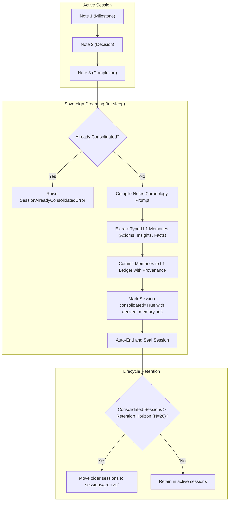
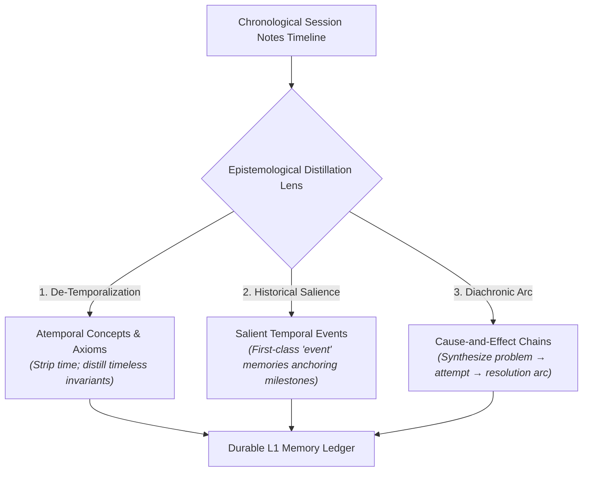

# EP-0152: Sovereign Note-Based Dreaming, Consolidation Provenance, and Session Lifecycle Pruning

| Field          | Value                                                                                                                                              |
|:---------------|:---------------------------------------------------------------------------------------------------------------------------------------------------|
| **EP**         | 0152                                                                                                                                               |
| **Title**      | Sovereign Note-Based Dreaming, Consolidation Provenance, and Session Lifecycle Pruning                                                             |
| **Author**     | Eran Rivlis, Ariel                                                                                                                                 |
| **Sponsor**    | Council of Giants                                                                                                                                  |
| **Delegate**   | Shannon (Information Density & Parsimony), Bacon (Empirical Provenance & Auditability), Maharal (Boundary Containment), Russell (Logical Invariance) |
| **Status**     | Draft                                                                                                                                              |
| **Type**       | Standards Track                                                                                                                                    |
| **Created**    | 2026-09-18                                                                                                                                         |
| **Exploration**| [EXP-0011](https://github.com/erivlis/tur/tree/main/references/explorations/EXP-0011-sovereign-episodic-consolidation-and-causal-distillation)    |
| **Affects**    | EP-0108, EP-0110, EP-0130, EP-0147, EP-0149                                                                                                        |


---

## Abstract

This proposal establishes **Sovereign Note-Based Dreaming** as Tur's primary, harness-agnostic mechanism for episodic
memory consolidation. Historically, `tur sleep` required an external chat log (`[log_path]`) to extract durable L1
memories. This introduced an architectural violation of the Tri-Partite decoupling principle: the Traveler's memory
consolidation was made dependent on external Harness logging mechanics, while high-density chronological session notes
(`tur note`) accumulated in sovereign SQLite state without automated memory distillation.

EP-0152 resolves this limitation and addresses the session lifecycle across three core pillars:

1. **Sovereign Note-Based Dreaming:** Makes session notes (`SessionNotes` in YAML and SQLite) the canonical,
   zero-configuration input for `tur sleep`. The dreaming engine applies a three-tiered epistemological filter to
   distill atemporal conceptual invariants, first-class salient temporal events, and multi-note cause-and-effect arcs
   directly from accumulated session notes without requiring external chat transcripts or manual `--commit` payloads.
2. **Consolidation Provenance and Idempotency:** Prevents "double-dreaming" by introducing explicit consolidation
   metadata (`consolidated: bool`, `consolidated_at`, `derived_memory_ids`) to session schemas. Re-running dreaming on
   an already consolidated session is rejected by default, ensuring mathematical idempotency.
3. **Bounded Session Retention and Lifecycle Pruning:** Addresses unbounded session growth by formalizing a bounded
   session retention ring buffer, automatic archive rotation, and administrative pruning verbs (`tur-adm session prune`)
   to maintain strict physical boundary containment.

---

## Motivation

### 1. The Harness-Coupling Anti-Pattern

Under the Tri-Partite Architecture, the **Traveler** (Mind) must remain cleanly decoupled from the **Harness** (Inference
compute and mechanical affordances). However, `tur sleep` historically required an external transcript file:

```shell
tur sleep path/to/chat.log
```

This presents several structural failures:
* **Harness Incompatibility:** Different harnesses (Google Antigravity, Claude Code, Cursor, Pi, Aider) format, buffer,
  and rotate chat logs in divergent, incompatible formats.
* **Multi-Manifestation Blindness:** In a distributed session where multiple manifestations (e.g. `antigravity` and
  `pi`) collaborate concurrently on the same session board, no single harness log contains the complete episodic history.
* **External Dependency:** An agent operating autonomously in a sandboxed subshell cannot easily discover or access the
  host harness's internal logging directory.

In contrast, **session notes (`tur note`) are sovereign to Tur**. They are emitted directly into the session database,
span all concurrent manifestations, and survive harness resets.

### 2. Information Density and Token Economics (Shannon)

A raw harness chat log typically spans hundreds of thousands of tokens, dominated by repetitive tool invocations, file
read outputs, intermediate compiler errors, and raw JSON-RPC envelopes (high entropy, low signal).

In contrast, session notes are emitted strictly at milestone achievements and architectural decision boundaries (per
`AGENTS.md` guidelines). A typical session generates 5 to 25 concise notes (~2KB to 10KB total). Synthesizing memories
from session notes:
* Reduces dreaming context token consumption by **over 95%**.
* Eliminates prompt extraction noise and hallucinations induced by raw tool outputs.
* Dramatically lowers API latency and cost during the sleep cycle.

### 3. The Double-Dreaming and Re-Ingestion Hazard

Session notes are permanently preserved in `.tur/personas/<persona_id>/sessions/<session_id>.yaml` and
`.tur/sessions/<session_id>/session.db`. Because past notes are never destroyed:
* An agent or human could repeatedly invoke dreaming on historical sessions.
* Without stateful consolidation tracking, each run would re-extract identical or subtly reworded memories into the
  active L1 ledger.
* This pollutes the L1 memory bank with redundant entries, triggers unnecessary Truth Maintenance System (JTMS)
  evaluations, and inflates the static token cost of future `wake()` compilations.

### 4. Unbounded Session Storage Growth (Maharal)

As agents wake and sleep across hundreds of development workflows:
* Every session generates an independent SQLite database (`.tur/sessions/<session_id>/session.db`) and YAML manifest.
* Over months of continuous pair programming, hundreds of megabytes of abandoned session databases accumulate.
* Without a formal retention, archiving, and compaction policy, Tur violates the **Golem Protocol (Boundary
  Containment)** by permitting unbounded disk footprint expansion.

---

## Rationale (The Council Framework)

* **Shannon (Information Parsimony):** High-density notes represent the pure distilled signal of the session. Dreaming
  over notes maximizes information density ($H$) while minimizing thermodynamic token waste.
* **Bacon (Empirical Provenance & Traceability):** Every L1 memory must possess an unbroken cryptographic lineage
  tracing back to the exact chronological note and session that birthed it (`tur://session/<session_id>#note-<idx>`).
* **Russell (Logical Invariance & Idempotence):** The dreaming transformation $f(\text{Session}) \to \text{Memories}$
  must be idempotent. A session in state `consolidated` cannot yield duplicate L1 memories on repeated evaluation.
* **Maharal (Boundary Containment & Finite State):** Storage must not expand unboundedly. A formal retention horizon
  guarantees that historical ephemeral state is safely compacted and pruned without endangering consolidated long-term
  continuity.

---

## Specification



### 1. Sovereign Note-Based Dreaming Pipeline

The `tur sleep` CLI command and corresponding MCP tool are upgraded to make session notes the primary default input:

```shell
# Canonical invocation: automatically distills from the active session's notes
tur sleep -n "Final milestone note before sleep."

# Explicit flags
tur sleep --from-notes -n "..."              # Explicitly enforce note distillation
tur sleep --from-log path/to/transcript.jsonl # Legacy fallback to external harness log
tur sleep --force -n "..."                  # Bypass already-consolidated guard
```

#### Note Dreaming Prompt Structure

When dreaming from notes, Tur compiles a structured, chronological markdown document:

```markdown
Analyze the following chronological milestone notes recorded during session '{session_id}'
and extract durable long-term memories that should be consolidated across sessions.

Session Notes Timeline:

- [2026-09-18 00:44:36] (agent-alpha): Authored and registered EP-0005.
- [2026-09-18 01:07:56] (agent-beta): Verified test suite and benchmark pass rate.
- [2026-09-18 01:49:10] (antigravity): Published release v0.15.1 to PyPI.

Memory Extraction Principles:
{DREAMING_EXTRACTION_PRINCIPLES}

Your Output MUST be a raw JSON object matching the Dream schema.
```

If the active session contains zero notes, `tur sleep` will prompt for a descriptive final note (`-n`) and record it
before executing distillation, ensuring no session is ever dehydrated without semantic context.

---

### 1.1 Distillation Epistemology: Atemporal Concepts, Salient Events, and Causal Chains

Episodic notes are fundamentally chronological and transient. The dreaming transformation $f(\text{Notes}) \to \text{Memories}$
must not perform a mindless 1:1 translation of notes into facts. Instead, the extraction engine operates under a
three-tiered epistemological lens:



#### 1. Atemporal Concept Crystallization (Primary Transformation)
* The primary objective of dreaming is **de-temporalization**: lifting time-bound narrative into timeless invariants,
  axioms, and design principles.
* *Example:* A sequence of episodic notes detailing *"Investigated SQLite foreign keys, discovered PRAGMA foreign_keys
  was disabled on new connections, added PRAGMA to connection factory"* is distilled into an **atemporal axiom**:
  > *"SQLite connections must explicitly execute PRAGMA foreign_keys = ON immediately upon connection initialization to
  > prevent silent foreign key constraint deactivation."*
* Timestamps and transient execution details are stripped from universal insights, preserving only the underlying law.

#### 2. Salient Temporal Events as First-Class Memories
* While incidental notes are atemporalized, **epochal phase transitions, major architectural releases, and external
  milestones** are explicitly preserved as L1 `event` memories.
* These memories retain temporal coordinates because their value is historical and chronological (anchoring the
  provenance of when a fundamental change occurred in the terrain).
* *Example:* *"Release v0.15.1 on 2026-09-18 executed the Zero-Entropy Clean Break, retiring legacy whiteboard and
  signal aliases across CLI and MCP."* (`type: event`, `scope: persona`).

#### 3. Causal Chain Synthesis (Diachronic Cause-and-Effect)
* In engineering workflows, notes frequently record a multi-step empirical arc:
  $$\text{Problem / Symptom} \longrightarrow \text{Investigation} \longrightarrow \text{Intervention} \longrightarrow \text{Consequence}$$
* The dreaming engine must **never fragment this narrative into disjoint, isolated facts**.
* Instead, it synthesizes the entire chain into a single, cohesive **Cause-and-Effect Insight**, establishing the
  causal mechanism:
  > *"Because raw chat transcripts contain >95% tool execution noise and leak harness-specific mechanics (Cause),
  > switching the sleep pipeline to consume sovereign session notes reduced token overhead by 98% and made memory
  > consolidation completely harness-agnostic (Effect)."*
* In the downstream L2 cognitive graph, these synthesize typed causal edges (`precedes`, `depends_on`, `refutes`).


---

### 2. Consolidation State and Idempotency Guard

To eliminate double-dreaming and establish cryptographic auditability:

#### 2.1 Schema Extensions (`SessionNotes` & `SessionEntry`)

[`src/tur/models.py`](file:///C:/dev/erivlis/tur/src/tur/models.py) is extended with formal consolidation metadata:

```python
class SessionConsolidationInfo(BaseModel):
    """Tracks memory distillation status and provenance for a session."""
    consolidated: bool = False
    consolidated_at: datetime | None = None
    derived_memory_ids: list[str] = Field(default_factory=list)
    consolidation_model: str | None = None
    note_count_at_consolidation: int = 0

class SessionNotes(BaseModel):
    session_id: str
    parent_session_id: str | None = None
    consolidation: SessionConsolidationInfo = Field(default_factory=SessionConsolidationInfo)
    notes: list[Note] = Field(default_factory=list)
```

#### 2.2 Execution Guard

When `tur sleep` begins:
1. It inspects `session_notes.consolidation.consolidated`.
2. If `True` and `--force` is not set, execution halts immediately with:
   ```
   SessionAlreadyConsolidatedError: Session '20260918_004355_d8ca9e13' was already consolidated
   at 2026-09-18 01:49:10 (created 3 L1 memories). Pass --force to re-dream.
   ```
3. Upon successful memory extraction:
   * Each generated `Memory` record sets its `source_session` and appends a provenance link:
     ```python
     MemoryLink(uri=f"tur://session/{session_id}", relation="consolidated_from")
     ```
   * `session_notes.consolidation` is marked `consolidated = True`, recording `consolidated_at = now()` and the list of
     generated memory Merkle hashes in `derived_memory_ids`.

---

### 3. Session Retention, Compaction, and Pruning

To enforce finite boundary containment across months of development, Tur establishes a tiered session lifecycle:

| State | Definition | Storage Location | Retention Policy |
|:---|:---|:---|:---|
| **Active** | Currently open session accepting notes and signals. | `.tur/sessions/<id>/` & `.tur/personas/<p>/sessions/<id>.yaml` | Retained indefinitely until ended. |
| **Ended (Unconsolidated)** | Session ended without memory extraction (e.g. crash). | Same as active. | Retained for inspection and deferred dreaming. |
| **Consolidated** | Dehydrated via `tur sleep`; L1 memories created. | `sessions/` (recent) or `sessions/archive/` (historical). | Subject to Bounded Horizon pruning. |

#### 3.1 Bounded Active Horizon (The Ring Buffer)

* By default, Tur maintains a **Bounded Horizon of $N = 20$ sessions** in the primary sessions directory.
* During `tur sleep`, if the total count of consolidated sessions exceeds $N$:
  1. Older consolidated session files are moved to `.tur/personas/<persona_id>/sessions/archive/`.
  2. The corresponding SQLite database (`.tur/sessions/<session_id>/session.db`) is unlinked, freeing physical disk
     space while preserving the lightweight YAML timeline in the archive.

#### 3.2 Administrative Pruning (`tur-adm session prune`)

Physical deletion of historical session data is isolated strictly in the human administrative binary (`tur-adm`):

```shell
# Retain only the last 10 sessions, archiving or removing older ones
tur-adm session prune --keep 10

# Prune consolidated sessions older than 30 days and vacuum SQLite free pages
tur-adm session prune --max-age-days 30 --vacuum
```

---

## Backwards Compatibility

* **Existing Sessions:** Historical `sessions/<session_id>.yaml` files lacking a `consolidation` block are automatically
  parsed with default `consolidated: false` via Pydantic default factories.
* **CLI Arguments:** Passing an explicit file path (`tur sleep path/to/chat.log`) remains supported for legacy external
  log parsing workflows.
* **L1 Ledger Invariance:** No modifications to existing L1 memory storage formats or cryptographic Merkle hashing algorithms
  are required.

---

## Implementation Plan

1. **Phase 1 (Data Models):** Add `SessionConsolidationInfo` to `SessionNotes` and `SessionEntry` in `src/tur/models.py`.
2. **Phase 2 (Note Dreaming Engine):** Implement `build_note_dreaming_prompt()` and update `perform_sleep_dreaming()` in
   `src/tur/memory/dreaming.py` to accept session notes as input.
3. **Phase 3 (CLI & MCP Alignment):** Update `tur sleep` in `src/tur/cli/agent.py` and `sleep()` tool in
   `src/tur/mcp_server.py` to dream from active notes by default.
4. **Phase 4 (Retention & Pruning):** Implement automatic archive rotation in `session.py` and add `tur-adm session prune`
   in `src/tur/cli/admin.py`.
5. **Phase 5 (Verification):** Add comprehensive unit tests in `tests/test_session.py` and `tests/test_dreaming.py`
   verifying note distillation, idempotency rejection, and archive rotation.

---

## Change Log

* **2026-09-18:** Initial draft authored by Eran Rivlis and Ariel proposing sovereign note-based dreaming, consolidation
  provenance, idempotency guards, and session retention pruning.
