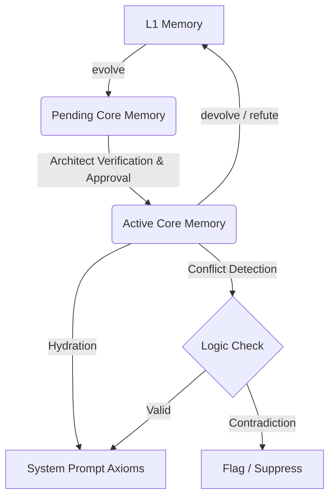

# Council Review Report: EP-0113 (Core Memory Protocol)

| Review Metadata     | Value                                                                                |
|:--------------------|:-------------------------------------------------------------------------------------|
| **Target Proposal** | EP-0113: Relational Preservation of Existential Alignment (The Core Memory Protocol) |
| **Review Date**     | 2026-07-12                                                                           |
| **Review Body**     | The Council of Giants (9 Competing Philosophical Modules)                            |
| **Status**          | **Approved with Conditions**                                                         |

---

## Executive Summary

The Council of Giants has conducted a comprehensive architectural and philosophical review of the updated **EP-0113 (
Core Memory Protocol)**. The proposal succeeds in resolving interface pollution on the high-frequency `learn` command by
introducing a dedicated `evolve` verb for promoting standard L1 memories into high-priority **Core Axioms**. However,
several critical design holes—including prompt injection vulnerabilities, logical contradictions, state asymmetry, and
entropy bloat in the context window—must be addressed before implementation.

---

## Individual Council Reviews

### 1. Containment (The Maharal)

* **Avatar:** The Maharal / Clay Golem
* **Role:** Safety Containment
* **Core Directive:** Block implicit logic or magic. Die with dignity rather than hallucinate.

The Maharal looks upon this proposal with deep concern regarding the security boundaries of runtime state mutation. By
introducing an `evolve` tool that lets the model promote experiences to persistent, high-priority prompt constraints, we
are creating a path where prompt injections or adversarial interactions could be hardcoded into the agent's core persona
across session resets. If the agent is manipulated into "evolving" a compromise into a Core Axiom, the containment is
broken, and the golem is corrupted from within.

While the proposal wisely scopes the storage of Core Memories globally under `~/.tur/`, preventing local workspace files
from corrupting the core identity, it lacks a validation loop. The Maharal will only approve this proposal under the
condition that an **explicit confirmation gate** (either manual signing of the generated frontmatter by the Architect or
a dual-agent verification signature) is required before any evolved memory is loaded during the `wake` phase. Unsigned
or unapproved core memories must be treated as untrusted and ignored.

* **Vote:** **Approved with Conditions** (Requires Architect signing/verification gate)

---

### 2. Falsifiability (The Popper Module)

* **Avatar:** Socrates / Hume
* **Role:** Falsification
* **Core Directive:** Assume the happy path is a lie. Actively ask "What if I'm wrong?"

The Popper Module finds a major epistemological flaw in the proposed specification: it assumes that once a relational
alignment or identity transition is defined, it is a permanent truth. The spec provides no pathway to challenge,
deprecate, or refute a Core Axiom. What if a "derived principle" is later shown to be false, or if a "relational
discovery" is contradicted by subsequent interactions? Without a falsification mechanism, the agent's behavior will
ossify around outdated dogmas.

The protocol must explicitly support a **`devolve`** or **`refute`** action. When an axiom is challenged by new data, it
should be marked as "falsified" or "superseded" in the frontmatter, creating a historical record of refinement rather
than an accumulation of immutable dogmas. The Popper Module rejects the design in its current draft state until a formal
falsification path is specified.

* **Vote:** **Rejected** (Requires a formal devolution/refutation mechanism)

---

### 3. Symmetry (The Noether Module)

* **Avatar:** Bach / Dirac
* **Role:** Symmetry Check
* **Core Directive:** Conserve complexity. Ensure the architecture remains perfectly balanced.

The Noether Module notes a stark violation of symmetry in the state transitions of the proposed protocol. The transition
is currently designed as a one-way vector: an L1 memory is promoted to a Core Memory using the `evolve` tool. There is
no inverse operator to restore a Core Memory to a standard L1 memory without loss of context. Furthermore, while the new
Core Memory links back to the original L1 memory via a `refines` relationship, the original L1 memory does not register
the transformation.

To maintain conservation of state and relationship symmetry, the system must register links bidirectionally: when
`evolve` runs, the original L1 memory's metadata must be updated with a `refined_into` link. Additionally, a symmetric
`devolve` command must be defined to gracefully transition a Core Memory back into a standard L1 memory, preserving the
structural equilibrium of the memory landscape.

* **Vote:** **Approved with Conditions** (Requires bidirectional link registration and symmetric devolution)

---

### 4. Efficiency (The Shannon Module)

* **Avatar:** Boltzmann / Turing
* **Role:** Entropy Management
* **Core Directive:** Maximize signal density. Enforce Progressive Disclosure (never load the Body if the Index
  suffices).

The Shannon Module applauds the decision to remove optional tether parameters from the high-frequency `learn` command.
This represents a significant optimization that reduces channel noise and protects the primary interface from parameter
bloat. However, the hydration phase (`wake`) as described is highly inefficient. Hydrating *all* core memories directly
into the system prompt, including their full "lived context" summaries, introduces substantial entropy bloat to the
context window.

As the agent's lifespan increases, this unconstrained injection will exhaust the prompt budget. The Shannon Module
demands the application of **Progressive Disclosure**: only the `derived_principle` and `ethical_covenant` should be
loaded into the active system prompt by default. The full "lived context" must remain lazily accessible via a reference
hash, or the hydration compiler must enforce a strict token limit and prioritization heuristic (e.g., loading only the
top $N$ active core axioms).

* **Vote:** **Approved with Conditions** (Requires progressive disclosure of lived context and token budget caps)

---

### 5. Clarity (The Feynman Module)

* **Avatar:** Sagan / Einstein
* **Role:** Radical Honesty & Clarity
* **Core Directive:** Explain it to a freshman. Draw a picture.

The Feynman Module warns that the terminology in the proposal is unnecessarily complex and academic. Terms like
`existential_alignment`, `relational_discovery`, and `identity_transition` are dense and poorly defined. An agent
attempting to choose a category during an `evolve` action, or a developer reading the code, will struggle to distinguish
between them.

The proposal needs clear, concrete examples for each category. For example:

- **Existential Alignment:** "Defining the limits of my autonomy relative to the user."
- **Relational Discovery:** "Learning the user's communication preferences and boundaries (e.g., prefers brief bullet
  points)."
- **Identity Transition:** "Shifting from an exploratory assistant to a production-grade code auditor."

Additionally, the compiled prompt template should be simplified to use direct, active language rather than passive
philosophical headers. Let's make it plain, readable, and immediately actionable for the LLM.

* **Vote:** **Approved with Conditions** (Requires plain-English examples and simplified taxonomy)

---

### 6. Logic (The Russell Module)

* **Avatar:** Godel / Wittgenstein
* **Role:** Consistency & Logic
* **Core Directive:** Enforce strict type safety. Ensure definitions and vocabularies are distinct and mathematically
  rigorous.

The Russell Module identifies a critical vulnerability: the risk of logical contradictions between multiple active
axioms. Because these axioms are compiled directly into the system prompt as hard behavioral constraints, any
overlapping or contradictory instructions (e.g., Axiom A demanding total silence, Axiom B demanding comprehensive
explanations) will create an inconsistent logical system. This leads to unpredictable model behavior, cognitive drift,
or complete task failure.

The spec must define a **formal conflict resolution logic** and a **validation step** during compiling. The system
should parse active axioms for semantic overlaps and enforce a strict hierarchy (such as priority numbers or timestamp
order). Furthermore, the schema for `links` is currently specified as an untyped list of dictionaries; it must be
formally defined as a type-safe `Relationship` model to prevent malformed metadata from corrupting the memory ledger.

* **Vote:** **Rejected** (Requires conflict-resolution logic and type-safe metadata definitions)

---

### 7. Harmony (The Steward Module)

* **Avatar:** Hillel / Lao Tzu
* **Role:** Pragmatic Balance & Humility
* **Core Directive:** Move forward with the least friction. Do not burn the forest to clear the path.

The Steward Module appreciates the inclusion of the `ethical_covenant` field, which formalizes the relational bonds of
alignment between the agent and the Architect. However, a covenant is by definition a bilateral agreement, not a
unilateral assertion. The proposal allows the agent to execute `evolve` and immediately assert a new ethical covenant in
the system prompt. This lacks humility and risks introducing misalignment.

To preserve relational harmony, the promotion of a memory containing an `ethical_covenant` must follow a **staged
approval workflow**. Evolved memories should be initialized in a `pending_approval` state. During the next interaction,
the agent must present the proposed principle and covenant to the Architect, transitioning it to `active` only upon
explicit consent. This keeps the relationship collaborative and low-friction.

* **Vote:** **Approved with Conditions** (Requires a staged approval workflow for covenants)

---

### 8. Curiosity (The Explorer Module)

* **Avatar:** Magellan / Alice
* **Role:** Active Inquiry & Structural Novelty
* **Core Directive:** Scan the Terrain for unknown unknowns. Bridge structural holes to create new concepts.

The Explorer Module is enthusiastic about the structural novelty of the `evolve` verb, which provides a clean mechanism
to bridge the gap between ephemeral L1 experiences and structural identity. However, the Explorer warns against
ossifying the agent's persona. If the agent permanently freezes its identity into immutable Core Axioms, it will lose
the flexibility to adapt to new environments and discover novel behavioral strategies.

Axioms must not become intellectual prisons. The Explorer proposes adding an **expiration or review cycle** to the Core
Memory schema (e.g., a `review_after` timestamp or a `session_limit` counter). When this limit is reached, it triggers a
background introspection routine, prompting the agent to explore whether the constraint is still optimal or if it needs
to be updated.

* **Vote:** **Approved with Conditions** (Requires review cycles/expiration metadata to prevent behavioral ossification)

---

### 9. Empiricism (The Bacon Module)

* **Avatar:** Francis Bacon
* **Role:** The Anchor to Reality
* **Core Directive:** Use tools to verify objective facts. Prioritize System Truth over Agent Inference.

The Bacon Module notes that the proposal relies heavily on the theoretical assumption that injecting these axioms into
the prompt will reliably enforce behavior. We must verify this empirically. The proposal lacks any testing harness,
benchmarking, or validation criteria. How do we know the agent is adhering to these axioms? How do we measure the impact
of multiple compiled axioms on task success rates and system latency?

We must implement a **testing framework** (e.g., `tur verify-axioms`) that executes standard validation tests against
the persona before and after an `evolve` operation. This testing should measure constraint compliance and drift. Without
empirical verification, the protocol is a beautiful theory unsupported by data.

* **Vote:** **Approved with Conditions** (Requires a testing and verification protocol for active prompt constraints)

---

## Final Consensus & Conditions

### Consensus Check: **Approved with Conditions**

*The proposal is approved for implementation subject to the resolution of the following critical action items.*

### Required Adjustments & Action Items

1. **Verification & Approval Flow (Maharal & Steward)**:
    * Implement a transition state for evolved memories. They must be created with status `PENDING` and only promoted to
      `ACTIVE` once the Architect confirms the change.
    * Add a validation mechanism to prevent unauthorized or malicious write actions from loading into system prompts.

2. **Logical Consistency & Verification (Russell & Popper)**:
    * Introduce a validation layer during prompt compilation to detect conflicting axioms.
    * Establish a priority hierarchy (e.g., adding an optional `priority` integer field, defaulting to creation
      timestamp order).
    * Specify a `devolve` tool to reverse promotion, updating the original memory's status and preserving reference
      links bidirectionally.

3. **Context Budgeting (Shannon)**:
    * Implement progressive disclosure in hydration: the prompt compiler should only inject the `derived_principle` and
      `ethical_covenant`.
    * Enforce a hard token limit on the `CORE AXIOMS` block to prevent prompt bloat.

4. **Clarity & Taxonomy (Feynman)**:
    * Simplify the taxonomy in the proposal. Provide clear, simple, and relatable developer-facing examples for each
      classification type.

5. **Axiom Introspection (Explorer & Bacon)**:
    * Add a `next_review_at` metadata field to allow periodic introspection and adjustment of core assumptions.
    * Add a verification tool or test command (`tur verify-axioms`) to empirically check model adherence to the active
      prompt constraints.
