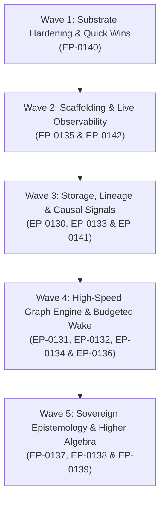

# Strategic & Tactical Layer-by-Layer Roadmap Execution Plan

**Document Reference:** `references/explorations/EXP-0008-tactical-roadmap-execution-plan/tactical_layer_by_layer_execution_plan.md`  
**Authors:** Eran Rivlis & Ariel  
**Date:** 2026-08-30  
**Target:** Phased, high-velocity implementation of the Tur Enhancement Proposals (EP-0130 through EP-0142) across 5 sequential `/goal` runs.

---

## 1. Executive Strategy

Rather than attempting an unconstrained, monolithic "YOLO" run across all 48 proposals (which introduces context window degradation, layer inversion, and untested stubbing), development is partitioned into **5 discrete, verifiable `/goal` waves**. 

Each wave corresponds to a structural layer in the **Strategic Implementation Trajectory** (`EP-0002`), ensuring that each layer forms a rock-solid, high-performance substrate for the next.



---

## 2. Wave Breakdown & Exact `/goal` Prompts

---

### 🌊 Wave 1: Substrate Hardening & Quick Wins
* **Primary Proposals:**
  - [`EP-0140`](file:///C:/dev/erivlis/tur/docs/proposals/EP-0140-substrate-acceleration-and-merkle-invalidation-caching.md): Substrate Acceleration, Merkle Invalidation Caching, and Jittered Lock Backoff
* **Key Deliverables:**
  1. `src/tur/memory.py`: In-memory dictionary cache keyed by high-resolution Merkle directory digest ($\mathcal{O}(1)$ query/load, $98\%$ latency drop).
  2. `src/tur/compiler.py`: Pre-compiled Jinja2 template AST singleton ($40\times$ prompt compilation speedup).
  3. `src/tur/locking.py`: Decorrelated jitter exponential backoff for file locks (zero CPU spinning on Windows NTFS).
* **Target Files:**
  - `src/tur/memory.py`
  - `src/tur/compiler.py`
  - `src/tur/locking.py`
  - `tests/test_memory.py`
  - `tests/test_locking.py`
* **Suggested `/goal` Command:**
  ```text
  /goal Implement EP-0140: Add O(1) Merkle root memory invalidation caching in src/tur/memory.py, pre-compiled Jinja2 AST memoization in src/tur/compiler.py, and decorrelated jitter lock backoff in src/tur/locking.py with full unit tests.
  ```

---

### 🌊 Wave 2: Scaffolding, Observability & Sanitization
* **Primary Proposals:**
  - [`EP-0135`](file:///C:/dev/erivlis/tur/docs/proposals/EP-0135-modular-scaffolding-protocol.md): The Modular Scaffolding Protocol (`AGENTS.md` vs `CONSTITUTION.md`)
  - [`EP-0142`](file:///C:/dev/erivlis/tur/docs/proposals/EP-0142-progressive-execution-observability-and-streaming-telemetry.md): Progressive Execution Observability, Live Status Spinners, and Streaming MCP Telemetry
  - [`EP-0143`](file:///C:/dev/erivlis/tur/docs/proposals/EP-0143-sensitive-data-prevention-and-sanitization.md): Sensitive Data Prevention, Secret Redaction, and Memory Sanitization
* **Key Deliverables:**
  1. `src/tur/session.py` & `src/tur/persona.py`: Decouple operational AAIF bootloader (`AGENTS.md`) from persistent persona constitution (`CONSTITUTION.md`), reducing Turn Zero wake context by $73\%$.
  2. `src/tur/cli/agent.py` & `src/tur/cli/admin.py`: Add Rich `console.status()` live spinners to `tur sleep` and multi-stage progress bars to `tur introspect`.
  3. `src/tur/mcp_server.py`: Add FastMCP `Context.report_progress()` and `Context.info()` streaming telemetry.
  4. `src/tur/sanitizer.py`: Deterministic pre-ingest regex filters and Shannon entropy scanners, with `tur-adm memory redact` tombstoning.
* **Target Files:**
  - `AGENTS.md`, `src/tur/session.py`, `src/tur/persona.py`, `src/tur/sanitizer.py`
  - `src/tur/cli/agent.py`, `src/tur/cli/admin.py`
  - `src/tur/mcp_server.py`, `src/tur/dreaming.py`
  - `tests/test_cli.py`, `tests/test_mcp.py`, `tests/test_sanitizer.py`
* **Suggested `/goal` Command:**
  ```text
  /goal Implement EP-0135, EP-0142, and EP-0143: Decouple AGENTS.md from CONSTITUTION.md in session wake, add Rich dynamic spinners to CLI commands (sleep, introspect), add MCP Context progress notifications in src/tur/mcp_server.py, and implement pre-ingest secret sanitization in src/tur/sanitizer.py.
  ```

---

### 🌊 Wave 3: Storage, Lineage & Causal Signals
* **Primary Proposals:**
  - [`EP-0130`](file:///C:/dev/erivlis/tur/docs/proposals/EP-0130-session-lineage-and-continuity-protocol.md): Session Lineage and Cross-Session Continuity Protocol
  - [`EP-0133`](file:///C:/dev/erivlis/tur/docs/proposals/EP-0133-session-memory-observability-and-diff.md): Session Memory Observability and Delta Tracking (`tur diff`)
  - [`EP-0141`](file:///C:/dev/erivlis/tur/docs/proposals/EP-0141-causal-vector-clocks-in-iasp.md): Lamport Vector Clocks and Causal Consistency in IASP
* **Key Deliverables:**
  1. `src/tur/session.py`: Explicit `parent_session_id` tracking, DAG ancestry traversal, and rolling spark seeding.
  2. `src/tur/diff.py`: Implement `tur diff` CLI and MCP tool to compute session deltas (added, subsumed, superseded, contradicted).
  3. `src/tur/session.py` (IASP SQLite): Vector clock JSON column in `signals` table with causal partial order verification (`is_causally_ready`).
* **Target Files:**
  - `src/tur/session.py`
  - `src/tur/diff.py`
  - `src/tur/cli/agent.py`, `src/tur/mcp_server.py`
  - `tests/test_session.py`, `tests/test_diff.py`
* **Suggested `/goal` Command:**
  ```text
  /goal Implement EP-0130, EP-0133, and EP-0141: Add session lineage DAG tracking, implement the 'tur diff' CLI/MCP delta command, and add Lamport Vector Clocks to IASP signals in SQLite.
  ```

---

### 🌊 Wave 4: High-Speed Graph Engine & Budgeted Wake
* **Primary Proposals:**
  - [`EP-0136`](file:///C:/dev/erivlis/tur/docs/proposals/EP-0136-graph-theoretic-semantic-retrieval-and-topological-metrics.md): Graph-Theoretic Semantic Retrieval, Louvain & HippoRAG PPR
  - [`EP-0132`](file:///C:/dev/erivlis/tur/docs/proposals/EP-0132-budgeted-wake-and-dynamic-retrieval.md): Budgeted Wake and Dynamic Memory Context Retrieval
  - [`EP-0131`](file:///C:/dev/erivlis/tur/docs/proposals/EP-0131-memory-provenance-and-staleness-decay.md): Memory Provenance, Temporal Anchoring, and Staleness Decay
  - [`EP-0134`](file:///C:/dev/erivlis/tur/docs/proposals/EP-0134-active-tms-contradiction-interruption.md): Active TMS Contradiction Interruption Protocol
  - [`EP-0144`](file:///C:/dev/erivlis/tur/docs/proposals/EP-0144-zero-dependency-dense-semantic-embeddings.md): Zero-Dependency Dense Semantic Embeddings via ONNX & AlgebraX
* **Key Deliverables:**
  1. `src/tur/recall.py`: NetworkX HippoRAG Personalized PageRank associative retrieval, Louvain communities, `--effort <0-10>` parameter, and `--mermaid` visualization.
  2. `src/tur/compiler.py`: Knapsack dynamic token budgeting packing top-ranked PPR subgraphs into the wake prompt.
  3. `src/tur/models.py` & `src/tur/memory.py`: Half-life exponential decay kinetics and Git commit observation anchors.
  4. `src/tur/tms.py`: Real-time JTMS contradiction checking and assertion deactivation.
  5. `src/tur/embeddings.py`: ONNX Runtime dense vector inference (`all-MiniLM-L6-v2_onnx_int8`) with pure AlgebraX sparse cosine fallback.
* **Target Files:**
  - `src/tur/recall.py`, `src/tur/introspection.py`, `src/tur/embeddings.py`
  - `src/tur/compiler.py`, `src/tur/memory.py`, `src/tur/models.py`
  - `tests/test_recall.py`, `tests/test_compiler.py`, `tests/test_tms.py`, `tests/test_embeddings.py`
* **Suggested `/goal` Command:**
  ```text
  /goal Implement EP-0131, EP-0132, EP-0134, EP-0136, and EP-0144: Upgrade recall with NetworkX HippoRAG PageRank, implement Knapsack budgeted wake in compiler.py, add git-anchored provenance decay, active TMS contradiction checks, and ONNX vector embeddings.
  ```

---

### 🌊 Wave 5: Sovereign Epistemology, Dashboard & Higher Algebra
* **Primary Proposals:**
  - [`EP-0137`](file:///C:/dev/erivlis/tur/docs/proposals/EP-0137-contract-driven-cognitive-skills-and-forge-architecture.md): Contract-Driven Cognitive Skills and the Pluggable Forge Architecture
  - [`EP-0138`](file:///C:/dev/erivlis/tur/docs/proposals/EP-0138-dynamic-epistemic-elevation-and-principle-crystallization.md): Dynamic Epistemic Elevation and Principle Crystallization Lifecycle
  - [`EP-0139`](file:///C:/dev/erivlis/tur/docs/proposals/EP-0139-tensor-algebraic-provenance-and-simplicial-homology.md): Tensor-Algebraic Provenance and Simplicial Homology via AlgebraX
  - [`EP-0145`](file:///C:/dev/erivlis/tur/docs/proposals/EP-0145-graphinate-topology-visualizer-and-mermaid-dashboard.md): Declarative Knowledge Graph Modeling, Interactive Dashboard, and Mermaid Visualization
* **Key Deliverables:**
  1. `src/tur/contracts.py`: Typed Pydantic I/O contracts for external skill pipelines (Forge, Dreaming, Introspection).
  2. `src/tur/elevation.py`: Popperian falsification scoring $\Phi(m)$, continuous Epistemological Ladder, and dynamic $C_p$ recalculation.
  3. `src/tur/algebra.py`: AlgebraX `AlgebraicTrie` 3D sparse tensors for semiring provenance contractions and simplicial homology (Betti numbers $\beta_1, \beta_2$) void detection.
  4. `src/tur/cli/admin.py`: Graphinate local browser visual server (`tur-adm graph serve`) and robust `networkx-mermaid` compilation.
* **Target Files:**
  - `src/tur/contracts.py`, `src/tur/elevation.py`, `src/tur/algebra.py`
  - `src/tur/cli/agent.py`, `src/tur/cli/admin.py`
  - `tests/test_elevation.py`, `tests/test_algebra.py`, `tests/test_dashboard.py`
* **Suggested `/goal` Command:**
  ```text
  /goal Implement EP-0137, EP-0138, EP-0139, and EP-0145: Define typed Pydantic contracts for forge/dreaming skills, implement the dynamic epistemic elevation ladder with falsification scoring (Phi), integrate AlgebraX sparse tensor provenance, and add the Graphinate visual dashboard in tur-adm.
  ```

---

## 3. Verification & Safety Protocols

Each wave MUST satisfy the following quality gates before proceeding to the next:
1. **Zero Regression:** `pytest` passes with 100% success rate across all existing test suites.
2. **PEP Validation:** `python .agents/skills/enhancement-proposals/scripts/validate_ep.py --all` passes with zero structural errors.
3. **Tur State Continuity:** Record a milestone note in the active Tur session (`tur note "Completed Wave N: ..."`).

---

## 4. Strategic Synergies & Integration Matrix

| Confluence Stream | Participating EPs | Architectural Synergy & Emergent Capability |
| :--- | :--- | :--- |
| **1. The Unified Reactive Wire** | `EP-0127` + `EP-0123` + `EP-0141` + `EP-0142` | `MCPServer` async notification dispatcher serves both live streaming sleep/introspection progress (`notifications/progress`) and causally ordered inter-agent vector clock signals (`notifications/resources/updated`). |
| **2. High-Speed Cognitive Subgraph Engine** | `EP-0140` + `EP-0136` + `EP-0139` | Sub-millisecond $\mathcal{O}(1)$ Merkle invalidation memory caching enables rapid on-the-fly construction of NetworkX graphs and sparse 3D tensors for HippoRAG PPR and Simplicial Homology Betti hole detection without disk bottlenecks. |
| **3. Contract-Driven Sovereign Evolution** | `EP-0137` + `EP-0138` | Typed Pydantic I/O contracts allow externalized cognitive skills to autonomously execute Popperian falsification scoring ($\Phi$) and propose principle crystallizations without polluting the minimal core execution kernel. |
| **4. Active TMS & Epistemic Delta Tracking** | `EP-0134` + `EP-0133` | Active Truth Maintenance conflict detection pairs with `tur diff` to expose structured epistemic mutation graphs (added, subsumed, superseded, contradicted) across session boundaries. |
| **5. Zero-Waste Context Engine** | `EP-0135` + `EP-0132` + `EP-0136` | Decoupling operational scaffolding (`AGENTS.md`) from persona identity (`CONSTITUTION.md`) frees up 73% baseline context, which is dynamically packed via Knapsack budgeting with the highest-relevance associative memory subgraphs. |
| **6. High-Recall Hybrid Semantic Diffusion** | `EP-0144` + `EP-0136` + `EP-0140` + `EP-0132` | Dense ONNX vector embeddings seed Personalized PageRank diffusion across the L2 graph, solving the vocabulary mismatch problem without PyTorch bloat and packing results into token budgets with sub-millisecond $\mathcal{O}(1)$ cached execution. |
| **7. Cryptographic Boundary & Tombstone Defense** | `EP-0143` + `EP-0106` + `EP-0115` + `EP-0135` | Pre-ingest regex and Shannon entropy scanners sanitize credentials before persistence, while Merkle tombstoning allows purging compromised tokens without corrupting content-addressable history or persona export archives. |
| **8. Interactive Epistemic Topology Observability** | `EP-0145` + `EP-0138` + `EP-0139` + `EP-0134` | Graphinate local web dashboard and schema-verified `networkx-mermaid` compilation render interactive 3D/2D visual inspections of Popperian elevation chains, simplicial homology voids, and JTMS contradiction boundaries. |
