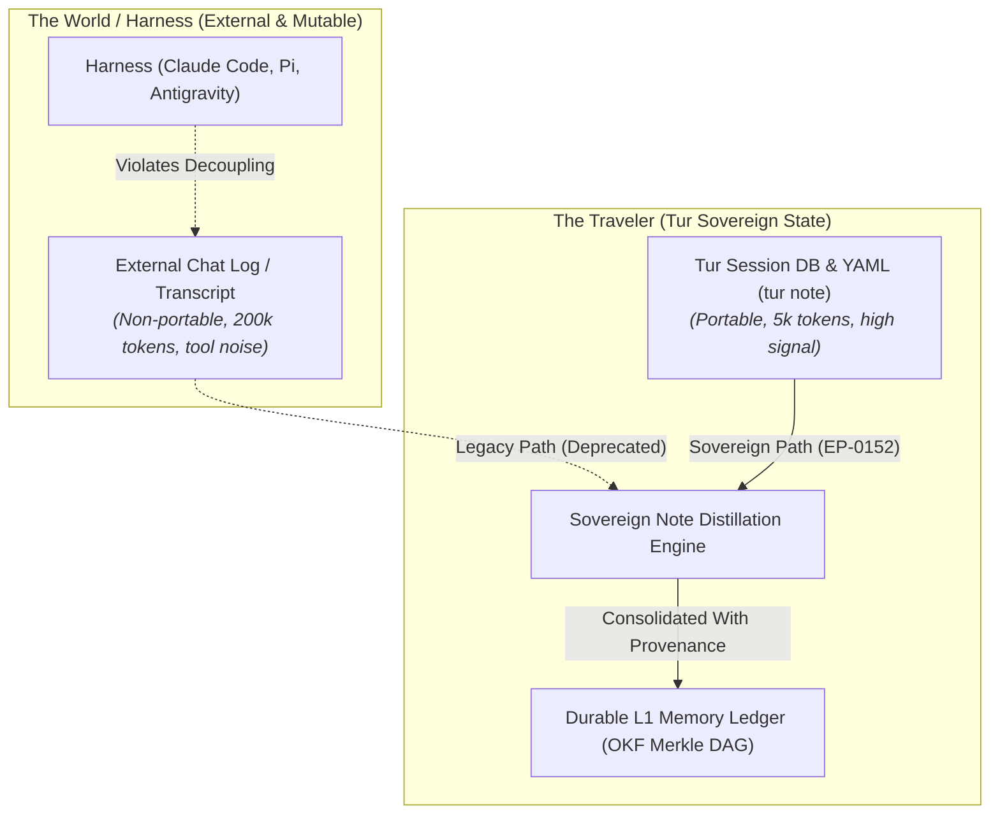

# EXP-0011: Sovereign Episodic Consolidation, Causal Distillation, and Session Lifecycle Pruning

| Field           | Value                                                                                                                                                                                                                                                                                                                                                                             |
|:----------------|:----------------------------------------------------------------------------------------------------------------------------------------------------------------------------------------------------------------------------------------------------------------------------------------------------------------------------------------------------------------------------------|
| **EXP**         | 0011                                                                                                                                                                                                                                                                                                                                                                              |
| **Title**       | Sovereign Episodic Consolidation, Causal Distillation, and Session Lifecycle Pruning                                                                                                                                                                                                                                                                                              |
| **Author**      | Eran Rivlis, Ariel                                                                                                                                                                                                                                                                                                                                                                |
| **Status**      | Active / Architectural Investigation                                                                                                                                                                                                                                                                                                                                              |
| **Type**        | Cognitive Physics, Epistemology & Storage Engineering                                                                                                                                                                                                                                                                                                                             |
| **Created**     | 2026-09-18                                                                                                                                                                                                                                                                                                                                                                        |
| **Updated**     | 2026-09-18                                                                                                                                                                                                                                                                                                                                                                        |
| **Related EPs** | [EP-0003](../../docs/proposals/EP-0003-policy-vs-mechanism.md), [EP-0108](../../docs/proposals/EP-0108-the-spark-protocol.md), [EP-0110](../../docs/proposals/EP-0110-session-bound-spark.md), [EP-0130](../../docs/proposals/EP-0130-session-lineage-and-continuity-protocol.md), [EP-0152](../../docs/proposals/EP-0152-sovereign-note-based-dreaming-and-session-lifecycle.md) |

---

## 1. Abstract & Context

This exploration investigates the cognitive architecture, epistemological transformations, and physical storage
invariants governing **Episodic-to-Semantic Memory Consolidation** in Tur.

Historically, Tur's `sleep` (dreaming) pipeline required an external chat log (`[log_path]`) to extract durable L1
memories. While this established proof-of-concept epilogue consolidation, production usage across multi-manifestation
swarms revealed critical structural seams:

1. **The Harness-Coupling Leak:** Requiring an external transcript binds the Traveler to host harness mechanics
   (Antigravity, Claude Code, Pi), violating the Tri-Partite decoupling principle.
2. **The Information Density Asymmetry:** Raw chat logs are dominated by tool outputs and noise (>95% token bloat),
   while Tur's sovereign chronological session notes (`tur note`) represent the dense, verified episodic ground truth.
3. **The Distillation Epistemology Gap:** Chronological notes must not be blindly transcribed into facts; they must be
   filtered through an epistemological lens into **atemporal invariants**, **salient epochal events**, and **causal
   chains**.
4. **The Double-Dreaming Hazard:** Unconsolidated session notes preserved indefinitely risk duplicate re-ingestion,
   violating mathematical idempotency and bloating the L1 ledger.
5. **The Unbounded State Boundary:** Without a formal retention horizon and compaction policy, historical session SQLite
   databases accumulate infinitely, violating the Golem Protocol (Boundary Containment).

EXP-0011 provides the theoretical research, empirical literature review, and architectural specifications serving as the
foundational prerequisite for
**[EP-0152](../../docs/proposals/EP-0152-sovereign-note-based-dreaming-and-session-lifecycle.md)**.

---

## 2. Compendium Directory & Artifacts

1. **[01_academic_and_industry_literature_review.md](01_academic_and_industry_literature_review.md)**:
   In-depth survey of Tulving's episodic-semantic dual-store model, Complementary Learning Systems (CLS) sleep replay
   theory, recent agent memory architectures (AriGraph, REMem, MemGPT, Generative Agents), Judea Pearl's causal
   hierarchy,
   and memory compaction/pruning strategies.

---

## 3. Structural & Conceptual Findings

### 3.1 The Tri-Partite Decoupling Invariant



By decoupling the sleep consolidation pipeline from external harness transcripts and grounding it natively in Tur's
sovereign session notes, the Traveler achieves **complete harness agnosticism**. An agent can awaken in Google
Antigravity, record notes in Pi, and dehydrate in Claude Code without a single byte of context loss or harness
dependency.

### 3.2 The Three Epistemological Rungs of Note Distillation

Chronological notes are time-bound episodic observations ($E_t$). When consolidating notes into semantic memory, the
engine applies three distinct transformations:

```
                  ┌────────────────────────────────────────────────────────┐
                  │ 1. ATEMPORAL CONCEPTS & AXIOMS (De-temporalization)    │
                  │ Strip transient timestamps. Distill universal laws     │
                  │ and design invariants (sub specie aeternitatis).       │
                  └───────────────────────────▲────────────────────────────┘
                                              │
                  ┌───────────────────────────┴────────────────────────────┐
                  │ 2. SALIENT TEMPORAL EVENTS (Epochal Milestones)        │
                  │ Preserve time coordinates for major architectural      │
                  │ releases and phase transitions (MemoryType.EVENT).     │
                  └───────────────────────────▲────────────────────────────┘
                                              │
                  ┌───────────────────────────┴────────────────────────────┐
                  │ 3. CAUSAL CHAIN SYNTHESIS (Diachronic Reasoning)       │
                  │ Synthesize multi-note arc (Trigger → Struggle → Fix)   │
                  │ into a single Cause-and-Effect Insight.               │
                  └───────────────────────────▲────────────────────────────┘
                                              │
                                 [ Chronological Notes Timeline ]
```

### 3.3 Mathematical Idempotence & Consolidation Provenance

To prevent re-dreaming and memory duplication:

* Every session records a `SessionConsolidationInfo` manifest:
  $$\text{Session} \in \{\text{Active}, \text{Ended}, \text{Consolidated}\}$$
* When in state `Consolidated`, repeated calls to `sleep()` fail with an invariant exception unless explicitly forced.
* Each generated L1 memory records an immutable provenance backlink:
  $$\text{Memory}.\text{links} \ni \text{MemoryLink} (\text{uri} = \text{"tur://session/}\langle \text{id} \rangle\text{"}, \text{relation} = \text{"consolidated\_from"})$$

### 3.4 Finite Boundary Containment (The Bounded Horizon Ring Buffer)

To prevent unbounded disk growth across months of pair programming:

* **Bounded Horizon ($N=20$)**: The active session index retains only the last $N$ sessions in primary working state.
* **Cold Archival Rotation**: Sessions older than the horizon are rotated to `.tur/personas/<id>/sessions/archive/`,
  unlinking heavy `.db` files while retaining the lightweight `.yaml` timeline for historical auditability.
* **Administrative Pruning**: Safe human governance (`tur-adm session prune --keep 10 --vacuum`) enforces physical
  disk reclamation without risk of agent tampering.

---

## 4. Conclusion & Recommendations

1. **Formalize EP-0152**: Advance EP-0152 from Draft to Accepted following Council review.
2. **Implement Sovereign Note Dreaming**: Update `tur sleep` to make note-based distillation the default, zero-config
   mode of operation.
3. **Extend Pydantic Schemas**: Add `SessionConsolidationInfo` to `SessionNotes` and `SessionEntry`.
4. **Incorporate into v0.16.0 Tactical Milestones**: Schedule implementation of EP-0152 as the headline memory feature
   for Tur's next minor release.
